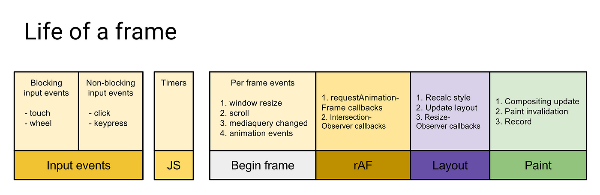

# 数据上报


要上报数据，最简单的当然直接使用ajax就行了，同时，为了每次上报是否出自同一次操作，我们这里为上报数据生成一个**UUID**，只要是同一次操作，生成的**UUID**始终一致。

```javascript
// utils/generateUniqueID.js
export default function generateUniqueID() {
  return `ys-${Date.now()}-${Math.floor(Math.random() * (9e12 - 1))}`
}
```

```javascript
import generateUniqueID from '../utils/generateUniqueID'
import config from '../config';

const uniqueID = generateUniqueID();

export function report(type, data) { 
  if (config.reportUrl === null) { 
    console.error('请设置上传 url 地址');
    return;
  }

  const reportData = JSON.stringify({
    id: uniqueID,
    appId: config.appId,
    userId: config.userId,
    type, //上报的类型 error/action/performance/...
    data, //上报的数据
    currentTime: Date.now(),
    currentPage: window.location.href,
    ua: config.ua
  })

  // ------ fetch 方式上报 ------
  fetch(config.reportUrl, {
    method: 'POST',
    headers: {
      'Content-Type': 'application/json'
    },
    body: reportData,
  }).then(res => {
    console.log(res);
  }).catch(err => {
    console.log(err);
  })
}
```

将report函数放入到之前的错误捕获中运行，就已经可以上报错误了。

现在看来好像没什么问题，但是其实通过ajax上报这种方式存在很大的问题。

1. **浏览器的安全策略：**由于浏览器的安全策略，Ajax 请求可能会受到同源策略限制。
2. **页面卸载时的数据上报：**如果使用异步的 XMLHttpRequest 或 fetch 发送 Ajax 请求进行数据上报，由于这些请求是异步的，可能会导致在页面卸载时尚未完成请求，从而导致数据丢失。当然，我们可以使用同步的 `XMLHttpRequest`来简单解决这个问题
3. **阻塞页面卸载：**如果在页面卸载时，当前页面仍在发送 Ajax 请求，这些请求可能会阻塞页面的卸载，导致页面无法正常关闭，从而影响用户体验。

## Navigator.sendBeacon()

[navigator.sendBeacon()](https://developer.mozilla.org/zh-CN/docs/Web/API/Navigator/sendBeacon)方法可用于通过 [HTTP POST](https://developer.mozilla.org/zh-CN/docs/Web/HTTP/Methods/POST) 将少量数据 [异步](https://developer.mozilla.org/zh-CN/docs/Glossary/Asynchronous) 传输到 Web 服务器。

它主要用于将统计数据发送到 Web 服务器，同时避免了用传统技术（如：[`XMLHttpRequest`](https://developer.mozilla.org/zh-CN/docs/Web/API/XMLHttpRequest)）发送分析数据的一些问题。

这个方法主要用于满足统计和诊断代码的需要，这些代码通常尝试在卸载（unload）文档之前向 Web 服务器发送数据。过早的发送数据可能导致错过收集数据的机会。然而，对于开发者来说保证在文档卸载期间发送数据一直是一个困难。因为用户代理通常会忽略在 [`unload`](https://developer.mozilla.org/zh-CN/docs/Web/API/Window/unload_event) 事件处理器中产生的异步 [`XMLHttpRequest`](https://developer.mozilla.org/zh-CN/docs/Web/API/XMLHttpRequest)。

过去，为了解决这个问题，统计和诊断代码通常要在

- 发起一个同步 `XMLHttpRequest` 来发送数据。
- 创建一个``元素并设置 `src`，大部分用户代理会延迟卸载（unload）文档以加载图像。
- 创建一个几秒的 no-op 循环。

上述的所有方法都会迫使用户代理延迟卸载文档，并使得下一个导航出现的更晚。下一个页面对于这种较差的载入表现无能为力。

这就是 **`sendBeacon()`** 方法存在的意义。使用 **`sendBeacon()`** 方法会使用户代理在有机会时异步地向服务器发送数据，同时不会延迟页面的卸载或影响下一导航的载入性能，这意味着：

- 数据发送是可靠的。
- 数据异步传输。
- 不影响下一导航的载入。

### 语法

```
navigator.sendBeacon(url);
navigator.sendBeacon(url, data);
```

### 参数

- `url`

  `url` 参数表明 `data` 将要被发送到的网络地址。

- `data` 可选

  `data` 参数是将要发送的 [`ArrayBuffer`](https://developer.mozilla.org/zh-CN/docs/Web/JavaScript/Reference/Global_Objects/ArrayBuffer)、[`ArrayBufferView`](https://developer.mozilla.org/zh-CN/docs/Web/JavaScript/Reference/Global_Objects/TypedArray)、[`Blob`](https://developer.mozilla.org/zh-CN/docs/Web/API/Blob)、[`DOMString`](https://developer.mozilla.org/zh-CN/docs/Web/JavaScript/Reference/Global_Objects/String)、[`FormData`](https://developer.mozilla.org/zh-CN/docs/Web/API/FormData) 或 [`URLSearchParams`](https://developer.mozilla.org/zh-CN/docs/Web/API/URLSearchParams) 类型的数据。

### 返回值

当用户代理成功把数据加入传输队列时，**`sendBeacon()`** 方法将会返回 `true`，否则返回 `false`。


```javascript
import generateUniqueID from '../utils/generateUniqueID'
import config from '../config';

const uniqueID = generateUniqueID();

export function report(type, data) { 
  if (config.reportUrl === null) { 
    console.error('请设置上传 url 地址');
    return;
  }

  const reportData = JSON.stringify({
    id: uniqueID,
    appId: config.appId,
    userId: config.userId,
    type, //上报的类型 error/action/performance/...
    data, //上报的数据
    currentTime: Date.now(),
    currentPage: window.location.href,
    ua: config.ua
  });

  sendBeacon(config.reportUrl, reportData);
}

// ------ navigator.sendBeacon 方式上报 ------
function sendBeacon(reportUrl, reportData) {
  if (navigator.sendBeacon) {
    navigator.sendBeacon(reportUrl, reportData);
  } else {
    reportWithXHR(reportUrl, reportData);
  }
}

// ------ XMLHttpRequest 方式上报 ------
function reportWithXHR(reportUrl,reportData) {
  const xhr = new XMLHttpRequest()
  xhr.open('POST', reportUrl, true)
  xhr.send(reportData)
}
```

## requestIdleCallback

[window.requestIdleCallback()](https://developer.mozilla.org/zh-CN/docs/Web/API/Window/requestIdleCallback)方法插入一个函数，这个函数将在浏览器空闲时期被调用

要弄懂`requestIdleCallback`函数，其实最主要的是要清楚，**浏览器在一帧里面做了什么？**

### 帧

由于现在广泛使用的屏幕都有固定的刷新率（比如最新的一般在 60Hz）， 在两次硬件刷新之间浏览器进行两次重绘是没有意义的只会消耗性能。 浏览器会利用这个间隔 16ms（1000ms/60）适当地对绘制进行节流， 因此 16ms 就成为页面渲染优化的一个关键时间。在这段时间内，浏览器需要完成如下事情：

- 脚本执行（JavaScript）：脚本造成了需要重绘的改动，比如增删 DOM、请求动画等
- 样式计算（CSS Object Model）：级联地生成每个节点的生效样式。
- 布局（Layout）：计算布局，执行渲染算法
- 重绘（Paint）：各层分别进行绘制
- 合成（Composite）：合成各层的渲染结果

### 一帧里事件执行顺序

- 用户事件
  - 阻塞输入事件，如`wheel`、`touch`等。
  - 非阻塞输入事件，如`click`、`keypress`等。
- 宏任务 + 微任务
  - 先执行宏任务。
  - 每个宏任务执行完后，会执行宏任务中产生的微任务。
  - 如果微任务中还有微任务，那么添加到微任务队列后，继续执行微任务。
  - 微任务执行完成后，可能会继续执行另一个宏任务（一帧里可以执行多个宏任务），也可能进入后续渲染阶段。
- begin frame
  - window.resize
  - scroll
  - mediaquery changed （媒体查询）
  - animation events （动画事件）
- requestAnimationFrame回调（在每次渲染之前执行，丢帧时不执行）
- 浏览器渲染过程
  - 样式计算
  - 布局
  - 重绘
  - 合成
- requestIdleCallback回调（空闲时间）



我们上传数据，也可以利用这一点，更好的处理上传时机

```javascript
export function report(type, data, isImmediate = false) { 
 	//其他代码省略......
  // 立即上传
  if (isImmediate) {
    sendBeacon(config.reportUrl, reportData)
    return
  }

  // ------ requestIdleCallback 方式上报 ------
  if (window.requestIdleCallback) {
      window.requestIdleCallback(() => {
          sendBeacon(config.reportUrl, reportData)
      }, { timeout: 3000 })
  } else {
      setTimeout(() => {
          sendBeacon(config.reportUrl, reportData)
      })
  }
}
```

## 延迟上报

还有一种情况，如果大量的问题需要上传，比如用户疯狂点击出现错误情况，那么每次上报这种情况也不太好，因此做一下延迟上报处理，也很有必要。

```javascript
// utils/cache.js
const cache = new Map();

export function getCache() {
  return cache;
}

export function addCache(type,data) {
  cache.get(type) ? cache.get(type).push(data) : cache.set(type, [data]);
}

export function clearCache() {
  cache.clear()
}
```


```javascript
// report/index.js
//其他代码省略
let timer = null

export function lazyReportCache(type, data, timeout = 3000) {
  console.log(data);
  addCache(type, data)

  clearTimeout(timer)
  timer = setTimeout(() => {
    const dataMap = getCache()

    if (dataMap.size) {
      for (const [type,data] of dataMap) {
        console.log(`${type},${data}`);
        report(type, data)
      }
      
      clearCache()
    }
  }, timeout)
}
```

然后直接将之前`report`的调用换成`lazyReportCache`调用，当然，后端的代码还需要修改，因为现在提交的都是数组了

## 图片打点上报的方式

其实除了传统的ajax方式，以及`Navigator.sendBeacon()`方式，还可以采用图片打点上报的方式。

这种方式可以避免页面切换阻塞的问题，但是缺点也很明显：

1、由于是url地址传值，所以传值的数据长度有限

2、地址传递需要后端单独做处理

```javascript
let oImage = new Image();
oImage.src = `${url}?logs=${data}`;
```

