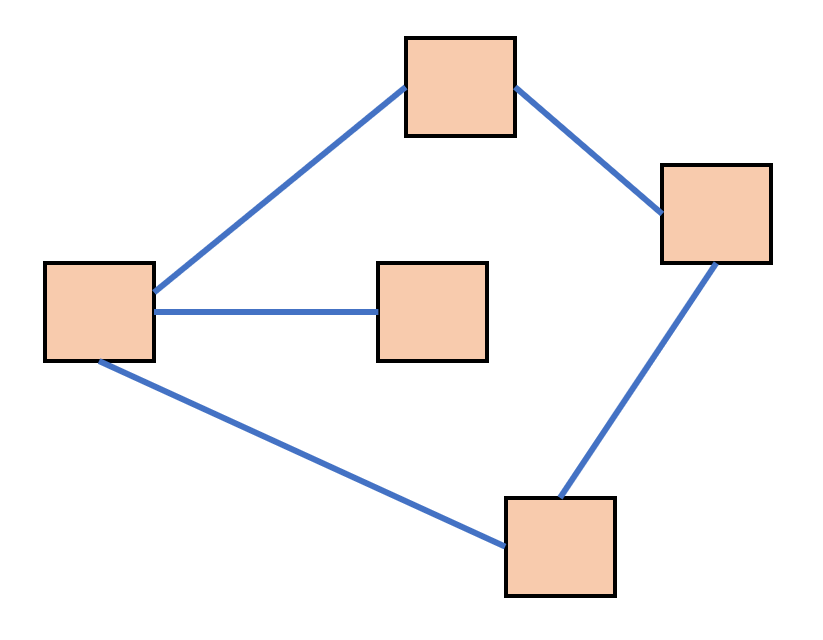

# 图结构 {ignore}

[toc]

## 概念



图结构中，一个结点可以链接到任意结点，所有结点链接而成的结构，即为图结构

图结构中的链接可以是有向的，也可以是无向的（双向链接），本文仅讨论双向链接

树结构是一种特殊的图结构

图结构没有根，可以有环，但是在一个图结构中，不能存在两个或以上的孤立结点

可以使用图中任何一个结点表示整个图结构

图结构是一种常见的数据结构，例如网络爬虫抓取的网页就是一种典型的图结构

图结构的代码可表示为：

```js
function Node(value){
    this.value = value;
    this.neighbors = [];
}
```

## 相关算法

1. 查询算法

和树结构一样，图结构的查询也可以分为深度优先（Depth First Search）和广度优先(Breadth First Search)查询

2. 最小生成树算法

如果一个图中结点连接而成的边具备某种数值，需要将这些边进行精简，生成一个连接全节点同时总边长最小的树结构，该树称之为最小生成树

实现最小生成树可以使用Prim算法，从任意一个点出发，连接到该点最短的点，组成一个部落，然后继续连接到该部落最短的点，直到把所有点连接完成