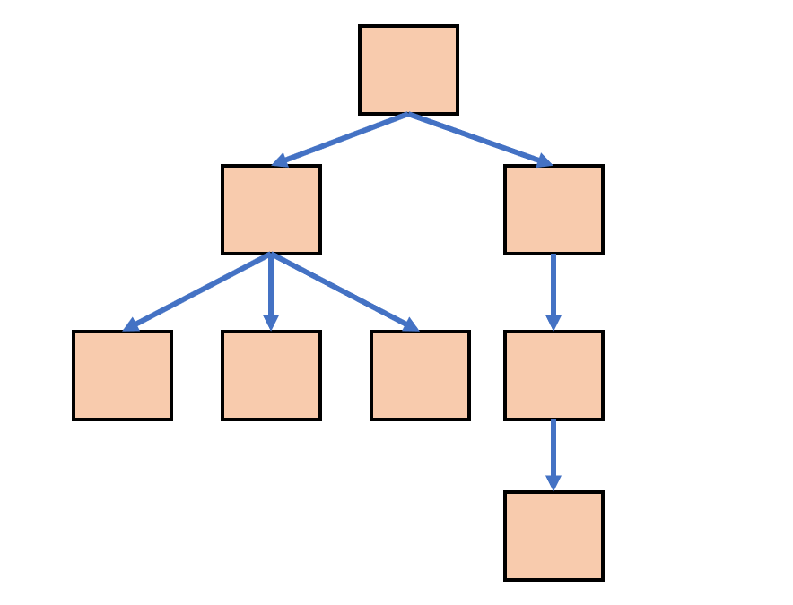

# 树形结构 {ignore}

[toc]

## 树

树是一个类似于链表的二维结构，每个节点可以指向0个或多个其他节点



树具有以下特点：

1. 单根：如果一个节点A指向了另一个节点B，仅能通过A直接找到B节点，不可能通过其他节点直接找到B节点
2. 无环：节点的指向不能形成环

树的术语：

1. 结点的度：某个节点的度 = 该节点子节点的数量
2. 树的度：一棵树中，最大的节点的度为该树的度
3. 结点的层：从根开始定义起，根为第1层，根的子结点为第2层，以此类推；
4. 树的高度或深度：树中结点的最大层次
5. 叶子节点：度为0的结点称为叶结点；
6. 分支节点：非叶子节点
7. 子节点、父节点：相对概念，如果A节点有一个子节点B，则A是B的父节点，B是A的子节点
8. 兄弟节点：如果两个节点有同一个父节点，则它们互为兄弟节点
9. 祖先节点：某个节点的祖先节点，是从树的根到该节点本身经过的所有节点
10. 后代节点：如果A是B的祖先节点，B则是A的后代节点

树的代码表示法：

```js
function Node(value){
    this.value = value;
    this.children = [];
}
```

## 二叉树

如果一颗树的度为2，则该树是二叉树

二叉树可以用下面的代码表示

```js
function Node(value){
    this.value = value;
    this.left = null;
    this.right = null;
}
```

### 二叉树的相关算法

编写各种函数，实现下面的功能

1. 对二叉树遍历打印
   1. 前(先)序遍历 DLR
   2. 中序遍历 LDR
   3. 后序遍历 LRD
2. 根据前序遍历和中序遍历结果，得到一颗二叉树
3. 计算树的深度
4. 查询二叉树 
   1. 深度优先 Depth First Search
   2. 广度优先 Breadth First Search
5. 比较两棵二叉树，得到比较的结果
