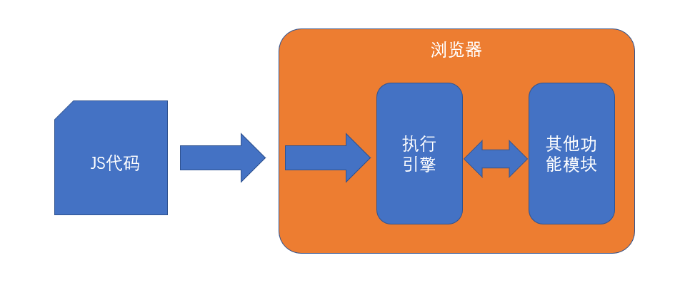
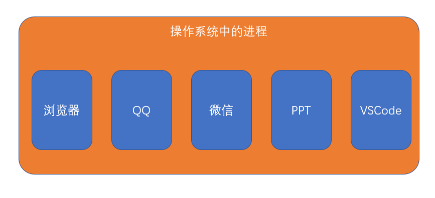
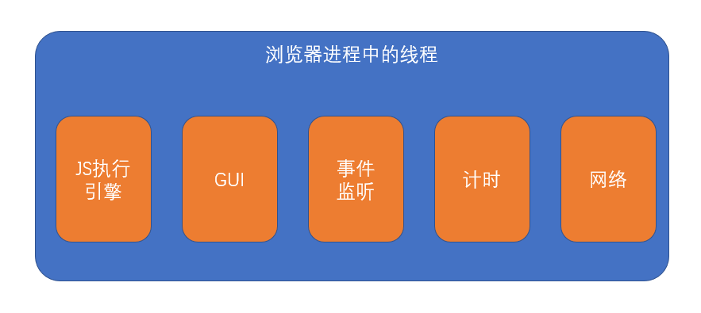
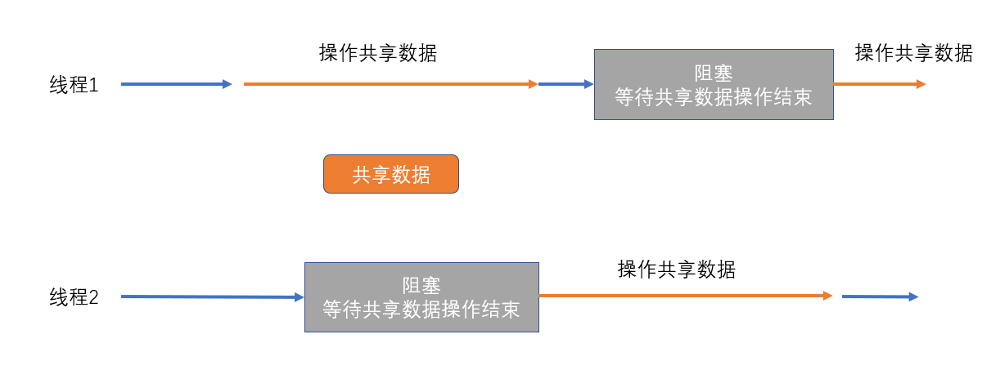
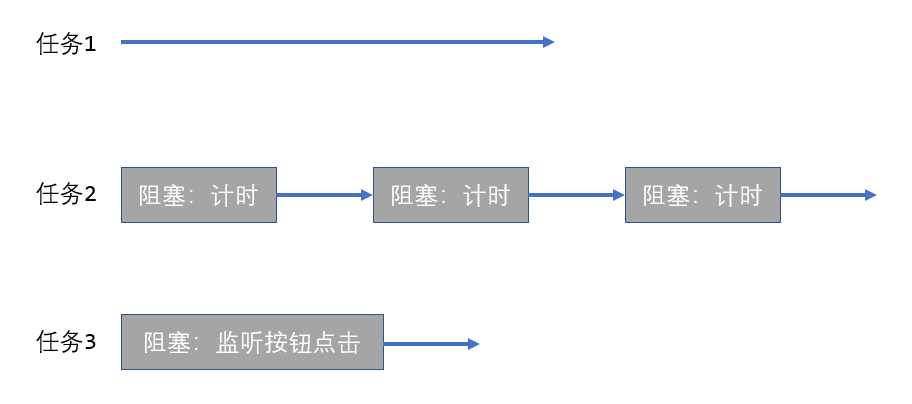
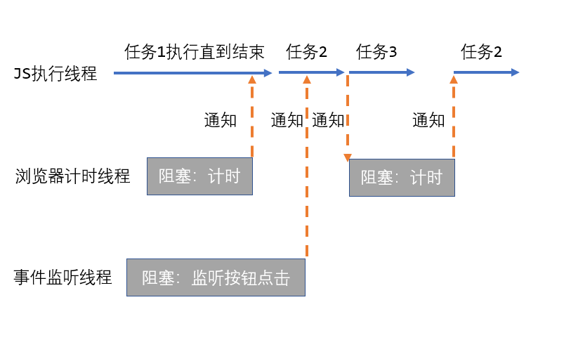
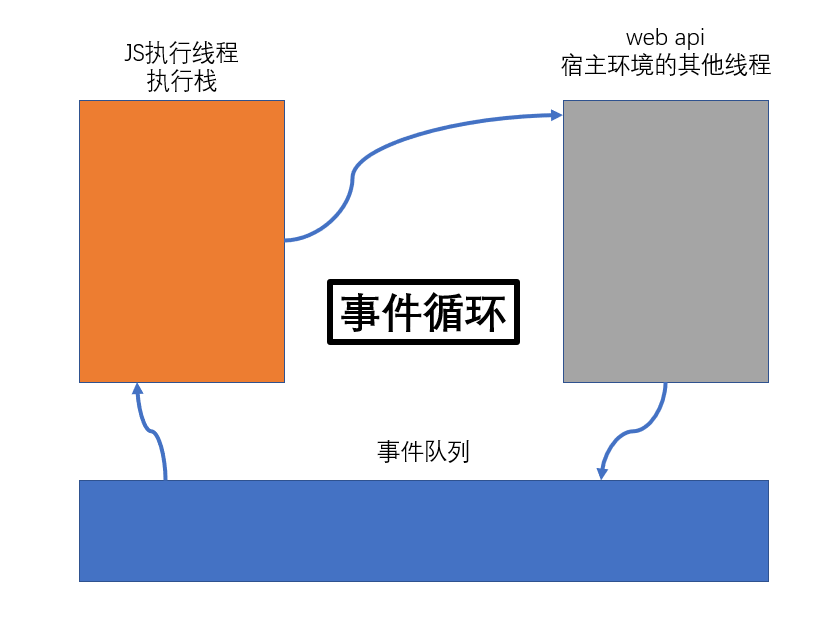
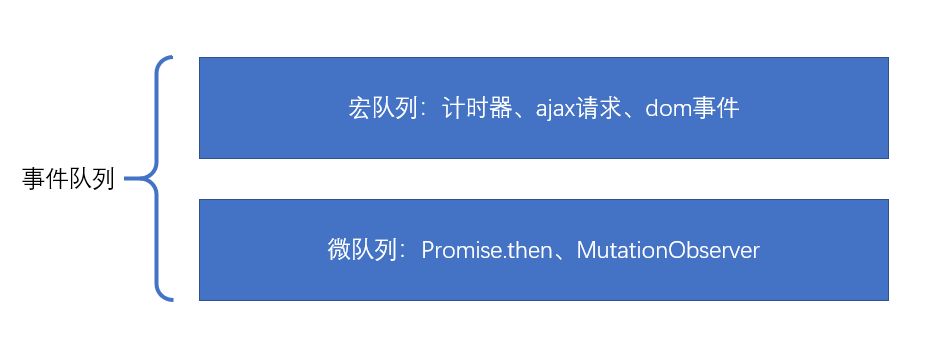

# 事件循环 {ignore}

[toc]

## 概念

1. **浏览器、JS、执行引擎的关系**

JS：一门计算机语言，提供了表达程序逻辑的语法和实现基本功能的API

浏览器：JS语言的真实运行环境，又称之为JS的宿主环境

JS执行引擎：JS宿主环境（例如浏览器）中的一个功能模块，用于解析并执行JS

它们的关系如下：

2. **进程 和 线程**

进程：当一个应用程序运行时，需要使用内存和CPU资源，这些资源需要向操作系统申请。操作系统以进程的方式来分配这些资源，一个进程就代表着一块独立于其他进程的内存空间。一个应用程序要运行，必须至少有一个进程启动。进程的最大特点是**独立**，一个进程不能随意的访问其他进程的资源。这就保证了多个程序在操作系统上运行互不干扰。

线程：可能要同时执行多个任务，每个任务需要在一个线程上运行，线程与线程之间**相对独立**，但可以共享应用程序的进程数据。

3. **如何理解JS的单线程**

我们之所以称JS为单线程的语言，是因为它的执行引擎只有一个线程，并且不会在执行期间开启新的线程。而并非浏览器是单线程的。

单线程的应用程序具有以下的特点：

- 易于学习和理解：所有代码都是按照顺序从上到下执行的
- 易于掌控程序：由于代码都按照顺序执行，不会出现中断，也没有共享资源的争夺问题，极大的降低了开发难度。
- 更加合理的利用计算机资源：创建新的线程和销毁线程都会耗费额外的CPU和内存资源，没有良好的线程设计，将导致程序运行效率低下。而单线程的应用不受此影响

4. **JS如何处理多任务**

任何一个程序在执行期间都可能会开启多个任务，比如：

1). 任务1：程序启动时开始进行一些操作
2). 任务2：开启一个计时器，每隔一段时间去做一些事
3). 任务3：监听按钮是否被点击，当按钮被点击后，去做一些事

由于JS的执行线程只有一个，因此，它通过异步的方式来解决这些任务

下面是单线程的异步和多线程的对比

多线程：

可以看到，如果以多线程的方式运行，会导致程序代码在某些时候会有重叠执行的情况出现，如果这些代码凑巧在使用共享数据，将难以控制最终的运行结果。

而使用异步的方式就解决了该问题：

可以看出，使用异步之后，所有的JS代码都在单个线程中执行，不会出现多个任务同时执行的情况，自然就不会出现资源争夺的问题。

5. **同步代码 和 异步代码**

同步代码：程序启动后，在JS执行线程上立即执行的任务代码

异步代码：收到宿主环境（浏览器）的其它线程通知，即将在JS执行线程上执行的代码，例如计时器回调函数中的代码，事件中的代码。JS中的异步代码往往放到一个函数中，该函数成为异步函数，或者描述为，该函数是异步的

6. **执行栈**

为了保证JS代码有序的执行，JS执行引擎使用执行栈来组织JS代码

每当调用一个函数时，都会在执行栈中创建一个执行上下文，上下文中提供了函数执行需要的环境，创建了上下文之后，再执行函数

## 事件循环

事件循环是JS处理异步函数的具体方法

具体的做法是：

1. 执行 执行栈 中的代码
2. 遇到一些特殊代码交给浏览器的其他线程处理
3. 将执行栈中的代码全部执行完毕
4. 从事件队列中取出第一个任务放入执行栈，然后重复第1步

事件队列在不同的宿主环境中有所差异，大部分宿主环境会将事件队列进行细分。在浏览器中，事件队列分为两种：

- 宏任务（队列）：macroTask，计时器结束的回调、事件回调、http回调等等绝大部分异步函数进入宏队列
- 微任务（队列）：microTask，Promise.then, [MutationObserver](https://developer.mozilla.org/zh-CN/docs/Web/API/MutationObserver)

当执行栈清空时，JS引擎首先会将微任务中的所有任务依次执行结束，如果没有微任务，则执行宏任务。