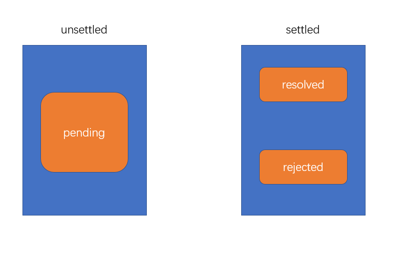
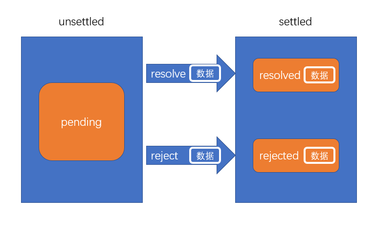
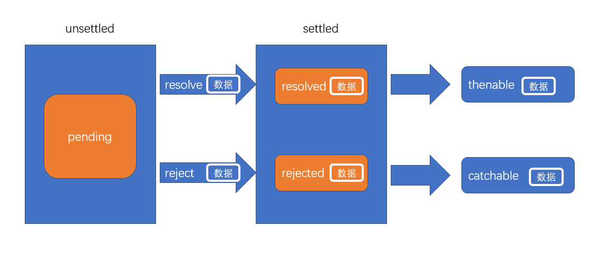

# ES6异步解决方案 {ignore}

[toc]

> 思考如下的场景：
> 有很多操作都需要从服务器验证是否具有操作的权限，为了避免重复代码，我们可以将验证权限的功能当作是一个异步任务，并把它提取成为一个方法
> 如果让你来编写这个方法，有哪些编写方式？

## 背景

JS经常会遇到一些**异步任务**，所谓异步任务，就是需要经过一段时间 或 当某个时机到达后才能得到结果的任务

例如：

- 使用ajax请求服务器，当服务器完成响应后拿到响应结果
- 监听按钮是否被点击，当按钮被点击后拿到某个文本框的值
- 使用setTimeout等待一段时间，当时间到达后做某些事情

面对这样的场景，JS没有一种标准的模式来进行处理，我们处理这些问题的方式是杂乱的，这就导致了不同的人书写的异步任务代码使用方式不一致。

ES6总结了各种异步场景，并提取出一种通用的异步模型

## ES6的异步处理模型

ES6将异步场景分为**两个阶段**和**三种状态**

两个阶段：unsettled（未决） 和 settled（已决）
三种状态：pending（挂起）、resolved（完成）、rejected（失败）

他们的关系图如下：



当任务处于**未决阶段**时，它一定是 **pending 挂起状态**，表示任务从开始到拿到结果之间的过程。比如：网络完成了各种配置，也发送了请求，但是请求结果还没有拿到。

当任务处于 **已决阶段**时，它只能是 **resolved** 和 **rejected**两种状态的一种，表示任务有了一个结果。比如：从服务器拿到了数据（resolved）、网络不好没有拿到数据（rejected）

任务开始时，始终是未决阶段，那任务如何才能走向已决阶段呢？

ES6认为，任务在未决阶段的时候，有能力将其**推向**已决。比如，当从服务器拿到数据后，我们就从未决阶段推向已决的resolved状态，如果网络不好，导致出错了，我们就从未决阶段推向已决的rejected状态

我们把**从未决推向已决的resolved状态的过程，叫做resolve**，**从未决推向已决的rejected状态的过程，叫做reject**，如下图所示


这种状态和阶段的变化是不可逆的，也就是说，一旦推向了已决，就无法重新改变状态

任务从未决到已决时，可能附带一些数据，比如：跑步完成后的用时、网络请求后从服务器拿到的数据



任务已决后（有了结果），可能需要进一步做后续处理，如果任务成功了（resolved），有后续处理，如果任务失败了（rejected），仍然可能有后续处理

我们把针对resolved的后续处理，称之为thenable，针对rejected的后续处理，称之为catchable



## Promise的基本使用

ES官方制定了一个全新的API来适配上面提到的异步模型，这个API即Promise

Promise是一个构造函数，通过```new Promise()```可以创建一个任务对象，构造函数的参数是一个函数，用于处理未决阶段的事务，该函数的执行是立即同步执行的。在函数中，可以通过两个参数自主的在合适的时候将任务推向已决阶段

```js
var pro = new Promise((resolve, reject)=>{
    //未决阶段的代码，这些代码将立即执行
    //...
    //在合适的时候，将任务推向已决
    //resolve(数据)：将任务推向resovled状态，并附加一些数据
    //reject(数据)：将任务推向rejected状态，并附加一些数据
})
```

**注意**

1. 任务一旦进入已决后，所有企图改变任务状态的代码都将失效
2. 以下代码可以让任务到达rejected状态
   1. 调用reject
   2. 代码执行报错
   3. 抛出错误

拿到Promise对象后，可以通过then方法指定后续处理

```js
pro.then(thenable, catchable)
//或
pro.then(thenable)
pro.catch(catchable)
```

无论是thenable还是catchable，均是下面格式的函数

```js
function (data){
    //data为状态数据
}
```

**注意：后续处理函数一定是异步函数，并且放到微队列中**
