# 手写微前端micro-app(1)-页面渲染


### micro-app实现的基本原理

micro-app实现的核心其实是 **Web Component(主要是自定义元素CustomElement) + HTMLEntry**

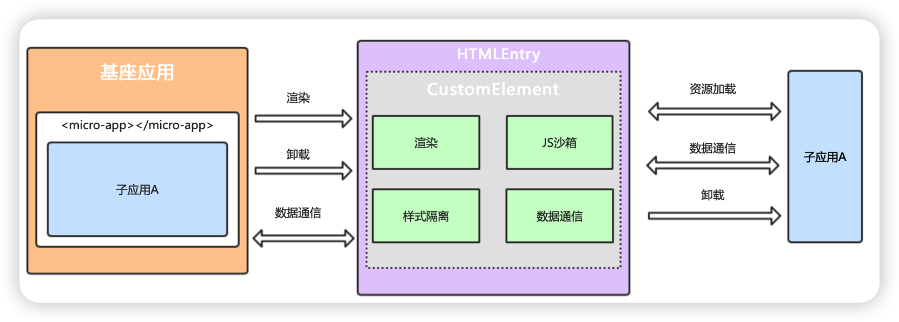

简单来说，其实就是直接读取子应用的HTML页面资源，然后剥离出包含在HTML中的css，js等资源，然后**直接加载到基座应用中执行，所以基座应用和子应用本质是同一个页面**


### 创建基本的Custom Element

通过customElements创建的自定义元素，因为它不仅提供一个元素容器，还自带了生命周期函数，我们可以在这些钩子函数中进行加载渲染等操作，从而简化步骤。

直接在基座应用下创建文件夹 **micro-ce**

```js
// src/micro-ce/element.js

class MyElement extends HTMLElement {
  // 声明需要监听的属性名，只有这些属性变化时才会触发attributeChangedCallback
  static get observedAttributes () {
    return ['name', 'url']
  }

  constructor() {
    super();
  }

  connectedCallback() {
    // 元素被插入到DOM时执行，此时去加载子应用的静态资源并渲染
    console.log('micro-app is connected')
  }

  disconnectedCallback () {
    // 元素从DOM中删除时执行，此时进行一些卸载操作
    console.log('micro-app has disconnected')
  }

  attributeChangedCallback (attrName, oldVal, newVal) {
    // 元素属性发生变化时执行，可以获取name、url等属性的值
    console.log(`attribute ${attrName}: ${newVal}`)
  }
}
//为了防止重复定义，加入判断
export function defineElement () {
  // 如果已经定义过，则忽略
  if (!window.customElements.get('micro-app')) {
    window.customElements.define('micro-app', MyElement)
  }
}
```

在**micro-ce**的入口文件,`index.js`中定义默认对象`SimpleMicroApp`，引入并执行`defineElement`函数。

```js
import { defineElement } from './element'

const SimpleMicroApp = {
  start () {
    defineElement()
  }
}

export default SimpleMicroApp
```

在基座程序中引入

```js
import SimpleMicroApp from './micro-ce';
SimpleMicroApp.start();
```

我们在基座的Home.vue页面中调用一下这个自定义元素**micro-app**

```
<template>
  <div>
    <div>
      <micro-app name='app' url='http://localhost:4002/'></micro-app>
    </div>
    <HelloWorld :msg="msg"/>
  </div>
</template>
```

插入micro-app标签后，就可以看到控制台打印的钩子信息。

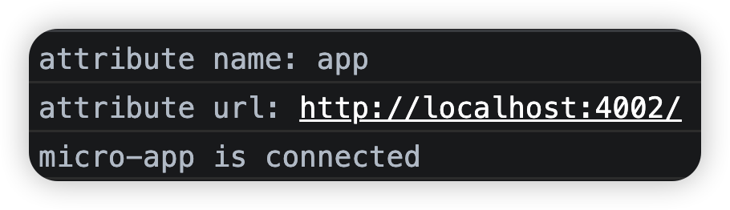

为了记录方便，给micro-app对象使用name和url属性，当属性更改的时候，就给name和url赋值

```js
// src/micro-ce/element.js

class MyElement extends HTMLElement {
  //...其他代码省略
  connectedCallback() {
      // 元素被插入到DOM时执行，此时去加载子应用的静态资源并渲染
      console.log('micro-app is connected');
      console.log(this);
      console.log(this.name);
      console.log(this.url);
  }

  attributeChangedCallback (attrName, oldVal, newVal) {
      // 元素属性发生变化时执行，可以获取name、url等属性的值
      console.log(`attribute ${attrName}: ${newVal}`)
      // 分别记录name及url的值
      if (attrName === 'name' && !this.name && newVal) {
        this.name = newVal
      } else if (attrName === 'url' && !this.url && newVal) {
        this.url = newVal
      }
  }
}
```


### 2、创建微应用实例

自定义元素有了，很显然，子应用的所有元素都会放入到这个容器中。接下来我们就需要完成子应用的静态资源加载及渲染。

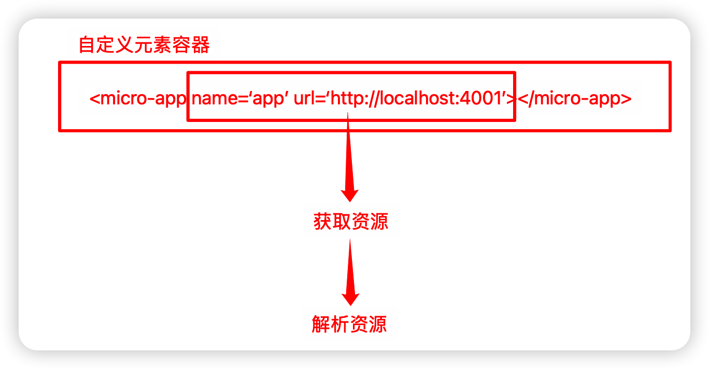

由于可能有很多子应用都需要加载，因此我们可以声明一个类，专门用来创建子应用

```js
// /src/micro-ce/app.js

// 存储微应用实例
export const appInstanceMap = new Map()

// 创建微应用
export default class CreateApp {
  constructor({ name, url, container }) {
    this.name = name // 应用名称
    this.url = url  // url地址
    this.container = container // micro-app元素
    this.status = 'loading'
  }

  // 组件状态，包括 created/loading/mount/unmount
  status = 'created' 

  // 存放应用的静态资源
  source = { 
    links: new Map(), // link元素对应的静态资源
    scripts: new Map(), // script元素对应的静态资源
  }

  // 资源加载完时执行
  onLoad () {}

  /**
   * 资源加载完成后进行渲染
   */
  mount () {}

  /**
   * 卸载应用
   * 执行关闭沙箱，清空缓存等操作
   */
  unmount () {}
}
```

这样，在micro-app容器创建之后，将name，url的值传入到createApp对象中，创建微应用对象

```js
// /src/element.js
import CreateApp, { appInstanceMap } from './app'

//...其他代码省略
connectedCallback () {
  // 创建微应用实例
  const app = new CreateApp({
    name: this.name,
    url: this.url,
    container: this,
  })

  // 记入map缓存，用于后续功能
  appInstanceMap.set(this.name, app)
  console.log(appInstanceMap);
}
```

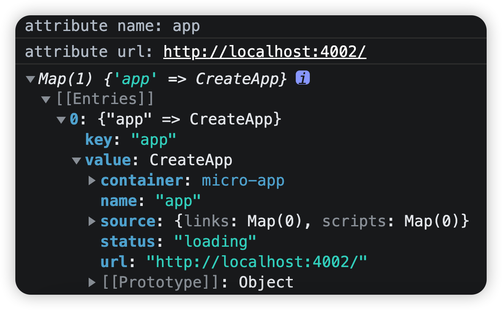

### 3、请求资源

为了使用方便先封装工具函数，创建**utils.js**文件，当然**加载的前提你要先打开子应用**😂

```js
// /src/micro-ce/utils.js

/**
 * 获取静态资源
 * @param {string} url 静态资源地址
 */
export function fetchSource (url) {
  return fetch(url).then((res) => {
    return res.text()
  })
}
```

创建专门处理资源的**source.js**文件

```js
// src/micro-ce/source.js
import { fetchSource } from './utils'
export default function loadHtml(app) {
  fetchSource(app.url).then((html) => { 
    console.log(html);
  }).catch((e) => {
    console.error('加载html出错', e)
  })
}
```

在**app.js**中调用

```diff
// /src/micro-app/app.js
+ import loadHtml from './source'

// 创建微应用
export default class CreateApp {
  constructor ({ name, url, container }) {
    this.name = name // 应用名称
    this.url = url  // url地址
    this.container = container // micro-app元素
    this.status = 'loading'
+    loadHtml(this)
  }
  ...
}
```

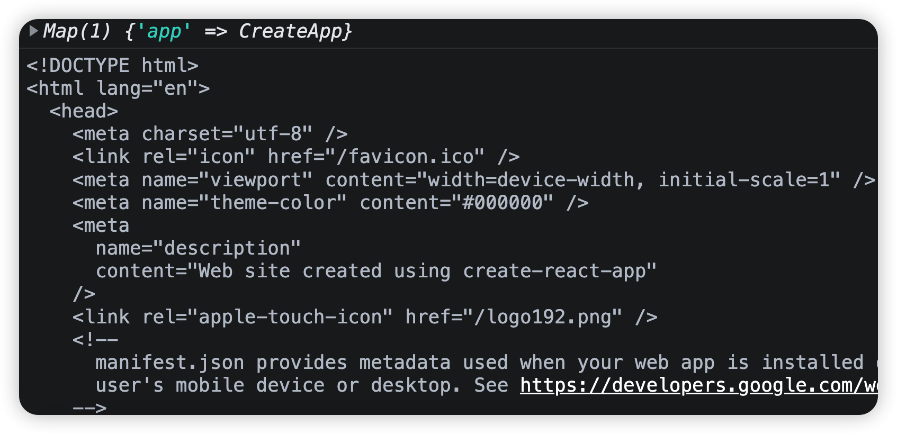

### 4、格式化HTML资源

读取出来的子应用HTML格式就想上面的图一样，还是一个原生的html格式，我们希望将格式改成下面的样子，一方面好和基座资源区分，另外一方面也比较好提取内部的js和css资源

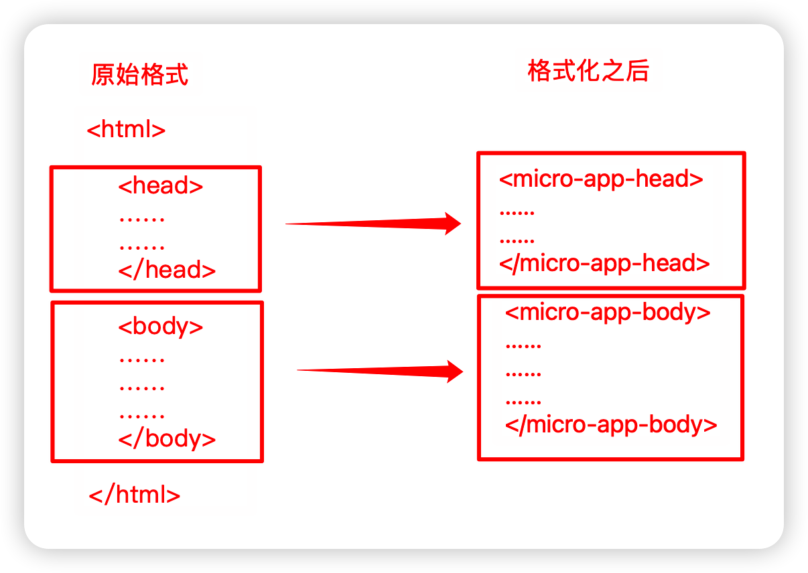

因此在**source.js**文件中，我们通过正则表达式进行替换

```js
// src/micro-ce/source.js
import { fetchSource } from "./utils";
export default function loadHtml(app) {
  fetchSource(app.url).then((html) => {
    html = html
      .replace(/<head[^>]*>[\s\S]*?<\/head>/i, (match) => {
        // 将head标签替换为micro-app-head，因为web页面只允许有一个head标签
        return match
          .replace(/<head/i, "<micro-app-head")
          .replace(/<\/head>/i, "</micro-app-head>");
      })
      .replace(/<body[^>]*>[\s\S]*?<\/body>/i, (match) => {
        // 将body标签替换为micro-app-body，防止与基座应用的body标签重复导致的问题。
        return match
          .replace(/<body/i, "<micro-app-body")
          .replace(/<\/body>/i, "</micro-app-body>");
      });

    // 将html字符串转化为DOM结构
    const htmlDom = document.createElement("div");
    htmlDom.innerHTML = html;
    console.log("html:", htmlDom);
  });
}
```

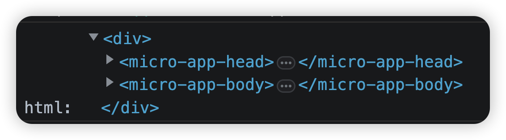

> 这里要注意一个问题：普通的静态标签我们是可以直接通过innerHTML直接通过dom加入到页面的。但是如果innerHTML加入的字符串中有script，link这种标签，浏览器出于安全问题考虑，是不会直接加载，只有我们获取之后，手动进行加载，link标签中的内容我们可以手动创建style标签把内容放入进去，script标签中的内容，我们可以使用eval直接加载


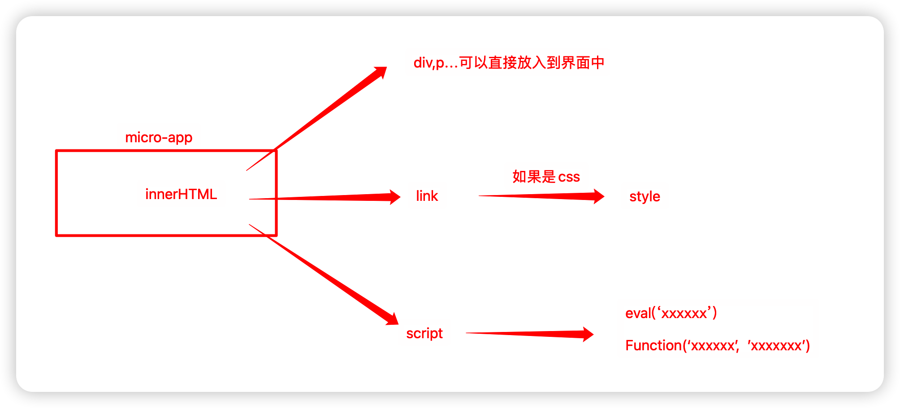

### 5、获取css静态资源地址

我们可以使用循环递归的方式提取上面字符串资源中所有遍历到的**link、style、script**标签，提取静态资源地址并格式化标签。

在**source.js**文件中，添加extraSourceDom函数，用来提取link，script这种特殊标签

```js
export default function loadHtml(app) {
  	// ......代码省略
    // 将html字符串转化为DOM结构
    const htmlDom = document.createElement("div");
    htmlDom.innerHTML = html;
    // console.log("html:", htmlDom);
  	//调用extractSourceDom函数
    extractSourceDom(htmlDom, app);
  });
}
function extractSourceDom(parent, app) {
  // 获取父元素下所有标签(其实就是micro-app-head和micro-app-body)
  // 并将伪数组转换为数组
  const children = Array.from(parent.children);

  // 递归每一个子元素
  children.length && children.forEach((child) => {
    extractSourceDom(child, app)
  })
  
  for (const dom of children) { 
    console.log(dom);
  }
}
```

上面打印`console.log(dom);`很明显就是获取了所有的子标签

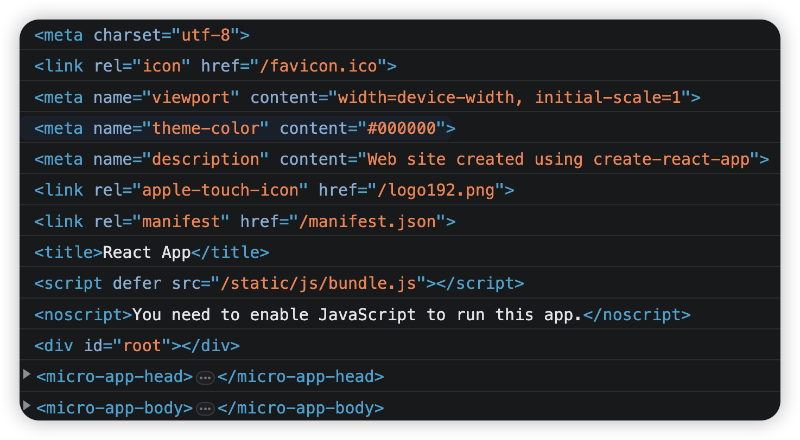

然后我们要做的事情，就是在循环中判断，到底是哪种标签，然后再进行处理

由于默认生成的子应用项目中，index.html没有link的css标签，我们手动加载一个到index.html中去，先模拟一下这个过程

bootscdn上随便找了一个css，加载到子应用的index.html中

```html
<link href="https://cdn.bootcdn.net/ajax/libs/twitter-bootstrap/5.2.3/css/bootstrap-grid.css" rel="stylesheet">
<link href="https://cdn.bootcdn.net/ajax/libs/animate.css/4.1.1/animate.compat.css" rel="stylesheet">
```

在`extractSourceDom`函数中判断是否是css资源，并放入到source缓存中

```js
function extractSourceDom(parent, app) {
  // 获取父元素下所有标签(其实就是micro-app-head和micro-app-body)
  // 并将伪数组转换为数组
  const children = Array.from(parent.children);
  
  // 递归每一个子元素
  children.length && children.forEach((child) => {
    extractSourceDom(child, app)
  })

  for (const dom of children) { 
    console.log(dom);
    if (dom instanceof HTMLLinkElement) { 
      //提取css地址
      const href = dom.getAttribute('href');
      //如果包含stylesheet并且href有地址说明是css资源
      if (dom.getAttribute('rel') === 'stylesheet' && href) {
        // 放入到source缓存中
        app.source.links.set(href, {
          code: '', // 代码内容，具体内容还需要通过fetch请求
        })
      }
      // 删除原有元素
      parent.removeChild(dom)
    }
  }
}
```

这里放入了map集合中，可以直接在上面的函数中，调用打印一下看看存放的值

```diff
export default function loadHtml(app) {
  fetchSource(app.url).then((html) => {
 		//......其他代码省略
    // 将html字符串转化为DOM结构
    const htmlDom = document.createElement("div");
    htmlDom.innerHTML = html;

    extractSourceDom(htmlDom, app);
		//查看放入到缓存中的内容
+   console.log(app.source.links);
		//app.source.links.entries().next().value 获取的是map第一个元素的数组
+		console.log(app.source.links.entries().next().value);
  });
}
```

### 6、提取css内容

css中内容，我们就必须通过ajax去远程获取了，当然既然是远程获取，所以肯定有跨域的问题，所以为什么都要求配置cors，我们这里模拟获取的远程css，主要也需要能远程获取才行

```js
/**
 * 获取link远程资源
 * @param app 应用实例
 * @param microAppHead micro-app-head，css的style标签放入到头部
 * @param htmlDom html DOM结构
 */
export function fetchLinksFromHtml(app, microAppHead, htmlDom) {
  //将map返回的MapIterator迭代器转换为数组
  //app.source.links.entries().next().value 获取的是map第一个元素的数组
  //因此Array.from转换的是一个二维数组
  const linkEntries = Array.from(app.source.links.entries());
  console.log(linkEntries);
  const fetchLinkPromise = [];
  // 遍历linkEntries数组
  for (const [href, source] of linkEntries) {
    fetchLinkPromise.push(fetchSource(href));
  }

  Promise.all(fetchLinkPromise).then(res => { 
    for (let i = 0; i < res.length; ++i) { 
      const code = res[i]; // 获取css代码资源
      // console.log(code);
      // 将代码放入到缓存中
      linkEntries[i][1].code = code;
      // 创建style标签,并放入到micro-app-head中
      const link2Style = document.createElement('style')
      link2Style.textContent = code
      microAppHead.appendChild(link2Style)
    }
    // 将htmlDom挂载到<micro-app>上，
    app.onLoad(htmlDom);
  }).catch((e) => {
    console.error('加载css出错', e)
  })
}
```

在上面的函数中调用:

```js
export default function loadHtml(app) {
  fetchSource(app.url).then((html) => {
    
    //...其他代码省略
    extractSourceDom(htmlDom, app);

    // 获取micro-app-head元素
    const microAppHead = htmlDom.querySelector('micro-app-head')
    // 如果有远程css资源，则通过fetch请求
    if (app.source.links.size) {
      fetchLinksFromHtml(app, microAppHead, htmlDom)
    } else {
      //如果没有css则直接挂载到<micro-app>上
      app.onLoad(htmlDom)
    }

    console.log(app.source.links); //查看缓存中内容
  });
}
```

### 7、将htmlDom挂载到`<micro-app></micro-app>`节点上

上面的代码中我们已经写了`app.onLoad(htmlDom)`方法，因此，我们填写此方法，目的是为了挂载具体的Dom节点到页面上

```js
// /src/micro-ce/app.js

export const appInstanceMap = new Map()
// 创建微应用
export default class CreateApp {
  
  //...其他省略

  // 资源加载完时执行
  onLoad (htmlDom) {   
    // 记录DOM结构用于后续操作
    this.source.html = htmlDom
    // 执行mount方法
    this.mount()
  }

  /**
   * 资源加载完成后进行渲染
   */
  mount() {
    // 克隆DOM节点
    const cloneHtml = this.source.html.cloneNode(true)
    // 创建一个fragment节点作为模版，这样不会产生冗余的元素
    const fragment = document.createDocumentFragment()
    Array.from(cloneHtml.childNodes).forEach((node) => {
      fragment.appendChild(node)
    })

    // // 将格式化后的DOM结构插入到容器中
    this.container.appendChild(fragment)
    console.log(this.container);

    // 标记应用为已渲染
    this.status = 'mounted'
  }
}
```

这样在页面中，已经可以看到挂载上去的内容了，只不过没有js的内容，很多东西还没有执行显示

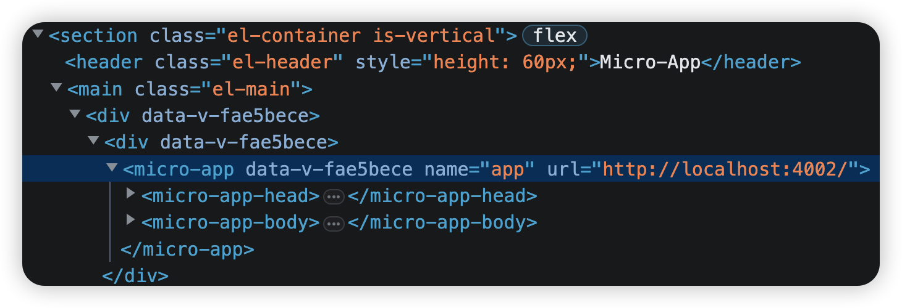

### 8、获取js地址

接下来的处理其实就和css的获取过程差不多了，

1.获取js的地址

2.根据地址去拉取js的资源内容

3.直接执行js资源字符串的内容


修改**extraSourceDom**函数，添加script标签的判断

```js
function extractSourceDom(parent, app) {
  	//......其他内容省略
  	if(如果是css的Link标签){
  		......
		}
    else if (dom instanceof HTMLScriptElement) {
      // 并提取js地址
      const src = dom.getAttribute('src')
      if (src) { // 如有有src属性，表示是远程script
        app.source.scripts.set(src, {
          code: '', // 代码内容
          isExternal: true, // 是否远程script
        })
      } else if (dom.textContent) { // 如果dom中有内容，表示是内联script
        //随机字符串名字
        const nonceStr = Math.random().toString(36).substring(2, 15)
        app.source.scripts.set(nonceStr, {
          code: dom.textContent, // 代码内容
          isExternal: false, // 是否远程script
        })
      }

      parent.removeChild(dom)
    }
  }
}
```

### 9、提取js内容

```js
/**
 * 获取js远程资源
 * @param app 应用实例
 * @param htmlDom html DOM结构
 */
export function fetchScriptsFromHtml (app, htmlDom) {
  const scriptEntries = Array.from(app.source.scripts.entries())
  // 通过fetch请求所有js资源
  const fetchScriptPromise = []
  for (let [url, info] of scriptEntries) {
    // js的url地址可能是一个本地相对路径，react生成的js路径默认为/static/js/bundle.js
    // 如果直接在基座程序中使用，会导致拼接成基座的域名，找不到资源
    // 因此需要将url地址拼接成子应用的域名
    if (!url.includes('http')) { 
      url = `${app.url.endsWith('/') ? app.url.substring(0,app.url.length-1):app.url}${url}`;
      console.log(url);
    }
    
    // 如果是内联script，则不需要请求资源
    fetchScriptPromise.push(info.code ? Promise.resolve(info.code) :  fetchSource(url))
  }

  Promise.all(fetchScriptPromise).then((res) => {
    for (let i = 0; i < res.length; i++) {
      const code = res[i]
      // 将代码放入缓存，再次渲染时可以从缓存中获取
      scriptEntries[i][1].code = code
    }

    // 处理完成后执行onLoad方法
    app.onLoad(htmlDom)
  }).catch((e) => {
    console.error('加载js出错', e)
  })
}
```

> **注意** 这里的url路径，在子应用是本地相对路径时，其实css同样有这样的问题，不过由于我们这里是手写简单实现，就简单化处理了。

比如：我们将react子应用的**index.css**从**src**目录下移入到**public**文件夹下，在**index.html**中使用**link**进行引用

```html
<link rel="stylesheet" href="/index.css">
```

这个时候，程序同样会报找不到index.css文件，道理和找不到js文件是一个道理

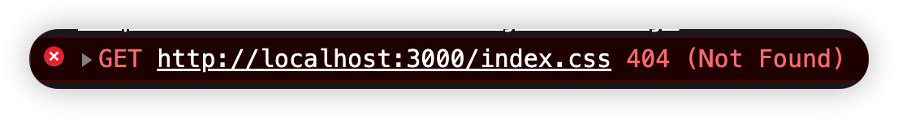

所以，同样将路径处理的代码加入到link判断的代码中去

```diff
export function fetchLinksFromHtml(app, microAppHead, htmlDom) {
	.......
  for (let [href, source] of linkEntries) {
+    if (!href.includes('http')) { 
+      href = `${app.url.endsWith('/') ? app.url.substring(0,app.url.length-1):app.url}${href}`;
+      console.log(href);
    }
    fetchLinkPromise.push(fetchSource(href));
  }
  
  ......
  }).catch((e) => {
    console.error('加载css出错', e)
  })
}
```


接下来将**fetchScriptsFromHtml**函数，放入到**loadHtml**函数中执行

```js
export default function loadHtml(app) {
  fetchSource(app.url).then((html) => {
    //......其他代码省略
    
    // 获取micro-app-head元素
    const microAppHead = htmlDom.querySelector('micro-app-head')
    // 如果有远程css资源，fetch请求资源
    if (app.source.links.size) {
      fetchLinksFromHtml(app, microAppHead, htmlDom)
    } else {
      app.onLoad(htmlDom)
    }

    // 如果有远程js资源，fetch请求资源
    if (app.source.scripts.size) {
      fetchScriptsFromHtml(app, htmlDom)
    } else {
      app.onLoad(htmlDom)
    }
  });
}
```

### 10、执行js资源

css资源直接加入到style标签内即可，js 的资源需要我们自己执行，我们可以直接使用**eval()**执行js字符串

上面的css资源我们已经使用app.onLoad函数，加载到`<micro-app>`标签中，同样，script这里我们还是加载了一次，无论如何，其实两次都是加载的**htmlDom**这个资源，所以，我们第二次的时候加载一下就可以了。

因此，在**app.js**的代码中，我们稍微做一下修改

```js
export default class CreateApp {
  //......其他代码省略

  // 资源加载完时执行
  onLoad (htmlDom) {   
    this.loadCount = this.loadCount ? this.loadCount + 1 : 1
    // 第二次执行且组件未卸载时执行渲染
    if (this.loadCount === 2 && this.status !== 'unmount') {
      // 记录DOM结构用于后续操作
      this.source.html = htmlDom
      // 执行mount方法
      this.mount()
    }
  }

  /**
   * 资源加载完成后进行渲染
   */
  mount() {
    console.log(this.source.html);
    // 克隆DOM节点
    const cloneHtml = this.source.html.cloneNode(true)
    // 创建一个fragment节点作为模版，这样不会产生冗余的元素
    const fragment = document.createDocumentFragment()
    Array.from(cloneHtml.childNodes).forEach((node) => {
      fragment.appendChild(node)
    })

    // // 将格式化后的DOM结构插入到容器中
    this.container.appendChild(fragment)
    console.log(this.container);

    // 执行js
    this.source.scripts.forEach((info) => {
      //局部执行eval，主要是保证this的全局作用域
      (0, eval)(info.code)
    })

    // 标记应用为已渲染
    this.status = 'mounted'
  }
}
```

上面的代码中，我们要把js字符串放入到**eval**中执行，使用了`(0, eval)(info.code)`这样的表达式，这其实就是一个立即执行的函数，然后将字符串`info.code`传给了**eval**。这样可以保证eval是在当前环境下执行，还是在全局环境下值。说到底，最重要的是保证如果传入字符串`info.code`中有**this**，保证**this**的作用域是指向全局的，因为上面的代码中，**eval**是放在一个函数中执行的。

大家看一下下面的例子，就能知道是什么意思了

```js
const obj = {
    foo:'jack',
    method:function(){
        eval('console.log(this)')
    }
}
obj.method();
```

上面这里打印：

```js
{foo: 'jack', method: ƒ}
```

稍微修改：

```diff
const obj = {
    foo:'jack',
    method:function(){
+        (0,eval)('console.log(this)')
    }
}
obj.method();
```

打印:

```js
Window {0: global, 1: Window, 2: global, 3: global, window: Window, self: Window, document: document, name: '', location: Location, …}
```

### 11、静态资源问题

上面这样处理完之后，我们在基座中嵌套的子应用页面，已经可以正确显示了，但是唯一的问题是，图片不显示
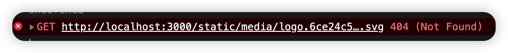

404找不到图片，但是这个路径已经说明了问题，因为图片应该是子应用的，但是找的是基座域名的地址。其实上面处理js的时候，改变url地址我们也是处理这个问题。

但是这个图片是经过react打包处理之后的文件，也就是这个路径我们在基座中是访问不了的，除非写正则表达式替换找到js字符串。但是谁知道每个应用的图片前缀地址是什么呢？

所以，最简单的修改办法，我们直接参考micro-app框架的方案。在子应用打包的时候，就修改子应用的**publicPath**路径

首先在基座程序的main.js中，加上全局环境参数*__MICRO_APP_ENVIRONMENT__*

```js
window.__MICRO_APP_ENVIRONMENT__ = true;
```


在react子应用的src下面，直接创建文件**public-path.js**文件

```js
if (window.__MICRO_APP_ENVIRONMENT__) {
  // eslint-disable-next-line
  __webpack_public_path__ = "http://localhost:4002/";
}
```

然后再react的入口文件index.js的最上面导入

```js
import "./public-path.js";
```

### 12、卸载

当micro-app元素被删除时会自动执行生命周期函数`disconnectedCallback`，我们在此处执行卸载相关操作。无非也就是将缓存中的内容给清空

**element.js**

```js
// /src/micro-ce/element.js

class MyElement extends HTMLElement {
  ...
  disconnectedCallback () {
    // 元素从DOM中删除时执行，此时进行一些卸载操作
    console.log('micro-app has disconnected')
    // 获取应用实例
    const app = appInstanceMap.get(this.name)
    // 如果有属性destroy，则完全卸载应用包括缓存的文件
    app.unmount(this.hasAttribute('destroy'))
  }
}
```

**app.js**

```js
// /src/micro-ce/app.js

export default class CreateApp {
  ...
  /**
   * 卸载应用
   * @param destroy 是否完全销毁，删除缓存资源
   */
  unmount(destroy) {
    // 更新状态
    this.status = 'unmount'
    // 清空容器
    this.container = null
    // destroy为true，则删除应用
    if (destroy) {
      appInstanceMap.delete(this.name)
    }
    console.log(this);
    console.log(appInstanceMap);
  }
}
```

页面`<micro-app></micro-app>`元素需要有`destroy`属性

```js
<micro-app name='app' url='http://localhost:4002/' destroy></micro-app>
```

