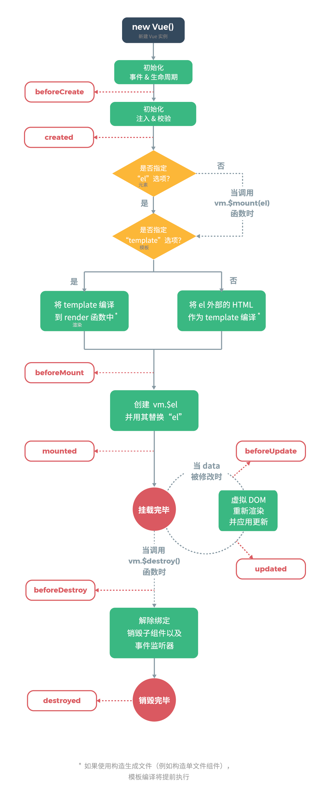

# vue 组件间的数据通信

> prevent修饰符用于v-on指令，表示阻止默认行为
> stop修饰符用于v-on指令，表示阻止事件冒泡

## 组件的状态和属性

通常讲组件中需要自身管理的数据（组件配置中的data），叫做组件状态（component state）

组件状态只能在组件内部使用，外部原则上不可以使用

1. data（state 状态）在组件中的配置和在vue实例中的配置的区别：

在组件中data必须是一个函数，而vue实例中必须是一个对象

2. 组件中可以有属性（component props），而vue实例中没有

声明组件属性时，使用短横线或小驼峰命名法

传递组件属性时，使用短横线或小驼峰命名法

属性会被提升到vue组件实例中

**组件的属性是只读的，不允许更改，根本原因是要保证单向数据流**

key是内置属性，当循环渲染自定义组件时，建议使用该属性，并且提供给唯一的值，通常是id，以便vue提高渲染效率

## 自定义事件

在组件中触发事件：```this.$emit("事件名", 事件参数...)```

当一个组件状态发生变化时，该组件会重新渲染，在渲染的过程中，可能会导致其子组件的属性发生变化，而属性的变化会导致组件重新渲染。但根本原因，是状态的变化。

v-model的本质是一个语法糖，实际上，是绑定value属性，同时监听input事件

## 生命周期



## 插槽