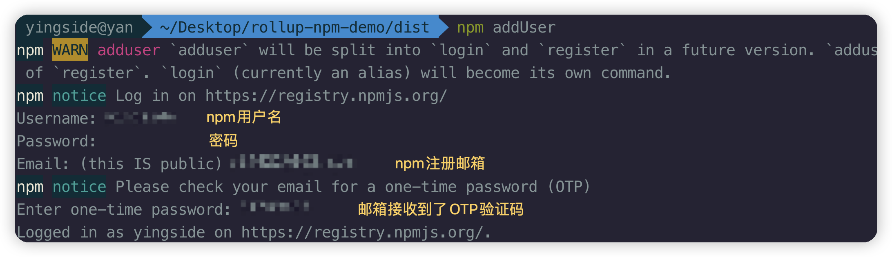
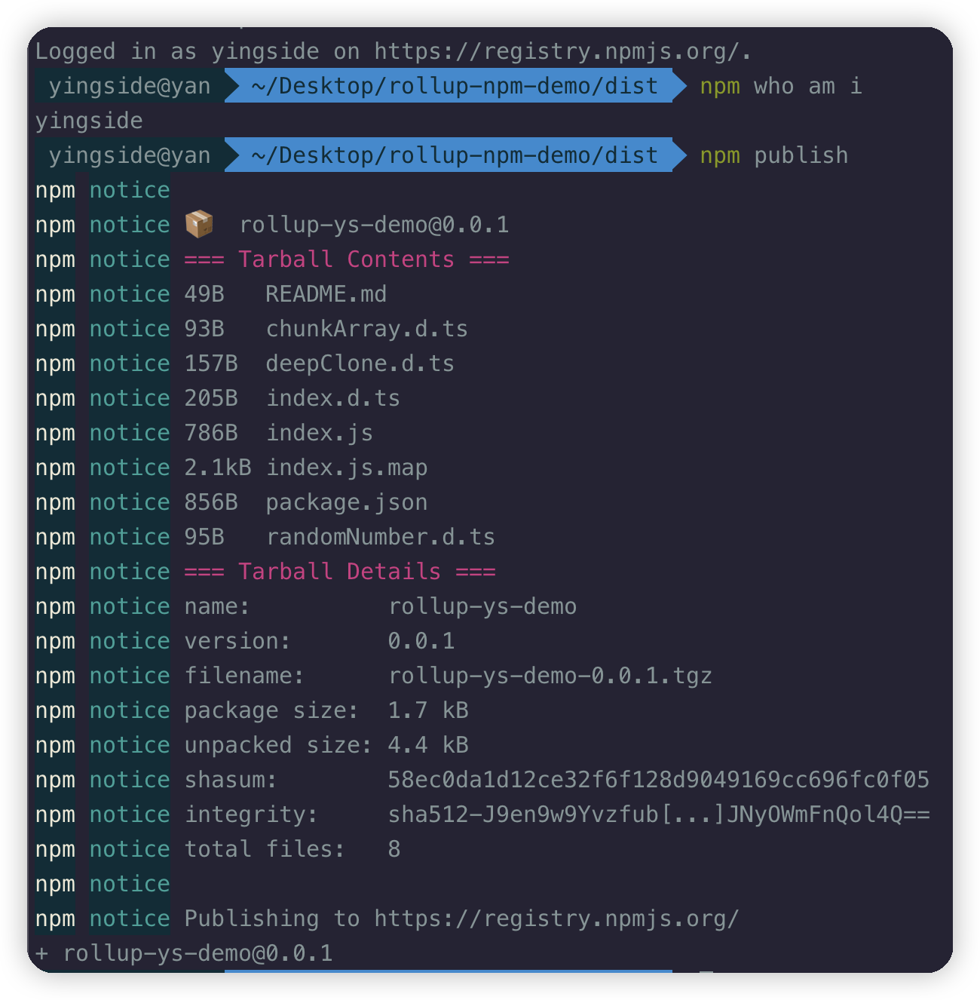

# npm发布

## node_modules

```shell
# rollup
pnpm add rollup -D 

# rollup常规插件
pnpm add @rollup/plugin-node-resolve @rollup/plugin-commonjs -D

# typescript相关
pnpm add typescript tslib @rollup/plugin-typescript -D

# @rollup/plugin-babel相关
pnpm add @rollup/plugin-babel @babel/core @babel/preset-env -D

# lodash-es
pnpm add lodash-es

# @types/lodash-es
pnpm add @types/lodash-es -D
```

## tsconfig.json文件

```javascript
// tsconfig.json
{
  "compilerOptions": {
    "target": "es5",
    "module": "ESNext",
    "declaration": true,// 根据ts文件自动生成.d.ts声明文件和js文件
    "emitDeclarationOnly": true, // 只输出.d.ts声明文件，不生成js文件
    "outDir": "./dist", // 输出目录
		......
  }
}
```


## 本地调试link安装

最终打包的文件夹是dist文件夹，我们可以把package.json文件和README.md文件都拷贝到dist目录中。

npm link地址其实就是全局安装地址：

**mac:** `/usr/local/lib/node_modules/`

**Windows:** `c:\用户(Users)\你的用户名\AppData(隐藏文件夹)\Roaming\npm\node_modules`

[pnpm link](https://pnpm.io/zh/cli/link#pnpm-link---global)

在库文件的dist目录下执行：

```shell
pnpm link --global
```

这个命令会读取package.json文件中的name，作为包文件的名字，你可以理解为，相当于pnpm将我们打包的项目，全局安装在了本地

在目标项目中，使用命令

```javascript
pnpm link --global 包名
```

进行安装。

**卸载link** [pnpm unlink](https://pnpm.io/zh/cli/unlink)


## 发布到npm


常用命令：

- `npm whoami`  检测当前登录状态

- `npm config ls`  显示当前 npm 配置信息

- `npm addUser` 、`npm login`  登录

- `npm config set registry 链接地址` 切换源地址

- `npm publish` 发布

> 注意必须使用npm源镜像才能发布，如果使用的是阿里源等镜像，需要切换成源镜像才能发布 `https://registry.npmjs.org/`



