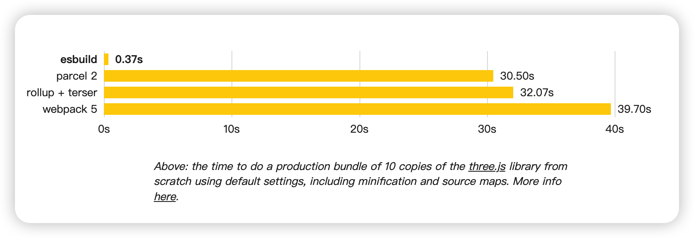
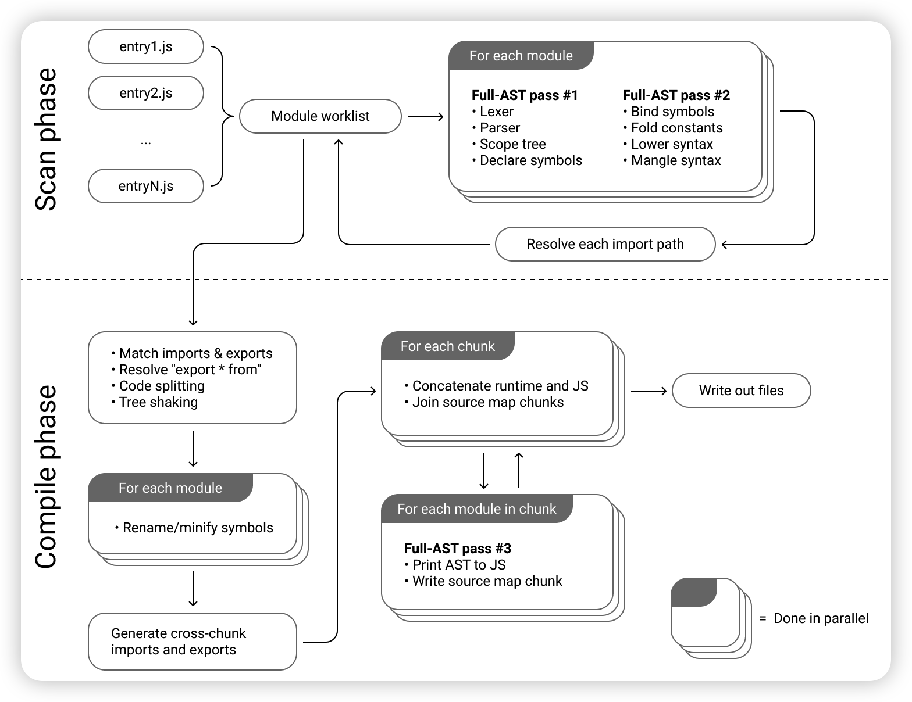
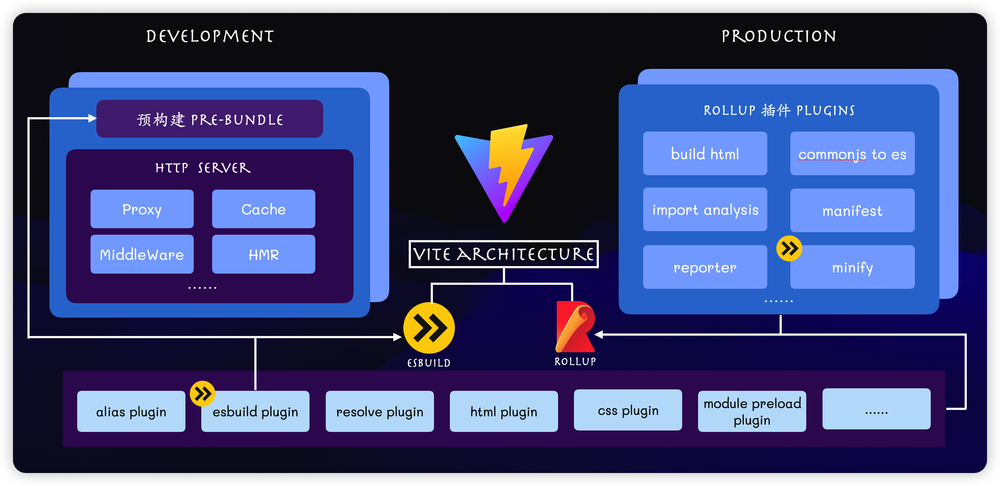
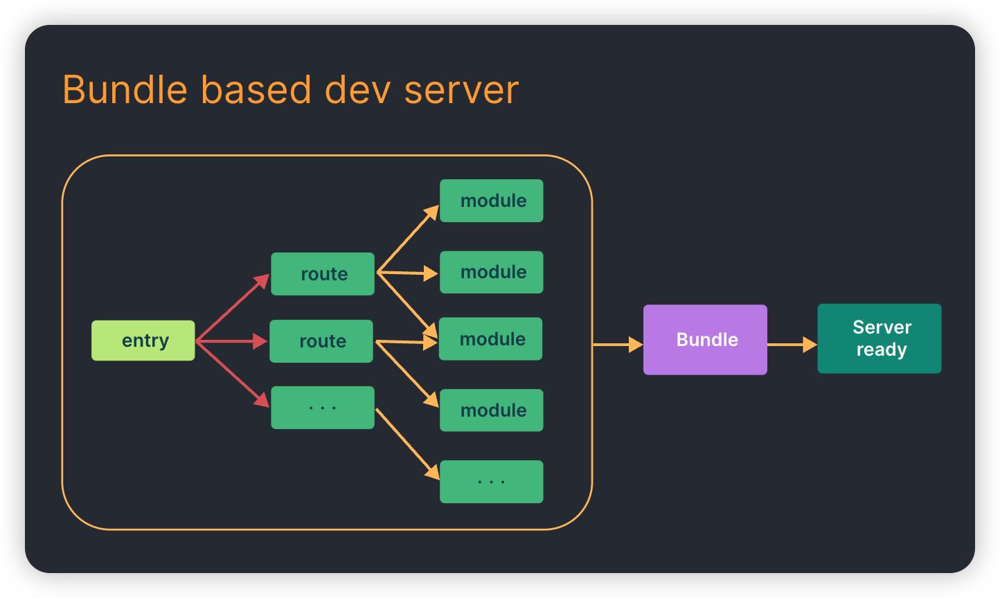
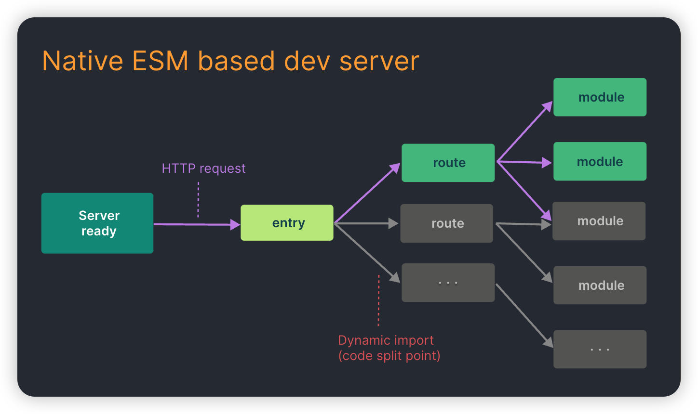

# esbuild 概述

## 什么是[esbuild](https://esbuild.github.io/)？

`esbuild` 是一款基于 `Go` 语言开发的 `javascript` 构建打包工具，相比传统的构建工具，主打性能优势。同样规模的项目，使用 `Esbuild` 可以将打包速度提升 `10` - `100` 倍，这对广大一直饱受 `Webpack` 缓慢打包速度折磨的开发人员来说，简直就是福音。

下图为esbuild和其他的构建工具用默认配置打包10个three.js库所花费时间的对比：

## 为什么能这么快？

1. **Golang 开发**

采用 Go 语言开发，传统的JS开发的构建工具并不适合资源打包这种 CPU 密集场景下，Go更具性能优势。

2. **多核并行**

go具有多线程运行能力，而JS本质上就是一门单线程语言。由于go的多个线程是可以共享内存的，所以可以将解析、编译和生成的工作并行化。

3. **从零开始**

从一开始就考虑性能，不使用第三方依赖，从始至终是使用的是一致的数据结构，从而避免数据转换无意义的消耗。

4. **内存的有效利用**

在 JS 开发的传统打包工具当中一般会频繁地解析和传递抽象语法树( AST )数据，比如 `字符串 -> TS -> JS -> 字符串，然后字符串 -> JS -> 旧的JS -> 字符串，然后字符串 -> JS -> minified JS -> 字符串`，这其中会涉及复杂的编译工具链，比如 `webpack -> babel -> terser`，每次接触到新的工具链，都得重新解析 AST，导致大量的内存占用。

esbuild 仅触及整个JavaScript AST 3次：

1. 进行词法分析，解析，作用域设置和声明符号的过程
2. 绑定符号，最小化语法。比如：将 JSX / TS转换为 JS。
3. AST生成JS，source map生成。

当 AST 数据在CPU缓存中仍然处于活跃状态时，会最大化AST数据的重用。

## 为什么还没有一统江山？

虽然esbuild有很多优点，但是缺点也非常的明显，从esbuild的官方文档[upcoming roadmap](https://esbuild.github.io/faq/#upcoming-roadmap)中，就能看出下面的问题：

- **ESbuild 没有提供 AST 的操作能力，打包产物无法降级到 ES5 及以下，不能兼容一些低版本浏览器**
- **Code splitting 还在计划中**
- **没有TS的类型检测**
- **默认不支持vue，angular等代码文件格式**
- ......

简单来说，现在希望直接将esbuild放入到生产环境中，还需要一些路走，并不足以支撑一个大型项目的开发需求。有些内容虽然我们可以通过插件去实现，但是并不是开箱即用的功能，对于项目开发的新手来说，并不友好。变相增加了开发成本

## 为什么要学习esbuild?

无论如何，`esbuild`为我们所熟知，还是因为[**Vite**](https://cn.vitejs.dev/)，`esbuild`是组成`Vite`的两架马车之一。

下图描述了`Vite`的架构组成:

## 为什么Vite要使用esbuild？

一个字...快

现在来说，Vite在下面几个地方都依托于esbuild，而未来随着esbuild的完善，应该会做进一步处理

- **依赖预构建---作为 Bundle 工具**
- **单文件编译——作为 TS 和 JSX 编译工具**
- **代码压缩——作为压缩工具**

## 什么是no-bundle?

`ESM`是`JavaScript`提出的官方标准化模块系统，不同于之前的`CJS`，`AMD`，`CMD`等等，`ESM`提供了更原生以及更动态的模块加载方案，最重要的就是它是浏览器原生支持的，也就是说我们可以直接在浏览器中去执行`import`，动态引入我们需要的模块，而不是把所有模块打包在一起。

 Vite 是一个提倡 `no-bundle` 的构建工具，相比于传统的 Webpack，能做到开发时的模块按需编译，而不用先打包完再加载。

## 什么是依赖预构建？

模块代码其实分为两部分，一部分是源代码，也就是业务代码，另一部分是第三方依赖的代码，即`node_modules`中的代码。所谓的`no-bundle`只是对于源代码而言，对于第三方依赖而言，我们基本不会去改变他，Vite 还是选择 bundle(打包)，这个部分，就依赖于`esbuild`。

但是关键点是，为什么在开发阶段我们要对第三方依赖进行预构建? 如果不进行预构建会怎么样？

首先 Vite 是基于浏览器原生 ES 模块规范实现的 Dev Server，不论是应用代码，还是第三方依赖的代码，理应符合 ESM 规范才能够正常运行。但是，我们没有办法控制第三方的打包规范。还有相当多的第三方库仍然没有 ES 版本的产物。

此外，ESM还有一个比较重要的问题——**请求瀑布流问题**。ESM的每个`import`都会触发一次新的文件请求，因此在`依赖层级深`、`涉及模块数量多`的情况下，会触发很多个网络请求，巨大的请求量加上 **Chrome 对同一个域名下只能同时支持 6个 HTTP 并发请求的限制**，导致页面加载十分缓慢，与 Vite 主导性能优势的初衷背道而驰。

在进行**依赖的预构建**之后，这种第三方库的代码被打包成了一个文件，这样请求的数量会骤然减少，页面加载也快了许多

