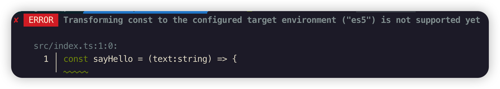
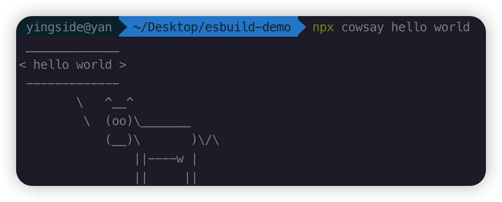
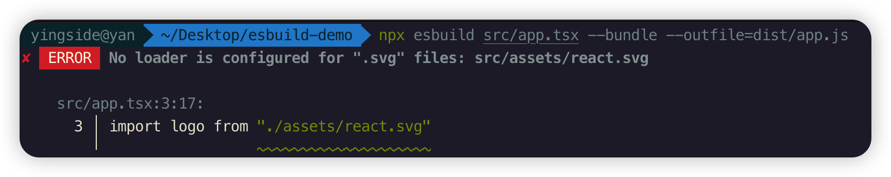

## esbuild 命令行调用

使用 Esbuild 有 2 种方式，分别是 **命令行调用**和**代码调用**。

无论如何我先`npm init -y`创建一个新项目，然后通过如下的命令完成 Esbuild 的安装:

```javascript
npm i esbuild
```

查看esbuild版本

```javascript
./node_modules/.bin/esbuild --version
```

创建ts文件

```javascript
const sayHello = (text:string) => { 
  console.log(`hello ${text}`);
}
sayHello('world!');
```

ts文件编译,指定输出文件位置

```javascript
./node_modules/.bin/esbuild src/index.ts --outfile=dist/index.js
```

## 对比tsc的编译

```javascript
tsc src/index.ts
```

默认转成的是ES5语法

```javascript
var sayHello = function (text) {
    console.log("hello ".concat(text));
};
sayHello('world!');
```

可以给一些参数

```javascript
tsc src/index.ts --target es6 --outFile dist/index.js
```

其实esbuild也能指定ES的转换版本

```javascript
./node_modules/.bin/esbuild src/index.ts  --outfile=dist/index.js --target=esnext
```

但是注意，esbuild只支持es6以上的版本，因此，如果你指定es5的版本，就会报出如下的错误

```javascript
./node_modules/.bin/esbuild src/index.ts  --outfile=dist/index.js --target=es5
```



关键是要看执行了多少时间

```javascript
time tsc src/index.ts --target es6 --outFile dist/index.js
```

> **注意**：**time为liunx命令**，这里只是演示时间效果，windows系统上不能复现这个命令效果不用强求

## npx 软件包运行器

如果你想执行一个本地安装的软件包，你只需要输入：

```bash
$ npx your-package
```

npx 将检查 `<command>` 或 `<package>` 是否存在于 `$PATH` 或本地项目的二进制文件中，如果存在，npx 将执行它。

上面的代码可以直接简写为

```javascript
npx esbuild src/index.ts --outfile=dist/index.js
```

## 执行以前没有安装的软件包

npx甚至能够执行以前没有安装的软件包。

让我们通过运行来测试一下：

```bash
$ npx cowsay hello world	
```



## bundle

```javascript
npx src/index.ts  --outfile=dist/index.js --target=es6 --bundle
```

当`--bundle`启用后，默认输出[格式](https://esbuild.github.io/api/#format)设置为`iife`，它将生成的 JavaScript 代码包装在立即调用的函数表达式中，以防止变量泄漏到全局范围内。

这样看着不是太明显，我们可以导入react相关包，模拟一下相关打包情况

```javascript
npm install react react-dom @types/react @types/react-dom
```

**App.tsx**

```javascript
import * as React from 'react'
import * as Server from 'react-dom/server'

let Greet = () => <h1>Hello, world!</h1>
console.log(Server.renderToString(<Greet />))
```

我们可以直接将这个tsx文件进行编译打包，你会看到，包括react的相关内容，也都会打包到生成的文件中

```javascript
npx esbuild src/app.tsx --outfile=dist/app.js --bundle
```

当然，如果你想压缩的话，也可以很简单的加上`--minify`属性

```javascript
npx esbuild src/app.tsx --outfile=dist/app.js --bundle --minify
```

## [Content Types](https://esbuild.github.io/content-types/)

但是这里你需要留意一个问题，tsx其实是react的语法后缀，但是esbuild也能直接进行默认编译。esbuild内置了内容类型，每个内容类型都有一个关联的**“加载器”-loader**。它告诉 esbuild 如何解释文件内容。默认情况下，某些文件扩展名已经为其配置了加载器

比如，如果后缀名是`tsx`或者`jsx`，就会自动的加载**jsx loader**加载器。换句话说，如果后缀名不为`tsx`或者`jsx`，我们可以手动的为其设置加载器loader

测试：`text.ts`,**下面的jsx代码肯定会报错**，不过这里不纠结，直接在编译的时候，使用loader进行转换

```javascript
import * as React from 'react'
import * as Server from 'react-dom/server'

let Greet = () => <h1>Hello, world!</h1>
console.log(Server.renderToString(<Greet />))
```

```javascript
npx esbuild src/test.ts --bundle --outfile=dist/test.js --loader:.ts=tsx
```

当然有一些并非默认就可以直接处理的，比如图片，我们加入张图片到`app.tsx`的代码中

```javascript
import * as React from 'react'
import * as Server from 'react-dom/server'
import logo from "./assets/react.svg"

let Greet = () => (
  <div>
    
    <h1>Hello, world!</h1>
  </div>
  
)
console.log(Server.renderToString(<Greet />))
```

由于我们并没有工程化的导入react工程，因此TS类型肯定会有一些问题，我们可以简单的引入一下svg的类型，直接在根目录下创建`types.d.ts`文件，声明图片类型

```javascript
declare module '*.svg' {
  const src: string
  export default src
}
declare module '*.png' {
  const src: string
  export default src
}
declare module '*.jpg' {
  const src: string
  export default src
}
declare module '*.jpeg' {
  const src: string
  export default src
}
declare module '*.gif' {
  const src: string
  export default src
}
declare module '*.ico' {
  const src: string
  export default src
}
declare module '*.webp' {
  const src: string
  export default src
}
declare module '*.avif' {
  const src: string
  export default src
}
```

一般情况下，我们通过脚手架创建的项目，其实都会有一个类似于`react-app-env.d.ts`或者 `vite-env.d.ts`文件，里面内容大致如下：

```javascript
/// <reference types="react-scripts" />
或者
/// <reference types="vite/client" />
```

你可以在对应的types声明文件中找到相应的类型声明

无论怎么样，加入了图片之后，再通过esbuild直接打包，就会报错



对于一些简单的图片，我们可以直接通过[data url](https://esbuild.github.io/content-types/#data-url)来进行处理，加上下面的属性，可以把svg图片转换为

```javascript
npx esbuild src/app.tsx --outfile=dist/app.js --bundle --loader:.svg=dataurl
```
