# 页面性能监控

我们都听说过性能的重要性。但当我们谈起性能，以及让网站"速度提升"时，我们具体指的是什么？

`其实性能是相对的`：

- 某个网站可能对一个用户来说速度很快（网速快，设备强大的情况下），但可能对另一个用户来说速度很慢（网速慢，设备低端的情况下）。
- 两个网站完成加载所需的时间或许相同，但其中一个却 **显得** 加载速度更快（如果该网站逐步加载内容，而不是等到最后才一起显示）。
- 一个网站可能 **看起来** 加载速度很快，但随后对用户交互的响应速度却很慢（或根本无响应）。

因此，在谈论性能时，重要的是做到精确，并且根据能够进行定量测量的客观标准来论及性能。这些标准就是 **指标**。

**`前端性能监控，就是要监测页面的性能情况，将各种的性能数据指标量化并收集`**


## Lighthouse灯塔

**Lighthouse** 是一个网站性能测评工具， 它是 Google Chrome 推出的一个开源自动化工具。能够对网页多方面的效果指标进行评测，并给出最佳实践的建议以帮助开发者改进网站的质量。它的使用方法也非常简单，我们只需要提供一个要测评的网址，它将针对此页面运行一系列的测试，然后生成一个有关页面性能的报告。通过报告我们就可以知道需要采取哪些措施来改进应用的性能和体验。

在高版本（ >= 60）的 Chrome 浏览器中，**Lighthouse** 已经直接集成到了调试工具 **DevTools**中了，因此不需要进行任何安装或下载。

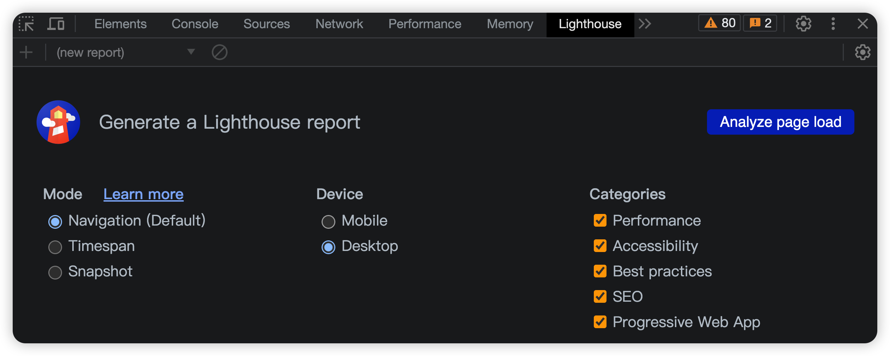

**Lighthouse 能够生成一份该网站的报告，比如下图：**

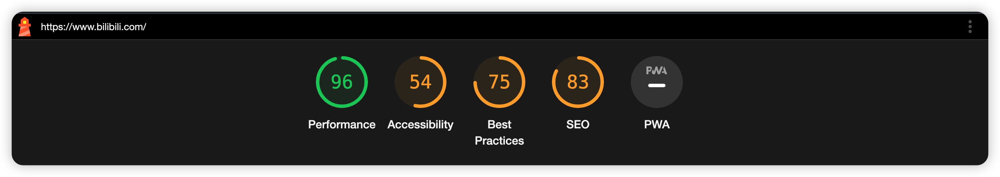

**这里重点关注`Performance性能评分`**

性能评分的分值区间是 0 到 100，如果出现 0 分，通常是在运行 Lighthouse 时发生了错误，满分 100 分代表了网站已经达到了 98 分位值的数据，而 50 分则对应 75 分位值的数据

#### Lighthouse 给出 Opportunities 优化建议

Lighthouse 会针对当前网站，给出一些`Opportunities`优化建议

**Opportunities 指的是优化机会，它提供了详细的建议和文档，来解释低分的原因，帮助我们具体进行实现和改进**

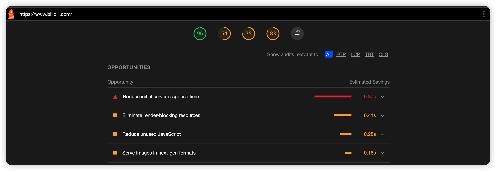

**Opportunities 给出优化建议列表**

| 问题                             | 建议                                                  |
| -------------------------------- | ----------------------------------------------------- |
| Remove unused JavaScript         | 去掉无用 js 代码                                      |
| Preload key requests             | 首页资源 preload 预加载                               |
| Remove unused CSS                | 去掉无用 css 代码                                     |
| Serve images in next-gen formats | 使用新的图片格式，比如 webp 相对 png jpg 格式体积更小 |
| Efficiently encode images        | 比如压缩图片大小                                      |
| Preconnect to required origins   | 使用 preconnect or dns-prefetch DNS 预解析            |

#### Lighthouse 给出 Diagnostics 诊断问题列表

**`Diagnostics` 指的是现在存在的问题，为进一步改善性能的验证和调整给出了指导**

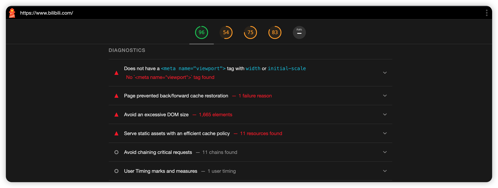

**Diagnostics 诊断问题列表**

| 问题                                                         | 影响                                                         |
| ------------------------------------------------------------ | ------------------------------------------------------------ |
| A long cache lifetime can speed up repeat visits to your page | 这些资源需要提供长的缓存期，现发现图片都是用的协商缓存，显然不合理 |
| Image elements do not have explicit width and height         | 给图片设置具体的宽高，减少 cls 的值                          |
| Avoid enormous network payloads                              | 资源太大增加网络负载                                         |
| Minimize main-thread work                                    | 最小化主线程 这里会执行解析 Html、样式计算、布局、绘制、合成等动作 |
| Reduce JavaScript execution time                             | 减少非必要 js 资源的加载，减少必要 js 资源的大小             |
| Avoid large layout shifts                                    | 避免大的布局变化，从中可以看到影响布局变化最大的元素         |


## Performance 寻找性能瓶颈

打开 Chrome 浏览器控制台，选择`Performance`选项，点击左侧`reload图标`

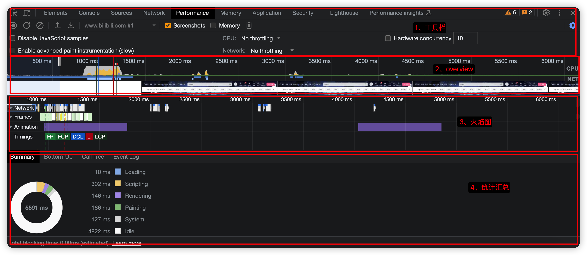

## W3C标准化

官方地址：[Navigation Timing Level 2](https://www.w3.org/TR/navigation-timing-2/)

为了帮助开发者更好地衡量和改进前端页面性能，`W3C性能小组`引入了 `Navigation Timing API` ，实现了自动、精准的页面性能打点；开发者可以通过 `window.performance` 属性获取。


`图中指标的解读`可以在 [developer.mozilla.org/zh-CN/docs/…](https://developer.mozilla.org/zh-CN/docs/Web/API/PerformanceTiming) 中查看

| 时间                       | 作用                                                         |
| -------------------------- | ------------------------------------------------------------ |
| `navigationStart`          | （可以理解为该页面的起始时间）同一个浏览器上下文的上一个文档卸载结束时的时间戳，如果没有上一个文档，这个值会和 fetchStart 相同 |
| unloadEventStart           | unload 事件抛出时的时间戳,如果没有上一个文档，这个值会是 0   |
| unloadEventEnd             | unload 事件处理完成的时间戳,如果没有上一个文档，这个值会是 0 |
| redirectStart              | 第一个 HTTP 重定向开始时的时间戳，没有重定向或者重定向中的不同源，这个值会是 0 |
| redirectEnd                | 最后一个 HTTP 重定向开始时的时间戳，没有重定向或者重定向中的不同源，这个值会是 0 |
| fetchStart                 | 浏览器准备好使用 HTTP 请求来获取文档的时间戳。发送在检查缓存之前 |
| domainLookupStart          | 域名查询开始的时间戳，如果使用了持续连接或者缓存，则与 fetchStart 一致 |
| domainLookupEnd            | 域名查询结束的时间戳，如果使用了持续连接或者缓存，则与 fetchStart 一致 |
| connectStart               | HTTP 请求开始向服务器发送时的时间戳，如果使用了持续连接，则与 fetchStart 一致 |
| connectEnd                 | 浏览器与服务器之间连接建立（所有握手和认证过程全部结束）的时间戳，如果使用了持续连接，则与 fetchStart 一致 |
| secureConnectionStart      | 浏览器与服务器开始安全连接握手时的时间戳，如果当前网页不需要安全连接，这个值会是 0 |
| `requestStart`             | 浏览器向服务器发出 HTTP 请求的时间戳                         |
| `responseStart`            | 浏览器从服务器收到（或从本地缓存读取）第一个字节时的时间戳   |
| responseEnd                | 浏览器从服务器收到（或从本地缓存读取）最后一个字节时（如果在此之前 HTTP 连接已经关闭，则返回关闭时）的时间戳 |
| `domLoading`               | 当前网页 DOM 结构开始解析时的时间戳                          |
| domInteractive             | 当前网页 DOM 结构解析完成，开始加载内嵌资源时的时间戳        |
| domContentLoadedEventStart | 需要被执行的脚本已经被解析的时间戳                           |
| domContentLoadedEventEnd   | 需要立即执行的脚本已经被执行的时间戳                         |
| `domComplete`              | 当前文档解析完成的时间戳                                     |
| loadEventStart             | load 事件被发送时的时间戳，如果这个事件还未被发送，它的值将会是 0 |
| `loadEventEnd`             | load 事件结束时的时间戳，如果这个事件还未被发送，它的值将会是 0 |


我们可以通过`performance API` 获取下面的内容

```javascript
export default function performance() {

  const {
    fetchStart,
    connectStart,
    connectEnd,
    requestStart,
    responseStart,
    responseEnd,
    domLoading,
    domInteractive,
    domContentLoadedEventStart,
    domContentLoadedEventEnd,
    loadEventStart,
    domainLookupStart,
    domainLookupEnd,
    navigationStart
  } = window.performance.timing;
  console.log(fetchStart,
    connectStart,
    connectEnd,
    requestStart,
    responseStart,
    responseEnd,
    domLoading,
    domInteractive,
    domContentLoadedEventStart,
    domContentLoadedEventEnd,
    loadEventStart,
    domainLookupStart,
    domainLookupEnd,
    navigationStart)
  
  const tcp = connectEnd - connectStart; // TCP连接耗时
  const dns = domainLookupEnd - domainLookupStart; // dns 解析时长
  const ttfbTime = responseStart - requestStart; // 首字节到达时间
  const responseTime = responseEnd - responseStart; // response响应耗时
  const parseDOMTime = loadEventStart - domLoading; // DOM解析渲染的时间
  const domContentLoadedTime = domContentLoadedEventEnd - domContentLoadedEventStart; // DOMContentLoaded事件回调耗时
  const timeToInteractive = domInteractive - fetchStart; // 首次可交互时间
  const loadTime = loadEventStart - fetchStart; // 完整的加载时间
  const whiteScreen = domLoading - navigationStart; // 白屏时间
  

  console.log(tcp,dns,ttfbTime,responseTime,parseDOMTime,domContentLoadedTime,timeToInteractive,loadTime,whiteScreen)
}

```

一大堆的变量和不知道的计算规则，你不用纠结这一堆，因为**已经被废弃了**。

**w3c level2** 扩充了 `performance` 的定义，并增加了 `PerformanceObserver` 的支持。

## [PerformanceObserver](https://developer.mozilla.org/zh-CN/docs/Web/API/PerformanceObserver)

**`PerformanceObserver`** 用于*监测*性能度量事件，在浏览器的性能时间轴记录新的 [performance entry](https://developer.mozilla.org/zh-CN/docs/Web/API/PerformanceEntry) 的时候将会被通知。

简单来说，我们只需要指定预定的[entryType](https://developer.mozilla.org/zh-CN/docs/Web/API/PerformanceEntry/entryType)，然后就能通过PerformanceObserver的回调函数获取相应的性能指标数值

```javascript
new PerformanceObserver((entryList) => {
  for (const entry of entryList.getEntriesByName('first-contentful-paint')) {
    console.log('FCP candidate:', entry.startTime, entry);
  }
}).observe({type: 'paint', buffered: true});
```

那么关键点来了，性能指标到底有些啥，每个性能指标有什么作用？

w3c制定了一大堆指标，不过google发布了`web-vitals` ，它是一个开源的用以衡量性能和用户体验的工具，对于我们现在来说，这个开源工具中所提到的指标已经足够用了。而且现在本身也是业界标准

## [web-vitals](https://web.dev/metrics/)

### [以用户为中心的性能指标](https://web.dev/user-centric-performance-metrics/)

什么叫以用户为中心的性能指标呢？其实就是可以直接的体现出用户的使用体验的指标；目前 `Google` 定义了`FCP`、`LCP`、`CLS` 等体验指标，

对于用户体验来说，指标可以简单归纳为 `加载速度`、`视觉稳定`、`交互延迟`等几个方面；

- `加载速度` 决定了 **用户是否可以尽早感受到页面已经加载完成**
- `视觉稳定` 衡量了 **页面上的视觉变化对用户造成的负面影响大小**
- `交互延迟` 决定了 **用户是否可以尽早感受到页面已经可以操作**

### [什么是 FCP？](https://web.dev/fcp/)

首次内容绘制 (FCP) 指标测量页面从开始加载到页面内容的任何部分在屏幕上完成渲染的时间。对于该指标，"内容"指的是文本、图像（包括背景图像）、`<svg>`元素或非白色的`<canvas>`元素。

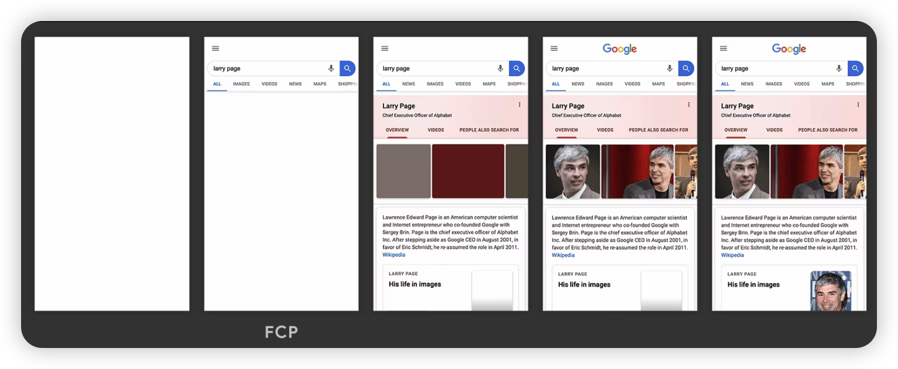

在上方的加载时间轴中，FCP 发生在第二帧，因为那是首批文本和图像元素在屏幕上完成渲染的时间点。

您会注意到，虽然部分内容已完成渲染，但并非所有内容都已经完成渲染。这是*首次*内容绘制 (FCP) 与*Largest Contentful Paint 最大内容绘制 (LCP)*（旨在测量页面的主要内容何时完成加载）之间的重要区别。

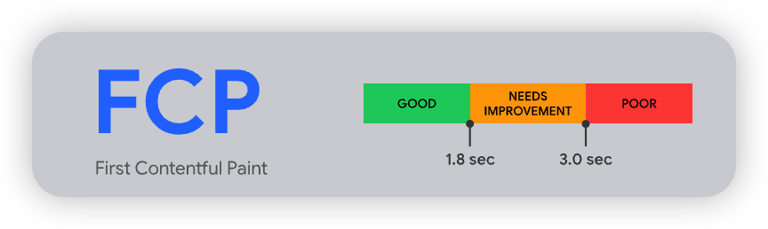

#### 怎样算是良好的 FCP 分数？

为了提供良好的用户体验，网站应该努力将首次内容绘制控制在**1.8 秒**或以内。为了确保您能够在大部分用户的访问期间达成建议目标值，一个良好的测量阈值为页面加载的**第 75 个百分位数**，且该阈值同时适用于移动和桌面设备。

### [什么是 LCP？](https://web.dev/lcp/)

最大内容绘制 (LCP) 指标会根据页面[首次开始加载](https://w3c.github.io/hr-time/#timeorigin-attribute)的时间点来报告可视区域内可见的最大[图像或文本块](https://web.dev/lcp/#what-elements-are-considered)完成渲染的相对时间。

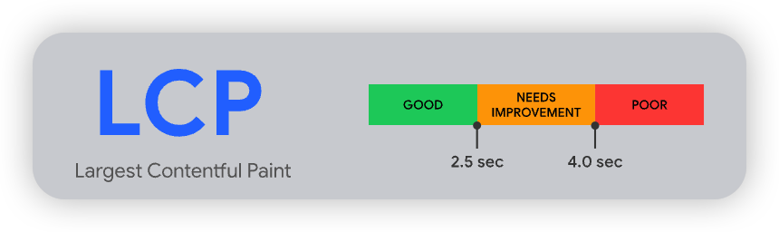

#### 哪些元素在考量范围内

根据当前[最大内容绘制 API](https://wicg.github.io/largest-contentful-paint/)中的规定，最大内容绘制考量的元素类型为：

- ``元素
- 内嵌在`<svg>`元素内的`<image>`元素
- `<video>`元素（使用封面图像）
- 通过[`url()`](https://developer.mozilla.org/docs/Web/CSS/url())函数（而非使用[CSS 渐变](https://developer.mozilla.org/docs/Web/CSS/CSS_Images/Using_CSS_gradients)）加载的带有背景图像的元素
- 包含文本节点或其他行内级文本元素子元素的[块级元素](https://developer.mozilla.org/docs/Web/HTML/Block-level_elements)。

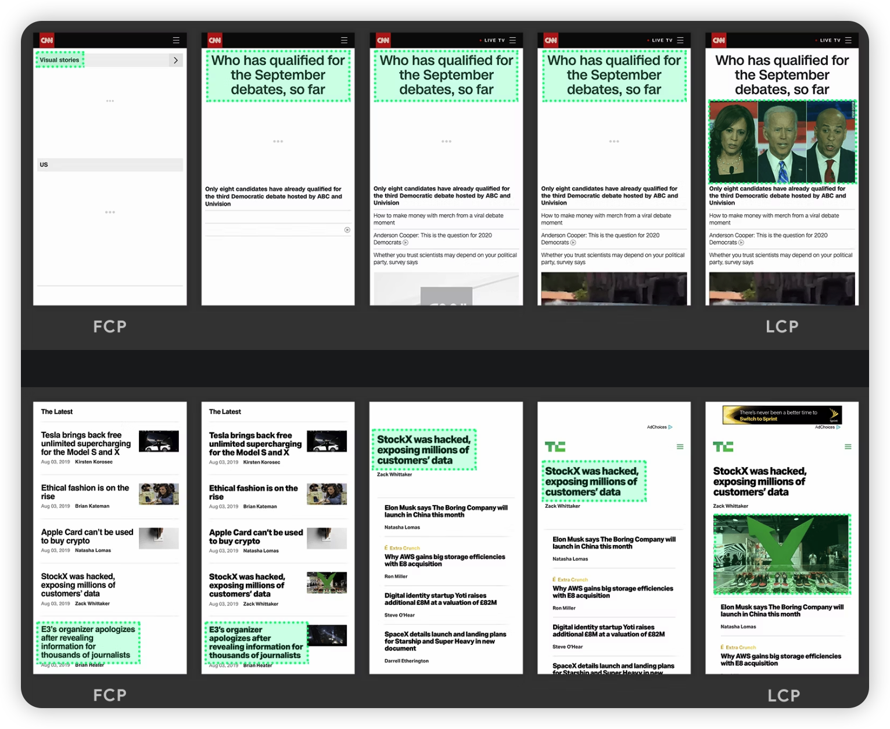

在上方的两个时间轴中，最大元素随内容加载而变化。在第一个示例中，新内容被添加进 DOM，并因此使最大元素发生了改变。在第二个示例中，由于布局的改变，先前的最大内容从可视区域中被移除。

虽然延迟加载的内容通常比页面上已有的内容更大，但实际情况并非一定如此。接下来的两个示例显示了在页面完全加载之前出现的最大内容绘制。

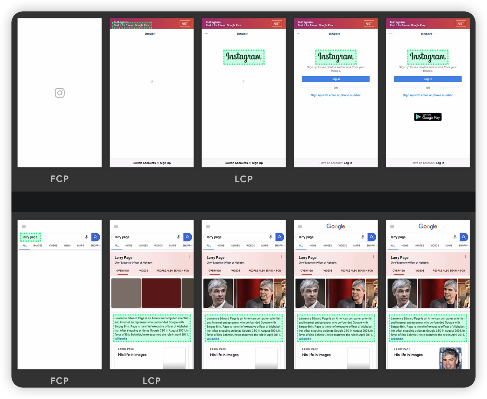

在第一个示例中，Instagram 标志加载得相对较早，即使其他内容随后陆续显示，但标志始终是最大元素。在 Google 搜索结果页面示例中，最大元素是一段文本，这段文本在所有图像或标志完成加载之前就显示了出来。由于所有单个图像都小于这段文字，因此这段文字在整个加载过程中始终是最大元素。

### [什么是 CLS?](https://web.dev/cls/)

CLS 测量整个页面生命周期内发生的所有[意外](https://web.dev/cls/#expected-vs-unexpected-layout-shifts)布局偏移中最大一连串的*布局偏移分数*。

您是否曾经历过在网上阅读一篇文章，结果页面上的某些内容突然发生改变？文本在毫无预警的情况下移位，导致您找不到先前阅读的位置。或者更糟糕的情况：您正要点击一个链接或一个按钮，但在您手指落下的瞬间，诶？链接移位了，结果您点到了别的东西！

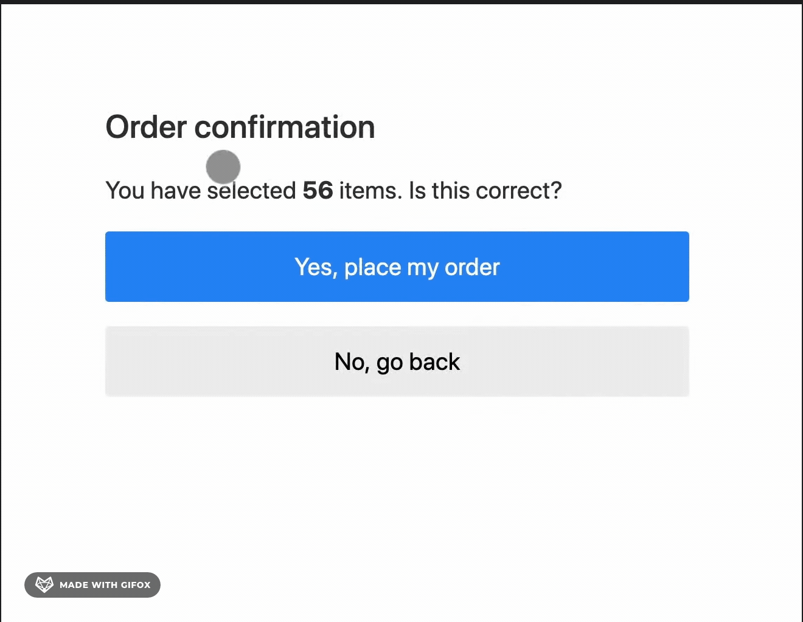

#### 怎样算是良好的 CLS 分数？

为了提供良好的用户体验，网站应该努力将 CLS 分数控制在**0.1** 或以下。为了确保您能够在大部分用户的访问期间达成建议目标值，一个良好的测量阈值为页面加载的**第 75 个百分位数**，且该阈值同时适用于移动和桌面设备。

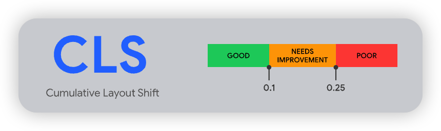

#### 影响分数

[影响分数](https://github.com/WICG/layout-instability#Impact-Fraction)测量*不稳定元素*对两帧之间的可视区域产生的影响。

前一帧*和*当前帧的所有*不稳定元素*的可见区域集合（占总可视区域的部分）就是当前帧的*影响分数*。

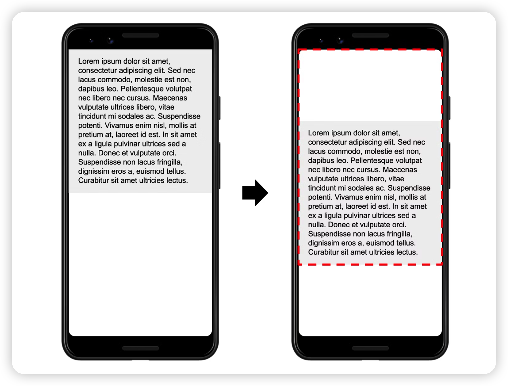

在上图中，有一个元素在一帧中占据了一半的可视区域。接着，在下一帧中，元素下移了可视区域高度的 25%。红色虚线矩形框表示两帧中元素的可见区域集合，在本示例中，该集合占总可视区域的 75%，因此其*影响分数*为`0.75` 。

### [什么是 FID？](https://web.dev/fid/)

FID 测量从用户第一次与页面交互（例如当他们单击链接、点按按钮或使用由 JavaScript 驱动的自定义控件）直到浏览器对交互作出响应，并实际能够开始处理事件处理程序所经过的时间。

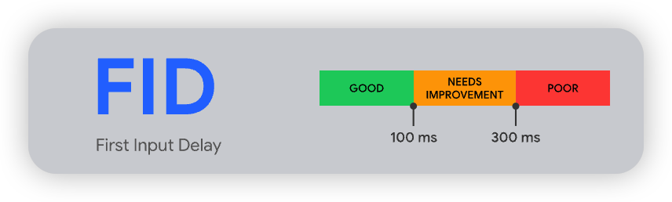

#### 如果交互没有事件侦听器怎么办？ 

FID 测量接收到输入事件的时间点与主线程下一次空闲的时间点之间的差值。这就意味着**即使在尚未注册事件侦听器的情况下，**FID 也会得到测量。这是因为许多用户交互的执行并不需要事件侦听器，但*一定*需要主线程处于空闲期。

例如，在对用户交互进行响应前，以下所有 HTML 元素都需要等待主线程上正在进行的任务完成运行：

- 文本字段、复选框和单选按钮 (`<input>` 、 `<textarea>`)
- 下拉选择列表（`<select>`）
- 链接 (`<a>`)

#### 为什么只考虑首次输入？

虽然任何输入延迟都可能导致糟糕的用户体验，但我们主要建议您测量首次输入延迟，原因如下：

- 首次输入延迟将会是用户对您网站响应度的第一印象，而第一印象对于塑造我们对网站质量和可靠性的整体印象至关重要。
- 我们现如今在网络上看到的最大的交互性问题发生在页面加载期间。因此，我们认为首先侧重于改善网站的首次用户交互将对改善网络的整体交互性产生最大的影响。
- 我们推荐网站针对较高的首次输入延迟采取的解决方案（代码拆分、减少 JavaScript 的预先加载量等）不一定与针对页面加载后输入延迟缓慢的解决方案相同。通过分离这些指标，我们将能够为网页开发者提供更确切的性能指南。

## 以技术为中心的性能指标


什么叫以技术为中心的性能指标呢？

我们再来看上面这张之前放过的图，这是 `W3C Performance Timeline Level 2` 的模型图，图中很多的时间点、时间段，对于用户来说或许并不需要知道，但是 `对于技术人员来说` ，**采集其中有意义的时间段，做成瀑图，可以让我们`从精确数据的角度`对网站的性能有一个定义，有一个优化的方向；**

### 关键时间点

| 字段      | 描述                                    | 计算公式                            | 备注                                                         |
| --------- | --------------------------------------- | ----------------------------------- | ------------------------------------------------------------ |
| FP        | 白屏时间                                | responseEnd - fetchStart            | 从请求开始到浏览器开始解析第一批HTML文档字节的时间。         |
| TTI       | 首次可交互时间                          | domInteractive - fetchStart         | 浏览器完成所有HTML解析并且完成DOM构建，此时浏览器开始加载资源。 |
| DomReady  | HTML加载完成时间也就是 DOM Ready 时间。 | domContentLoadEventEnd - fetchStart | 单页面客户端渲染下，为生成模板dom树所花费时间；非单页面或单页面服务端渲染下，为生成实际dom树所花费时间' |
| Load      | 页面完全加载时间                        | loadEventStart - fetchStart         | Load=首次渲染时间+DOM解析耗时+同步JS执行+资源加载耗时。      |
| FirstByte | 首包时间                                | responseStart - domainLookupStart   | 从DNS解析到响应返回给浏览器第一个字节的时间                  |

### 关键时间段

| 字段  | 描述            | 计算公式                                  | 备注                                                         |
| ----- | --------------- | ----------------------------------------- | ------------------------------------------------------------ |
| DNS   | DNS查询耗时     | domainLookupEnd - domainLookupStart       | 如果使用长连接或本地缓存，则数值为0                          |
| TCP   | TCP连接耗时     | connectEnd - connectStart                 | 如果使用长连接或本地缓存，则数值为0                          |
| SSL   | SSL安全连接耗时 | connectEnd - secureConnectionStart        | 只在HTTPS下有效，判断secureConnectionStart的值是否大于0,如果为0，转为减connectEnd |
| TTFB  | 请求响应耗时    | responseStart - requestStart              | TTFB有多种计算方式，相减的参数可以是 requestStart 或者 startTime |
| Trans | 内容传输耗时    | responseEnd - responseStart               | 无                                                           |
| DOM   | DOM解析耗时     | domInteractive - responseEnd              | 无                                                           |
| Res   | 资源加载耗时    | loadEventStart - domContentLoadedEventEnd | 表示页面中的同步加载资源。                                   |

