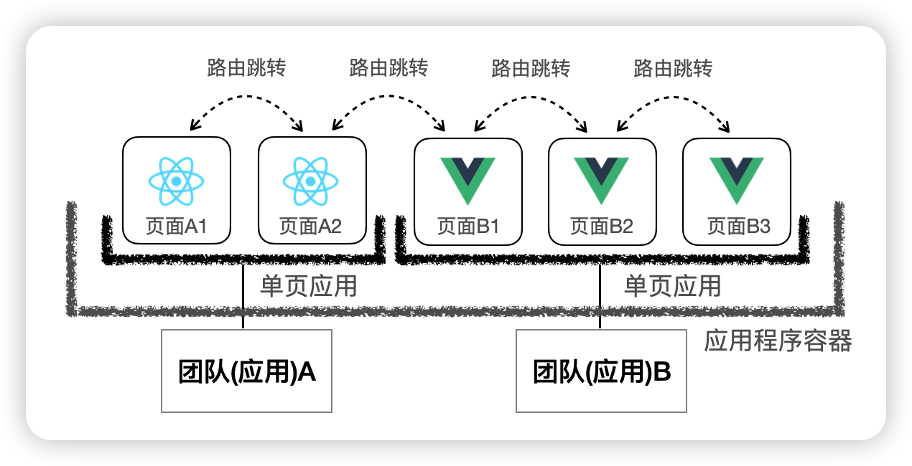
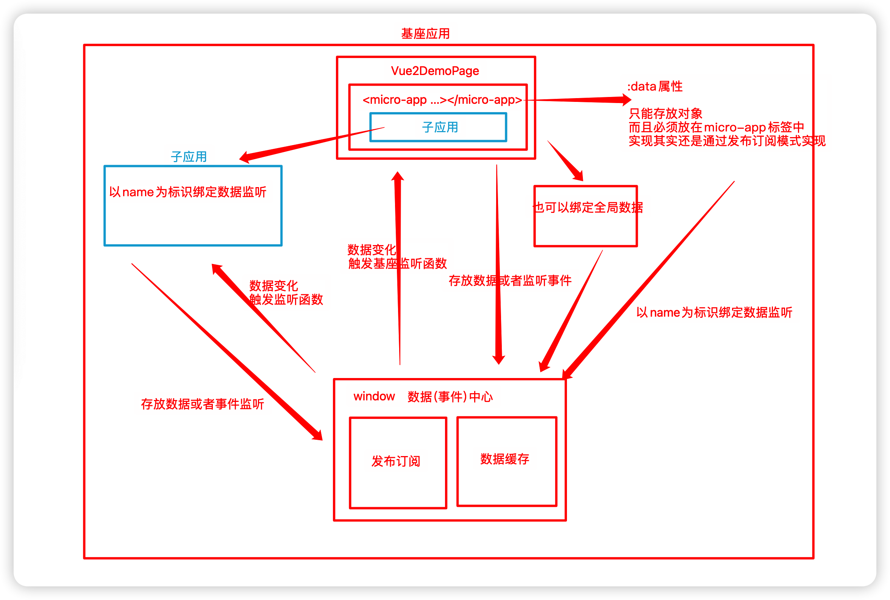

# Micro-app 框架


## 使用框架基调



## 1、框架安装

```js
npm i @micro-zoe/micro-app --save
```

## 2、子应用对应的view页面

```html
<template>
  <div>
    <!-- 
      name(必传)：应用名称
      url(必传)：应用地址，会被自动补全为http://localhost:3000/index.html
      baseroute(可选)：基座应用分配给子应用的基础路由，就是上面的 `/my-page`
     -->
     <micro-app 
      name='app-vue2-demo' 
      url='http://localhost:4001/' 
      baseroute='/app-vue2-demo'
     >
    </micro-app>
  </div>
</template>
```

## 3、页面对应的路由

```js
{
      //路由路径最好是非严格匹配
      path: "/app-vue2-demo*",
      name: "Vue2DemoPage",
      component: () => import("@/views/Vue2DemoPage.vue")
}
```

别忘记，view页面也需要配置

## 4、子应用的配置

子程序路由需要判断是否加上主程序给予的路由前缀

```
const router = new VueRouter({
  mode: "history",
  base: window.__MICRO_APP_BASE_ROUTE__ || '/',
  。。。。。
 }
```

## 5、子程序需要设置跨域

```js
devServer: {
    port: 4001,
    headers: {
      'Access-Control-Allow-Origin': '*',
    }
}
```


### 配置总结

主应用

1、创建一个页面，需要加入micro-app自定义元素

2、配置路由

子应用

1、如果在微前端中，加上路由前缀

2、设置跨域

#### 页面渲染实现原理

其实micro-app原理很简单：WebComponent(Custom Element) + HTMLEntry

其实就是把子应用的资源读取过来，直接在基座程序中运行


### 与react子应用集成

主应用

1、创建一个页面，需要加入micro-app自定义元素

```
<micro-app 
      name='app-react-demo' 
      url='http://localhost:4002/' 
      baseroute='/app-react-demo'
>
</micro-app>
```


2、配置路由

```js
{
      //路由路径最好是非严格匹配
      path: "/app-react-demo*",
      name: "ReactDemoPage",
      component: () => import("@/views/ReactDemoPage.vue")
    }
```


子应用

1、如果在微前端中，加上路由前缀

```js
<Router basename={window.__MICRO_APP_BASE_ROUTE__ || '/'}>
        <Routes>
          <Route path="/" element={<LayoutMain />} > 
            <Route index element={<Home />} />
            <Route path="about" element={<About />} />
            <Route path="info" element={<Info />} />
          </Route>
        </Routes>
      </Router>
```

2、设置跨域

```js
headers: {
      'Access-Control-Allow-Origin': '*',
},
```

3、静态资源的处理

在子应用中的src下创建public-path.js文件

```js
if (window.__MICRO_APP_ENVIRONMENT__) {
  // eslint-disable-next-line
  __webpack_public_path__ = window.__MICRO_APP_PUBLIC_PATH__ //http://localhost:4002  默认/
}
```

这个文件放入到程序的入口文件index.js中直接执行，建议最好放在第一行

```js
import "./public-path";
```


### 与vite项目子应用集成

当子应用是vite应用时需要做特别的适配，适配vite的代价是巨大的，我们必须关闭沙箱功能，因为沙箱在`module script`下不支持，这导致大部分功能失效，包括：环境变量、样式隔离、元素隔离、资源路径补全、baseroute 等。

在嵌入vite子应用时，`micro-app`的功能只负责渲染，其它的行为由应用自行决定，这包括如何防止样式、JS变量、元素的冲突。

在module模式下，引入的资源大多为相对地址，兼容主要做的事情就是将地址补全。

> vite的module模式是指vite在开发模式下直接使用ES模块来加载代码，而不是像传统的构建工具一样通过打包和压缩，将所有代码打包成一个文件。这种模式让我们开发的时候效率很高，不过却给微前端的集成带来了麻烦
>
> 因为我们之前说过micro-app集成的原理，就是把子应用打包好的index.html直接拉过来，然后在基座中运行子应用的代码。vite 这种module模式的话。缺少了这个统一的入口，集成起来就非常的麻烦

#### 1、基座项目中添加页面

views中添加页面ViteDemoPage.vue

```html
<template>
  <div>
    <h2>Main - Vite Vue3 Demo</h2>
    <div>
      <micro-app name='app-vite-demo' url='http://localhost:4003/' baseroute='/app-vite-demo'></micro-app>
    </div>
  </div>
</template>
```

路由中添加：

```ts
{
      path: "/app-vite-demo*",
      name: "AppViteDemo",
      component: () => import("@/views/ViteDemoPage.vue")
 }
```

app.vue页面别忘记添加路由

#### 2、适配vite项目，子应用修改vite.config.ts文件

无论micro-app框架还是single-spa框架，适配vite项目代价都很大，如果你要集成的项目很多是vite项目，建议直接使用iframe的方式接入，或者使用wujie

这里主要说明两点：

1、path如果报错，需要导入nodejs的TypeScript 的声明文件包 npm i --save-dev @types/node

2、赋值的自定义插件报错，直接any

```js
import { defineConfig } from 'vite'
import vue from '@vitejs/plugin-vue'
import { resolve } from 'path';
import { join } from 'path'
import { writeFileSync } from 'fs'

// https://vitejs.dev/config/
export default defineConfig({
  //域名，生成环境是是你具体的域名，开发环境下为空字符串，这里手动加上了微前端的路由前缀
  base: `${process.env.NODE_ENV === 'production' ? 'http://my-site.com' : ''}/app-vite-demo/`,
  plugins: [
    vue(),
    // 自定义插件
    (function () {
      let basePath = ''
      return {
        name: "vite:micro-app",
        apply: 'build',
        configResolved(config) {
          //配置资源文件基础路径
          //${config.base} 项目基础路径，就是上面配置的那些
          //${config.build.assetsDir}资源文件存放的目录名。默认情况下，它是 'assets'
          basePath = `${config.base}${config.build.assetsDir}/`
        },
        writeBundle (options, bundle) {
          //遍历所有的代码块，找到文件名以 '.js' 结尾的代码块
          for (const chunkName in bundle) {
            if (Object.prototype.hasOwnProperty.call(bundle, chunkName)) {
              const chunk = bundle[chunkName]
              if (chunk.fileName && chunk.fileName.endsWith('.js')) {
               //使用正则表达式来查找所有的相对路径，并使用 new URL() 方法将这些路径转换为绝对路径。
                chunk.code = chunk.code.replace(/(from|import\()(\s*['"])(\.\.?\/)/g, (all, $1, $2, $3) => {
                  return all.replace($3, new URL($3, basePath))
                })
       //options.dir Vite 构建过程中的输出目录，默认情况下，options.dir 的值就是 dist
      //options.dir 是 dist，chunk.fileName 是 main.js，那么完整的文件路径就是 dist/main.js
                const fullPath = join(options.dir, chunk.fileName)
                //将修改后的内容，重新写入文件系统
                writeFileSync(fullPath, chunk.code)
              }
            }
          }
        },
      }
    })() as any,
  ],
  resolve: {
    alias: {
      '@': resolve(__dirname, 'src') // 设置 `@` 指向 `src` 目录
    }
  },
  server: {
    port: 4003,
  }
})
```

#### 3、子项目修改容器id和渲染容器id

```html
<!-- index.html -->
<body>
  <div id="my-vite-app"></div>
</body>
```

```ts
// main.ts
createApp(App).mount('#my-vite-app')
```

#### 4、修改路由

vite子项目需要修改为**hash路由**

由于主应用关闭的沙箱功能，所以基座应用的环境变量不能使用了，所以，每次切换路由的时候就会产生问题

由于hash路由，使用的是地址栏的处理

```js
import { createRouter, createWebHashHistory } from 'vue-router'

const router = createRouter({
  history: createWebHashHistory(),
  routes,
})
```

#### 5、静态资源

```js
<template>
  <div>
    <div>
      <a href="https://vitejs.dev" target="_blank">
        
      </a>
      <a href="https://vuejs.org/" target="_blank">
        
      </a>
    </div>
    <HelloWorld msg="子应用 -- Vite+Vue@3.x" />
  </div>
</template>

<script setup lang="ts">
import HelloWorld from '@/components/HelloWorld.vue'
const vueLogo = new URL('@/assets/vue.svg', import.meta.url).href
const viteLogo = new URL('/vite.svg', import.meta.url).href
</script>
```

如果图片比较多，可以用计算属性稍微封装一下

```js
<template>
  <div>
    <div>
      <a href="https://vitejs.dev" target="_blank">
        
      </a>
      <a href="https://vuejs.org/" target="_blank">
        
      </a>
    </div>
    <HelloWorld msg="子应用 -- Vite+Vue@3.x" />
  </div>
</template>

<script setup lang="ts">
import {computed} from 'vue'
import HelloWorld from '@/components/HelloWorld.vue'
// const vueLogo = new URL('@/assets/vue.svg', import.meta.url).href
// const viteLogo = new URL('/vite.svg', import.meta.url).href

const imgUrl = computed(() => (url: string) => new URL(url, import.meta.url).href);
</script>
```

#### 6、基座应用的修改，关闭沙箱功能

```js
<micro-app 
  name='app-vite-demo' 
  url='http://localhost:4003/' 
  baseroute='/app-vite-demo'
  inline 
  disableSandbox
 >
 </micro-app>
```

#### 7、基座应用处理子应用静态资源

```js
microApp.start({
  plugins: {
    modules: {
      // appName即应用的name值,注意这里的name实际上是页面<micro-app>标签的name值
      'app-vite-demo': [{
        loader(code) {
          if (process.env.NODE_ENV === 'development') {
            // 这里 basename 需要和子应用vite.config.js中base的配置保持一致
            code = code.replace(/(from|import)(\s*['"])(\/app-vite-demo\/)/g, all => {
              return all.replace('/app-vite-demo/', 'http://127.0.0.1:4003/app-vite-demo/')
            })
          }
          return code
        }
      }]
    }
  }
})
```

#### 8、出现的问题


**开发者工具console窗口报错**

```js
[vite] failed to connect to websocket (SyntaxError: Failed to construct 'WebSocket': The URL 'ws://:/app-vite-demo/' is invalid.)
```

这个是由于框架自身问题导致，不影响运行，官方已经在1.0beta版本修复了这个问题

**由于沙箱隔离关闭，导致环境变量，css隔离，元素隔离、资源路径补全、baseroute等失效**

这个问题只有开发者在开发的时候自行定义好开发规范进行规避


### requestIdleCallback

requestIdleCallback浏览器渲染一帧的剩余空闲时间执行优先度相对较低的任务

页面是通过一帧一帧渲染出来的，通常60FPS是流程的，和浏览器刷新同步。这就意味着：**一秒之内要进行60次渲染，每次重新渲染的时间不能超过16.66(1000/60)毫秒**

浏览器一帧做了什么事情？

顺序

- 用户事件

- js事件轮询
- begin frame
  - window.resize
  - scroll
  - 媒体查询
  - 动画时间
- requestAnimationFrame（在每次渲染之前执行，不会重新触发浏览器重绘）
- 浏览器渲染
  - 样式计算
  - 布局
  - 重绘
  - 合成
- requestIdleCallback(空闲时间)

## 数据通信


实现原理 数据中心(发布订阅+数据缓存)



### 父应用直接传递

```
<micro-app 
	......
	:data='dataForChild'
>
</micro-app>

export default {
  data () {
    return {
      dataForChild:{type:'发送给子应用的数据'}
    }
  },
 }
```


### 子应用直接获取

```
<button @click="handleData">获取父应用传递数据</button>

methods: {
    handleData() { 
      const data = window.microApp.getData()
      console.log(data);
    },
}
```

### 子应用发送消息给父应用

```
<button @click="sendData">子应用反馈数据</button>

methods: {
    sendData() { 
      window.microApp.dispatch({type: '子应用发送的数据'})
    }
  }
 }
```

### 父应用直接接收消息

```
<micro-app 
  ......
  @datachange='handleDataChange'
>
</micro-app>

handleDataChange (e) {
	console.log('来自子应用的数据：', e.detail.data);
	//ele通知
	this.$notify({
    title: '子应用信息',
    message: e.detail.data.type,
    position: 'top-left'
  });
}
```


### 父应用主动发送信息给子应用

在vue2DemoPage页面发送消息

```
<button @click="sendDataToVue2">父应用-发送数据给app-vue2-demo</button>

import microApp from '@micro-zoe/micro-app'
sendDataToVue2() { 
   microApp.setData('app-vue2-demo', {type: '发送新的数据',path:"/about"})
}
```


### 子应用监听父应用发送的消息

```js
//element ui将通知挂载到Vue.prototype上，vue实例可以通过this获取，在main函数中，可以直接导入Notification
import { Notification } from 'element-ui';
// 与基座进行数据交互
function handleMicroData () {
  // 是否是微前端环境
  if (window.__MICRO_APP_ENVIRONMENT__) {
    // 主动获取基座下发的数据
    console.log('vue2-demo getData:', window.microApp.getData())

    // 监听基座下发的数据变化
    window.microApp.addDataListener((data) => {
      console.log('vue2-demo addDataListener:', data)
      Notification({
        title: '子应用信息',
        message: data.type,
        position: 'bottom-right'
      });

      // 当基座下发path时进行跳转
      if (data.path && data.path !== router.currentRoute.path) {
        router.push(data.path)
      }
    })
  }
}

let app = null
// 👇 将渲染操作放入 mount 函数 -- 必填
function mount () {
  app = new Vue({
    router,
    render: h => h(App),
  }).$mount('#app')
  handleMicroData();
}
```


### 子应用主动发送消息

和上面一样，只是这里基座应用通过事件监听获取，并且根据子应用发送的地址基座路由进行跳转

```
sendData() { 
	window.microApp.dispatch({type: '子应用发送的数据', path:"/app-react-demo/about"})
}
```

### 基座应用监听

```js
microApp.addDataListener('app-vue2-demo', (data) => { 
  console.log("基座主动监听", data);
  Vue.prototype.$notify({
    title: '子应用信息',
    message: data.type,
    position: 'bottom-left'
  });

  // 当收到子应用发path时进行跳转
  if (data.path && data.path !== router.currentRoute.path) {
    router.push(data.path)
  }
})
```


