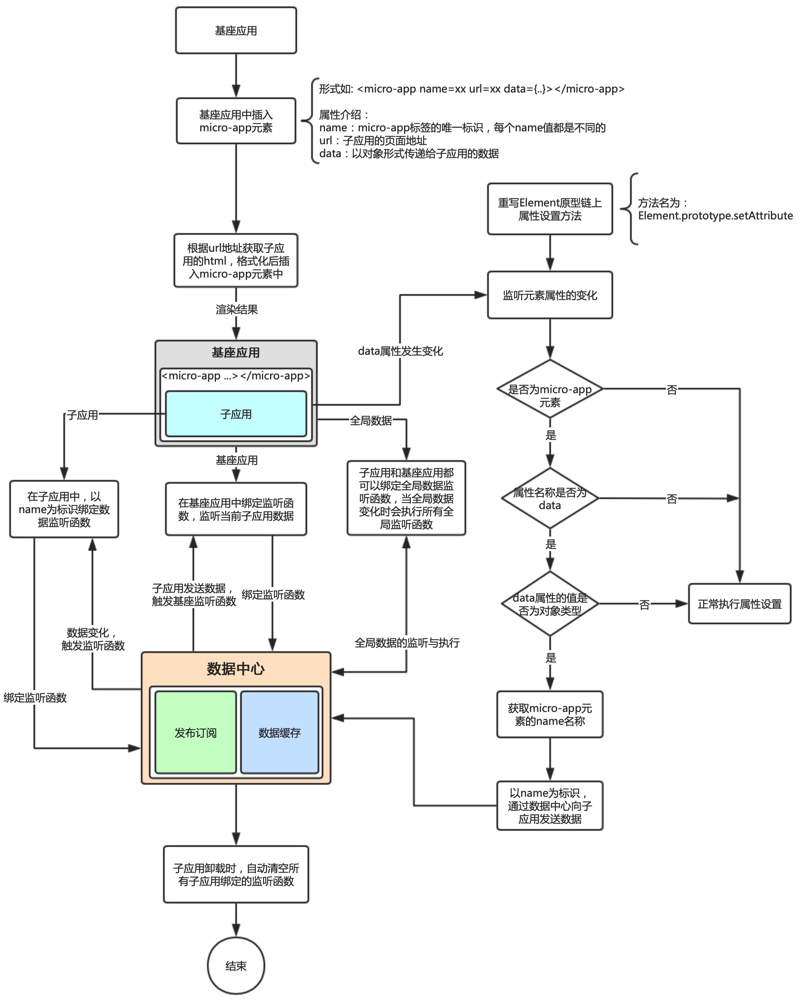

# 手写微前端micro-app(4)-数据通信

要实现微前端的数据通信，我们要实现两个重要的功能：

1、发布订阅

2、自定义元素支持传递对象数据

发布订阅其实不用多做介绍，大家使用vue一直在使用的`$emit`子组件发布事件，父组件通过`v-on`监听子组件发布的事件。就是发布订阅的一个过程。一般这个过程，都需要一个事件中心去统一处理发布订阅的事件与数据，这样便于清晰数据流向。我们可以使用很简单的代码来模拟这个过程

```js
class EventCenter{
  eventList = new Map(); //绑定数据与函数
  //监听事件
  on(name,f){
    //先从Map中取出对应的事件列表
    let eventInfo = this.eventList.get(name);
    if(!eventInfo){
      //如果没有，就创建一个
      eventInfo = {
        data:{},//存放数据
        callback:new Set() //存放函数，可能不止一个，并且不重复
      }
      //放入Map缓存中
      this.eventList.set(name,eventInfo);
    }
    //记录绑定函数
    eventInfo.callback.add(f);
  }

  //解除绑定
  off(name,f){
    let eventInfo = this.eventList.get(name);
    if(eventInfo && eventInfo.callback.has(f)){
      eventInfo.callback.delete(f);
    }
  }

  //发送事件
  dispatch(name,data){
    const eventInfo = this.eventList.get(name);
    //只有传入的数据和原来的数据不一致的时候才会触发
    if(eventInfo && eventInfo.data !== data){
      eventInfo.data = data;
      eventInfo.callback.forEach(f => {
        f(data);
      });
    }
  }
}

const eventCenter = new EventCenter();
eventCenter.on('test1',data => {
  console.log('test1:',data);
});
eventCenter.on('test1',data => {
  console.log('test1 --- :',data);
});
eventCenter.on('test2',data => {
  console.log('test2:',data);
});

eventCenter.dispatch('test1','hello world');
```

我们可以通过创建两个简单的类，来模拟一下数据通过发布订阅事件中心传递的过程

```js
const eventCenter = new EventCenter()
  
  // 主应用处理类
  class BaseApp{
    setData(name,data){
      eventCenter.dispatch(name,data);
    }
  }
  // 子应用处理类
  class SubApp{
    constructor (appName) {
      this.appName = appName
    }
    addDataListener(cb){
      eventCenter.on(this.appName,cb);
    }

    dispatch (data) {
      // 子应用以自定义事件的形式发送数据
      const event = new CustomEvent('datachange', {
        detail: {
          data,
        }
      })
			//具体执行时，可以传递对应的dom用来触发事件
      window.dispatchEvent(event)
    }
  }

  // window通过自定义事件，监听子应用的数据变化
  window.addEventListener('datachange',e=>{
    console.log('datachange:',e.detail.data);
  })

  const subApp = new SubApp('subApp');
  // 子应用发布数据
  subApp.dispatch('---hello world---');
  
  // 子应用监听数据变化
  subApp.addDataListener(data=>{
    console.log('subApp:',data);
  })

  // 主应用通过子应用的名字发布数据给subApp
  const baseApp = new BaseApp();
  baseApp.setData('subApp','hello world');
```

**流程图**



### 1、创建data.js

和上面的列子类似，先创建发布订阅系统类

我们的处理，是需要基座应用发送数据到具体的子应用，而子应用也需要发送数据到基座应用。不考虑子应用之间的互相通信，如果想实现这个效果，可以通过基座应用进行中转

```js
// 发布订阅系统
class EventCenter {
  // 缓存数据和绑定函数
  eventList = new Map()
  /**
   * 绑定监听函数
   * @param name 事件名称
   * @param f 绑定函数
   */
  on (name, f) {
    let eventInfo = this.eventList.get(name)
    // 如果没有缓存，则初始化
    if (!eventInfo) {
      eventInfo = {
        data: {},
        callbacks: new Set(),
      }
      // 放入缓存
      this.eventList.set(name, eventInfo)
    }

    // 记录绑定函数
    eventInfo.callbacks.add(f)
  }

  // 解除绑定
  off (name, f) {
    const eventInfo = this.eventList.get(name)
    // eventInfo存在且f为函数则卸载指定函数
    if (eventInfo && typeof f === 'function') {
      eventInfo.callbacks.delete(f)
    }
  }

  // 发送数据
  dispatch (name, data) {
    const eventInfo = this.eventList.get(name)
    // 当数据不相等时才更新
    if (eventInfo && eventInfo.data !== data) {
      eventInfo.data = data
      // 遍历执行所有绑定函数
      for (const f of eventInfo.callbacks) {
        f(data)
      }
    }
  }
}

// 创建发布订阅对象
const eventCenter = new EventCenter()
```

由于基座应用和子应用通信方式不一样，我们可以分开定义.

基座应用很简单，只需要做发布和清除即可

```js
// 基座应用的数据通信
export class EventCenterForBaseApp {
  /**
   * 向指定子应用发送数据
   * @param appName 子应用名称
   * @param data 对象数据
   */
  setData (appName, data) {
    eventCenter.dispatch(fappName, data)
  }
}
```

子应用的数据通讯，子应用需要监听事件，并且子应用需要绑定自定义事件，将其绑定到`<micro-app>`标签上，方便基座应用直接通过标签事件获取数据(这个过程其实和vue子组件通过$emit传递数据到父组件，父组件通过v-on获取数据的过程是一致的)

```js
import { appInstanceMap } from './app'

// 子应用的数据通信
export class EventCenterForMicroApp {
  constructor (appName) {
    this.appName = appName
  }

  /**
   * 监听基座应用发送的数据
   * @param cb 回调函数
   */
  addDataListener (cb) {
    eventCenter.on(this.appName, cb)
  }

  /**
   * 向基座应用发送数据
   * @param data 对象数据
   */
  dispatch (data) {
    //通过保存在缓存中的名字来获取具体的子应用标签对象，也就是<micro-app>标签
    const app = appInstanceMap.get(this.appName)
    if (app.container) {
      // 子应用以自定义事件的形式发送数据
      const event = new CustomEvent('datachange', {
        detail: {
          data,
        }
      })
			
      //将事件绑定到<micro-app>标签
      app.container.dispatchEvent(event)
    }
  }
}
```

### 2、使用

在沙箱中创建子应用的通信对象，并在沙箱关闭时清空所有绑定的事件

由于子应用通信需要用到应用名称，因此，沙箱的constructor构造器，需要参数，注意在调用的时候需要传递appName

```diff
+ import { EventCenterForMicroApp } from './data'

export default class SandBox {
+  constructor (appName) {
+    // 创建数据通信对象
+    this.microWindow.microApp = new EventCenterForMicroApp(appName)
    ...
  }

  stop () {
    if (this.active) {
      ...
      // 清空所有绑定函数
+    	this.microWindow.microApp.clearDataListener()
    }
  }
}
```

这里修改**SandBox**的构造器，因此，别忘记在调用的时候，修改**SandBox**构造器传参

```diff
// /src/micro-ce/app.js
export default class CreateApp {
  constructor({ name, url, container }) {
		......
-		this.SandBox = new SandBox()
+   this.SandBox = new SandBox(name) // 创建沙箱
  }
  ......
}
```

在index.js中调用基座应用的数据处理

```diff
import { defineElement } from './element'
+ import { EventCenterForBaseApp } from './data'
+ const BaseAppData = new EventCenterForBaseApp()

const SimpleMicroApp = {
  start () {
    defineElement()
  }
}
```

### 3、自定义元素支持传递对象数据

自定义元素无法支持对象类型的属性，只能传递字符串，例如`<micro-app data={x: 1}></micro-app>` 会转换为 `<micro-app data='[object Object]'></micro-app>`，想要以组件化形式进行数据通信必须让元素支持对象类型属性，为此我们需要重写micro-app原型链上setAttribute方法处理对象类型属性。

```js
// 记录原生方法
const rawSetAttribute = Element.prototype.setAttribute

// 重写setAttribute
Element.prototype.setAttribute = function setAttribute(key, value) {
  // 目标为micro-app标签且属性名称为data时进行处理
  if (/^micro-app/i.test(this.tagName) && key === 'data') {
    if (toString.call(value) === '[object Object]') {
      // 克隆一个新的对象
      const cloneValue = {}
      //Object.getOwnPropertyNames 返回对象的全部属性名
      Object.getOwnPropertyNames(value).forEach((propertyKey) => {
        // 过滤vue框架注入的数据
        // 因为获取的数据中会有vue框架注入的数据，
        // 这些数据都是以__开头的，所以我们在这里过滤掉,比如 
        // __ob__:Observer {value: {…}, shallow: false, mock: false, dep: Dep, vmCount: 0}
        if (!(typeof propertyKey === 'string' && propertyKey.indexOf('__') === 0)) {
          cloneValue[propertyKey] = value[propertyKey]
        }
      })
      // 发送数据
      BaseAppData.setData(this.getAttribute('name'), cloneValue)
    }
  } else {
    rawSetAttribute.call(this, key, value)
  }
}
```

**界面调用**

主应用：

```js
<micro-app 
	:data="data" 
	@datachange="handleSubData"  
	name="app" 
	url="http://localhost:4002" 
	destroy
>
</micro-app>

export default {
  data () {
    return {
      data: {
        name: 'micro-app',
        type:'微前端'
      }
    }
  },
  mounted() { 
    setTimeout(() => {
      this.data = {
        name: '---来自基座应用的数据---',
        type:'微前端'
      }
    }, 2000);
  },
  methods: {
    handleSubData(e) { 
      console.log('基座接收数据:', e.detail.data);
    }
  }
}
```

子应用:

```js
window.microApp.addDataListener((data) => { 
  console.log('子应用接收数据:', data);
})

setTimeout(() => { 
  window.microApp.dispatch({ name: '来自react子应用的数据' });
},3000)
```

