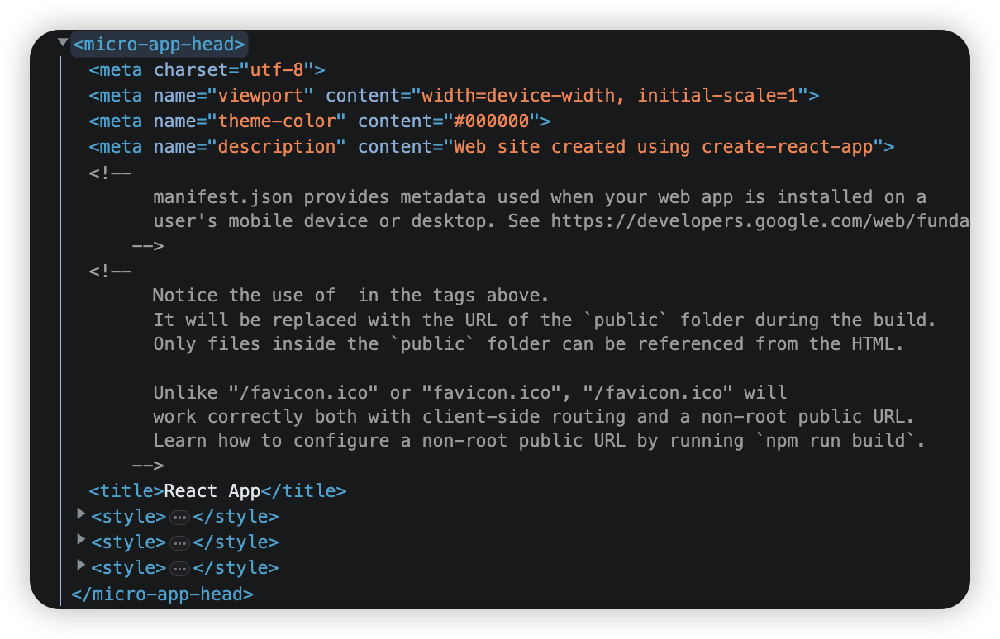
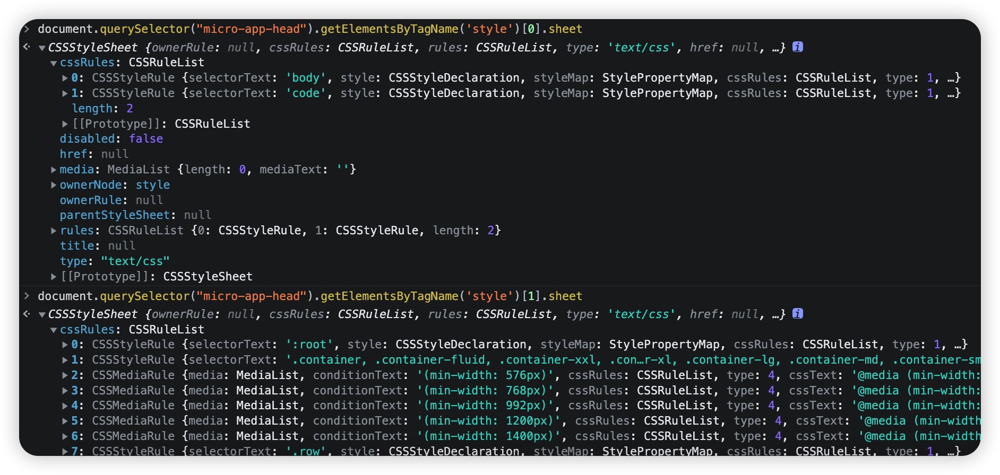
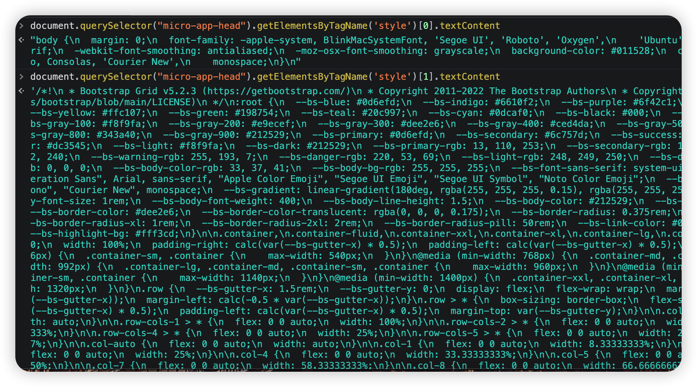
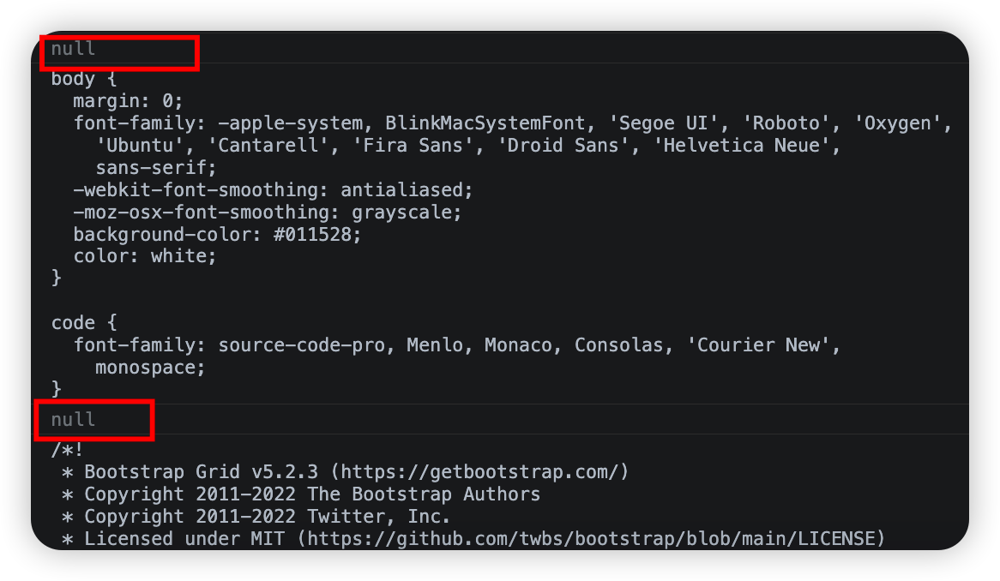
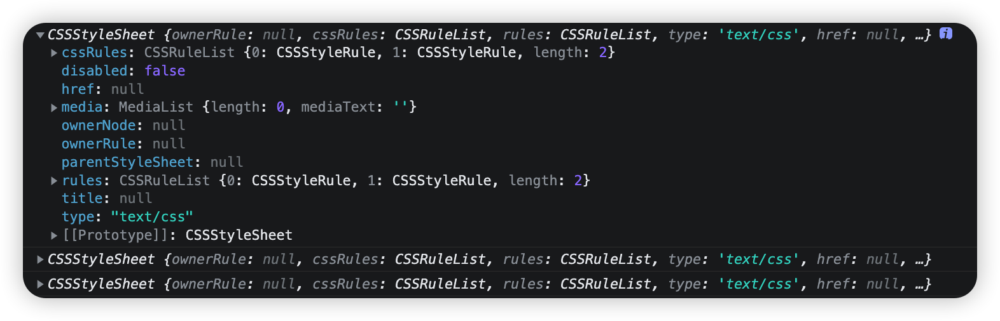
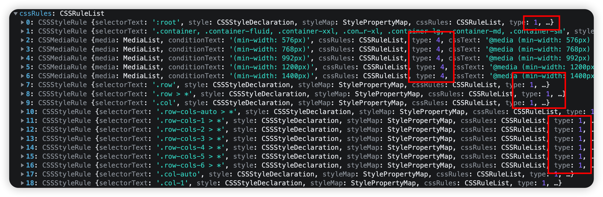

# 手写微前端micro-app(2)-CSS隔离


## 1、实现原理

先说明一下前提：我们所谓的CSS隔离，都是子应用的CSS可能会对基座应用或者其他子应用产生的影响，不是说屏蔽基座应用对子应用的影响，这种我们现在暂时不考虑。真正项目的时候大家注意好项目规范就行了

首先现在我们把react页面放入到vue2的页面大家也能看到一些问题了，在react中的index.css中对body的一些css样式，已经影响了基座应用的css。

为了看的更明显，我自己写一下，在基座应用中声明一个css样式，比如：

```
.text-color{
	color:red
}
```

> 做实验的时候，如果是vue2项目。别把这个样式写到了带scoped的style样式标签中了，这种本身就是隔离的，我们这里所谓的隔离，主要是针对全局样式
>
> 由于我们前面的处理只是将link标签转换为了style标签，因此在react项目中做处理的话，最好将样式写在静态css文件中，比如之前讲index.css文件放到了index.html中

如果在子应用中，也有同名的全局样式

```css
.text-color{
	color:skyblue
}
```

那么，你会发现，子应用的这个样式，对基座应用中，同样使用这个样式的标签起了作用，我们就是要隔绝这种情况

当然，做这种css隔离，有多种办法，比如，就行vue这种，style标签加上scoped属性，给组件加上一个唯一表示id，通过样式穿透的方式实现css样式隔离，或者可以使用web components的shadowDom来实现隔离。我们这里手写简单的实现，我们可以使用类似于vue的这种做法。给子应用的css都加上前缀。

比如上面的.text-color这个样式，在子应用中，我们就可能会加上

```
micro-app[name=app] .text-color
```

这种形式来与其他应用的同名样式进行区分

在我们上节课的处理中，将子应用的所有style，都放入到了基座应用的自定义元素中



那么我们现在的任务，只需要拿到每一个style标签中的内容，并且一一做替换，就能达到我们想要的效果





从上面截图中，我们可以看出cssRules就是由单个CSS规则组成的列表，我们只需要遍历规则列表，并在每个规则的选择器前加上前缀`micro-app[name=xxx]`，就可以将当前style样式的影响限制在micro-app元素内部。

### 2、代码实现

首先创建新的文件scopedcss.js,创建scopedCSS函数，来进行css过滤替换处理。从上面的演示可以分析出，这个函数我们至少需要两个参数

1、style节点对象，通过这个对象获取textContent与sheet的值

2、子应用app的名字，因为我们需要这个名字来组装前缀

```js
/**
 * 进行样式隔离
 * @param {HTMLStyleElement} styleElement style元素
 * @param {string} appName 应用名称
 */
export default function scopedCSS (styleElement, appName) {
  // 前缀
  const prefix = `micro-app[name=${appName}]`
	console.log(styleElement.sheet);
  console.log(styleElement.textContent);
}
```

根据我们前面的页面渲染的内容，我们的代码，只有两个地方会涉及到style元素的内容

* 一个地方是整体文本内容判断的时候，我之前只是判断了link标签和script标签

* 一个地方是link元素转换为style元素的时候

因此，这就意味着，我们的这个函数，也就这两个地方可以使用，用来做css前缀的替换

```diff
// /src/micro-ce/source.js

import scopedCSS from "./scopedcss.js";

function extractSourceDom(parent, app) {
  //......代码省略

  for (const dom of children) { 
    if (dom instanceof HTMLLinkElement) { //......代码省略
    }
+    else if (dom instanceof HTMLStyleElement) {
+      // 执行样式隔离
+      scopedCSS(dom, app.name)
+    } 
    else if (dom instanceof HTMLScriptElement) {//......代码省略
    }
  }
}

export function fetchLinksFromHtml(app, microAppHead, htmlDom) {
  //......代码省略

  Promise.all(fetchLinkPromise).then(res => { 
    for (let i = 0; i < res.length; ++i) { 
      const code = res[i]; // 获取css代码资源
      linkEntries[i][1].code = code;

      const link2Style = document.createElement('style')
      link2Style.textContent = code
+      scopedCSS(link2Style, app.name)
      microAppHead.appendChild(link2Style)
    }
		//代码省略
  }).catch((e) => {
    console.error('加载css出错', e)
  })
}
```

来看一下打印效果



你会发现打印了**textContent的内容，但是sheet内容却为空**，原因是css没有挂载到页面之前，样式表还没生成。是获取不了sheet的。而且有时候style元素(比如动态创建的style)在执行样式隔离时还没插入到文档中，此时样式表还没生成。也会出现这种情况

不能获取sheet内容的话，我们仅仅凭借textContent字符串的内容，去做处理工作量太大，也不好区分css中的内容

所以我们做一个取巧的办法，**声明一个临时的style模板，用来填充css，用完之后删除**

```js
let templateStyle // 模版sytle
/**
 * 进行样式隔离
 * @param {HTMLStyleElement} styleElement style元素
 * @param {string} appName 应用名称
 */
export default function scopedCSS (styleElement, appName) {
  // 前缀
  const prefix = `micro-app[name=${appName}]`

  // console.log(styleElement.sheet);
  // console.log(styleElement.textContent);

  // 初始化时创建模版标签
  if (!templateStyle) {
    templateStyle = document.createElement('style')
    document.body.appendChild(templateStyle)
    // 设置样式表无效，防止对应用造成影响
    templateStyle.sheet.disabled = true
  }

  if (styleElement.textContent) {
    // 将元素的内容赋值给模版元素
    templateStyle.textContent = styleElement.textContent
    // 获取临时模板中的sheet
    console.log(templateStyle.sheet)
  } 
}
```



为什么一定要转换为sheet？因为我们的css，有些是直接就是样式名字的，有些是有嵌套的，比如**@media**

```js
@media screen and (max-width: 300px) {
  .test {
    background-color:red;
  }
}
```

我们需要的是将**@media**内部的**.text**加上前缀，而这些，sheet中的**cssRules**已经帮我们划分了类型了，[CSSRule.type](https://developer.mozilla.org/zh-CN/docs/Web/API/CSSRule)类型有数十种，我们只处理`STYLE_RULE`、`MEDIA_RULE`、`SUPPORTS_RULE`三种类型



- type为1的，是普通的样式`STYLE_RULE`

- type为4的，是**media**类型，`MEDIA_RULE`

- type为12的，为**supports**类型`SUPPORTS_RULE`

也就是说，我们需要根据类型不一样，分开进行处理。其实分开处理无非也就是**media**和**supports**类型，再递归执行一下

因此将上面的代码再做修改：

```js
let templateStyle // 模版sytle
/**
 * 进行样式隔离
 * @param {HTMLStyleElement} styleElement style元素
 * @param {string} appName 应用名称
 */
export default function scopedCSS (styleElement, appName) {
  // 前缀
  const prefix = `micro-app[name=${appName}]`

  // 初始化时创建模版标签
  if (!templateStyle) {
    templateStyle = document.createElement('style')
    document.body.appendChild(templateStyle)
    // 设置样式表无效，防止对应用造成影响
    templateStyle.sheet.disabled = true
  }

  if (styleElement.textContent) {
    // 将元素的内容赋值给模版元素
    templateStyle.textContent = styleElement.textContent
    // console.log(templateStyle.sheet)
    // 格式化规则，并将格式化后的规则赋值给style元素
    styleElement.textContent = scopedRule(Array.from(templateStyle.sheet.cssRules || []), prefix)
    // 清空模版style内容
    templateStyle.textContent = ''
  } 
}

/**
 * 依次处理每个cssRule
 * @param rules cssRule
 * @param prefix 前缀
 */
function scopedRule (rules, prefix) {
  let result = ''
  // 遍历rules，处理每一条规则
  for (const rule of rules) {
    switch (rule.type) {
      case 1: // STYLE_RULE
        result += scopedStyleRule(rule, prefix)
        break
      case 4: // MEDIA_RULE
        result += scopedPackRule(rule, prefix, 'media')
        break
      case 12: // SUPPORTS_RULE
        result += scopedPackRule(rule, prefix, 'supports')
        break
      default:
        result += rule.cssText
        break
    }
  }

  return result
}

// 处理media 和 supports
function scopedPackRule (rule, prefix, packName) {
  // 递归执行scopedRule，处理media 和 supports内部规则
  const result = scopedRule(Array.from(rule.cssRules), prefix)
  return `@${packName} ${rule.conditionText} {${result}}`
}
```

递归之后，最终其实还是使用**scopedStyleRule()**函数进行处理。这个函数难度最大，因为要写难度的很大的正则表达式。不纠结，已经给大家写好了

```js
/**
 * 修改CSS规则，添加前缀
 * @param {CSSRule} rule css规则
 * @param {string} prefix 前缀
 */
function scopedStyleRule (rule, prefix) {
  // 获取CSS规则对象的选择和内容
  const { selectorText, cssText } = rule

  // 处理顶层选择器，如 body，html 都转换为 micro-app[name=xxx]
  if (/^((html[\s>~,]+body)|(html|body|:root))$/.test(selectorText)) {
    return cssText.replace(/^((html[\s>~,]+body)|(html|body|:root))/, prefix)
  } else if (selectorText === '*') {
    // 选择器 * 替换为 micro-app[name=xxx] *
    return cssText.replace('*', `${prefix} *`)
  }

  // 匹配顶层选择器，如 body，html
  const builtInRootSelectorRE = /(^|\s+)((html[\s>~]+body)|(html|body|:root))(?=[\s>~]+|$)/

  // 匹配查询选择器
  return cssText.replace(/^[\s\S]+{/, (selectors) => {
    return selectors.replace(/(^|,)([^,]+)/g, (all, $1, $2) => {
      // 如果含有顶层选择器，需要单独处理
      if (builtInRootSelectorRE.test($2)) {
        // body[name=xx]|body.xx|body#xx 等都不需要转换
        return all.replace(builtInRootSelectorRE, prefix)
      }
      // 在选择器前加上前缀
      return `${$1} ${prefix} ${$2.replace(/^\s*/, '')}`
    })
  })
}
```

