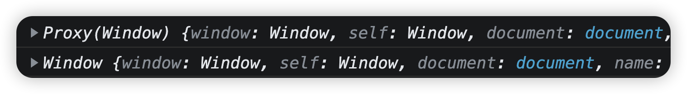
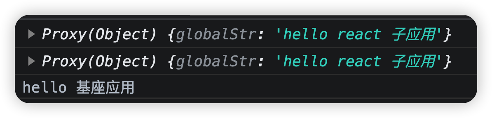

# 手写微前端micro-app(3)-沙箱

### 什么是沙箱

沙箱，即sandbox，顾名思义，就是让你的程序跑在一个隔离的环境下，使用的都是自己独立的属性和方法，并且最重要的，不对外界的其他程序造成影响，所以，先来看看我们现在程序中存在的问题。

### 存在的问题

首先来看，现在的代码会有什么情况出现

基座应用向window上添加一个全局变量：`window.globalStr = "hello 基座";`，如果此时子应用也有一个相同的全局变量：`globalStr='hello 子应用'`，此时就产生了变量冲突，基座应用的变量会被覆盖。

所以，我们需要给每一个子应用创建一个沙箱环境，让沙箱中的代码不要对外界产生影响。不过关键点是如何创建这个沙箱。在讲解具体代码之前...我们还有一堆小知识要补充。

### 1、eval，Function和(0,eval)

其实这个我们在之前提到过，如果我们想通过字符串动态的执行代码，可以用eval和Function

```js
eval("console.log('hello world')")
//参数1：参数(可选)
//参数2：函数体，也就是具体要执行什么
Function('msg','console.log(msg)')('hello world');
//如果没有参数的话，可以直接运行
Function('console.log("hello world")')();
```

区别就是eval是直接执行，而Function其实是通过函数去执行。这是表面上的区别，如果有作用域的话，可以更清楚的看到两者的区别

```js
const aaa = 10;
function fn(){
    const aaa = 0;
    eval('console.log("aaa:", aaa)'); // aaa:0
    Function('str', 'console.log(str, aaa)')('aaa:'); // aaa:10
}
fn()
```

`eval` 则是在当前作用域直接执行代码，代码可以直接访问当前作用域。而 `Function` 创建的函数只会在全局作用域中运行（除主动修改作用域：`bind`，`call` 等）

当然我们前面的课程也讲了，可以修改eval执行的作用域，使用(0,eval)()的这种方式，就可以让eval在全局作用域中运行

```js
  const aaa = 10;
  function fn(){
    const aaa = 0;
    eval('console.log("aaa:", aaa)'); // aaa:0
    (0,eval)('console.log("aaa:", aaa)'); // aaa:10
    Function('str', 'console.log(str, aaa)')('aaa:') // aaa:10
  }
  fn()
```

### 2、with

with是JavaScript中的一个关键字，扩展一个语句的作用域链。with会在作用域链的顶端添加一个新的作用域，改作用域的变量会加入with传入的对象，因此相较于外部环境其内部代码在查找变量时会优先在该对象上进行查找。

```js
with (console) {
  log("hello"); // hello
}
let obj = {
  a: 1,
  b: 2,
  c: 3,
};
with(obj){
  console.log(a)    //1
  console.log(b)    //2
  console.log(c)    //3
}
```

由于 with 定义的上下文会优先查找，因此在前端沙盒领域是一种解决方案，具体做法是：

```js
const obj = {
  a: 1,
  b: 2,
  c: 3,
};
const sandboxCode = `with(scope){console.log(a)}`
//Function的做法
new Function('scope', sandboxCode)(obj);
//eval的做法
(0,eval)(`(function(scope){${sandboxCode}}).call(obj,obj)`);
```

这里要解释一下上面的这个写法

```js
(0,eval)(`(function(scope){${sandboxCode}}).call(obj,obj)`);
```

因为直接写eval,里面的this执行始终都是window，因此，将他封装在一个立即执行的函数中，确保this对象是外面传递的obj对象，大家比较一下下面的这个写法：

```js
const obj = {
	a:2
}
var a = 1;

//上面两个虽然也是用到了with，只不过是因为在函数中运行，获取的obj对象不一样，所以打印不一样
//不过this始终指向的是window
new Function('obj','with(obj){console.log(a);console.log(this)}')(obj);// 2
new Function('obj','with(obj){console.log(a);console.log(this)}')(window);// 1
//由于本身在全局运行eval和(0,eval)没什么区别
//eval优先with(obj)域查找a
eval('with(obj){console.log(a);console.log(this)}');// 2 window
//通过立即执行的函数，绑定this对象，
//call(obj,obj);第一个参数表示this的绑定对象，第二个参数表示函数需要传递的参数
eval('(function(obj){with(obj){console.log(a);console.log(this)}}).call(obj,obj)')// 2 obj{a:2}
```


但是with有一个比较致命的问题，在提供的上下文对象中没有找到某个变量时，代码仍会沿着作用域链向上查找

```js
let globalVal = 100;
const obj = {
  a: 1,
  b: 2,
  c: 3,
};

const sandboxCode = `with(scope){a = 10;globalVal = 1}`;
//Function的做法
new Function('scope', sandboxCode)(obj);
//eval的做法
(0,eval)(`(function(scope){${sandboxCode}}).call(obj,obj)`);
console.log(obj); // {a: 10, b: 2, c: 3}
console.log(globalVal); // 1
```

上面的例子，我们希望只在obj对象中查找，不要向上查找，但是obj对象只是一个普通对象。因此我们可以使用Proxy代理进行处理

```js
let globalVal = 100;
const obj = {
  a: 1,
  b: 2,
  c: 3,
};

let sandboxProxy = new Proxy(obj,{
  get(target, key) {
    return target[key]
  },
  has(target, key) {
    return true
  }
})

const sandboxCode = `with(scope){a = 10;globalVal = 1}`;
// new Function('scope', sandboxCode)(sandboxProxy);
(0,eval)(`(function(scope){${sandboxCode}}).call(sandboxProxy,sandboxProxy)`);
console.log(obj); // {a: 10, b: 2, c: 3, globalVal: 1}
console.log(globalVal); // 100
```

在生成Proxy实例对象时，我们设置两个handle，一个**get**，一个**has**，当**with**中访问某个变量时，会首先触发**has**方法，我们都返回true，告诉系统这个属性我有，**不要再去外层作用域查找了**；然后进入get方法，返回代理的对象中的这个属性，如果没有返回undefined，当然我们这是是赋值，globalVal这个属性没有在obj中发现，就会直接将属性赋值给obj，这样在with中，就无法操纵外层作用域中的变量了，只能操作代理的target中给定的有限的变量。

注意，现在在`const sandboxCode = with(scope){a = 10;globalVal = 1};`这句代码里面就不能使用打印语句了。

```js
const sandboxCode = `with(scope){a = 10;globalVal = 1;console.log(a)}`
```

如果你使用console.log会报出下面的错误：

```
Uncaught TypeError: Cannot read properties of undefined (reading 'log')
```

因为我们已经使用Proxy拦截了所有，因此console对象在obj中也是找不到的，当然，你可以在obj中加上console属性

```js
const obj = {
  a: 1,
  b: 2,
  c: 3,
  console:window.console
};
```

我们也可以将Proxy的get方法做一下判断，如果是console,alert等需要从window上进行获取

下面的代码我直接使用Reflect对象，Reflect提供的方法与Proxy对象的拦截器方法相对应。Reflect方法返回值与Proxy对象的拦截器方法返回值是相同的。这些方法包括`Reflect.get()`、`Reflect.set()`、`Reflect.has()`、`Reflect.deleteProperty()`等等

```js
let globalVal = 100;
const obj = {
  a: 1,
  b: 2,
  c: 3,
  // console:window.console
};

let sandboxProxy = new Proxy(obj,{
  get(target, key) {
    // 优先从代理对象上取值
    if (Reflect.has(target, key)) {
      return Reflect.get(target, key)
    }

    // 否则兜底到window对象上取值
    const rawValue = Reflect.get(window, key)

    // 如果兜底的值为函数，则需要绑定window对象，如addEventListener
    if (typeof rawValue === 'function') {
      const valueStr = rawValue.toString()
      // 如果 valueStr 不是以大写字母开头的函数名或以 class 开头的字符串，则执行其中的代码块
      // 简单来说就是排除构造函数和类
      if (!/^function\s+[A-Z]/.test(valueStr) && !/^class\s+/.test(valueStr)) {
        return rawValue.bind(window)
      }
    }

    // 其它情况直接返回
    return rawValue
  },
  has(target, key) {
    return true
  }
})

console.log(sandboxProxy);

const sandboxCode = `with(scope){a = 10;globalVal = 1;console.log(a)}`;
// new Function('scope', sandboxCode)(sandboxProxy);
(0,eval)(`(function(scope){${sandboxCode}}).call(sandboxProxy,sandboxProxy)`);
console.log(obj);
console.log(globalVal);
```

这里`let sandboxProxy = new Proxy(obj,{......})`代理的是普通对象obj，如果直接把代理对象换成window，那么其实，我们就直接代理了一个window对象

```js
let sandboxProxy = new Proxy(window,{......})
console.log(sandboxProxy);
console.log(window);
```



现在我们可以获取window代理了，但是最好我们可以通过设置，然后转换当前对象的指向

```js
let sandboxProxy = new Proxy({},{
    get(target,key){
      //优先从代理对象上取值
      if(Reflect.has(target,key)){
        return Reflect.get(target,key);
      }

      //如果找不到，就直接从window对象上取值
      const rawValue = Reflect.get(window,key);

      //如果兜底的是一个函数，需要绑定window对象，比如window.addEventListener
      if(typeof rawValue === 'function'){
        const valueStr = rawValue.toString(); //转换为字符串
        //如果valueStr<<不是>>以大写字母开头的函数名或者以class开头的字符串,需要执行其中的代码块
        //简单来说，就是排除构造函数和类
        if(!/^function\s+[A-Z]/.test(valueStr) && !/^class\s+/.test(valueStr)){
          return rawValue.bind(window); //绑定window对象
        }
      }

      //其他情况直接返回
      return rawValue
    },
    set:(target,key,value)=>{
      Reflect.set(target,key,value);
      return true;
    }
  });

  window.globalStr = "hello 基座应用"
  const sandboxCode = `with(window){window.globalStr = "hello react 子应用";console.log(window);console.log(this)}`;

  (0,eval)(`(function(window){${sandboxCode}}).call(sandboxProxy,sandboxProxy)`);

  console.log(window.globalStr);
```

上面我给了一个空对象，意味着每次我都可以设置新的内容到对象中，但是如果在with中没有找到的内容，就去window中进行查找，并且绑定window的函数



根据这个前提，我们来给微前端创建一个JS沙箱环境，主要是隔离开window对象

### 1、创建沙箱

由于每个子应用都需要一个独立的沙箱，所以我们通过class创建一个类：SandBox，当一个新的子应用被创建时，就创建一个新的沙箱与其绑定。而我们创建这个沙箱，最最最重要的，其实就是隔离window全局对象

```js
export class SandBox { 
  active = false; //沙箱是否在运行
  microWindow = {}; //沙箱中的window代理对象
  injectedKey = new Set(); //新添加的属性，在卸载时情况

  constructor() { }

  start() { }

  stop() { }
}
```

我们使用[Proxy](https://developer.mozilla.org/zh-CN/docs/Web/JavaScript/Reference/Global_Objects/Proxy)进行代理操作，代理对象为空对象`microWindow`

在`constructor`中进行代理相关操作，通过Proxy代理`microWindow`，设置`get`、`set`、`deleteProperty`三个拦截器，此时子应用对window的操作基本上可以覆盖。

```js
export default class SandBox {
  active = false // 沙箱是否在运行
  microWindow = {} // // 代理的对象
  injectedKeys = new Set() // 新添加的属性，在卸载时清空

  constructor () {
    this.proxyWindow = new Proxy(this.microWindow, {
      // 取值
      get: (target, key) => {
        // 优先从代理对象上取值
        if (Reflect.has(target, key)) {
          return Reflect.get(target, key)
        }

        // 否则兜底到window对象上取值
        const rawValue = Reflect.get(window, key)

        // 如果兜底的值为函数，则需要绑定window对象，如addEventListener
        if (typeof rawValue === 'function') {
          const valueStr = rawValue.toString()
          // 如果 valueStr 不是以大写字母开头的函数名或以 class 开头的字符串，则执行其中的代码块
          // 简单来说就是排除构造函数和类
          if (!/^function\s+[A-Z]/.test(valueStr) && !/^class\s+/.test(valueStr)) {
            return rawValue.bind(window)
          }
        }

        // 其它情况直接返回
        return rawValue
      },
      // 设置变量
      set: (target, key, value) => {
        // 沙箱只有在运行时可以设置变量
        if (this.active) {
          Reflect.set(target, key, value)

          // 记录添加的变量，用于后续清空操作
          this.injectedKeys.add(key)
        }

        return true
      },
      deleteProperty: (target, key) => {
        // 当前key存在于代理对象上时才满足删除条件
        if (target.hasOwnProperty(key)) {
          return Reflect.deleteProperty(target, key)
        }
        return true
      },
    })
  }

  // 启动
  start () {}

  // 停止
  stop () {}
}
```

创建完代理后，我们接着完善`start`和`stop`两个方法，实现方式也非常简单

```js
// 启动
start () {
  if (!this.active) {
    this.active = true
  }
}

// 停止
stop () {
  if (this.active) {
    this.active = false

    // 清空变量
    this.injectedKeys.forEach((key) => {
      Reflect.deleteProperty(this.microWindow, key)
    })
    this.injectedKeys.clear()
  }
}
```

修改js作用域，将子应用的**window**指向代理的对象

```js
bindScope (code) {
  window.proxyWindow = this.proxyWindow
  return `;(function(window, self){with(window){;${code}\n}}).call(window.proxyWindow, window.proxyWindow, window.proxyWindow);`
}
```

### 2、使用沙箱

在`app.js`中引入沙箱，在`CreateApp`的构造函数中创建沙箱实例，并在`mount`方法中执行沙箱的start方法，在`unmount`方法中执行沙箱的stop方法。

```diff
// /src/micro-ce/app.js

import loadHtml from './source'
+ import SandBox from './SandBox'

export default class CreateApp {
  constructor ({ name, url, container }) {
    ...
+    this.SandBox = new SandBox()
  }

  ...
  mount () {
    ...
+    this.SandBox.start()
    // 执行js
    this.source.scripts.forEach((info) => {
-      (0, eval)(info.code)
+      (0, eval)(this.SandBox.bindScope(info.code))
    })
  }

  unmount (destory) {
    ...
+    this.SandBox.stop()
    // destory为true，则删除应用
    if (destory) {
      appInstanceMap.delete(this.name)
    }
  }
}
```

沙箱重写window的部分就完成了，当然沙箱需要解决的问题远不止这些，比如还有事件冲突的问题等等，由于只是简单复刻，这里就不再一一介绍了，有需要的话，我们再给大家补充
