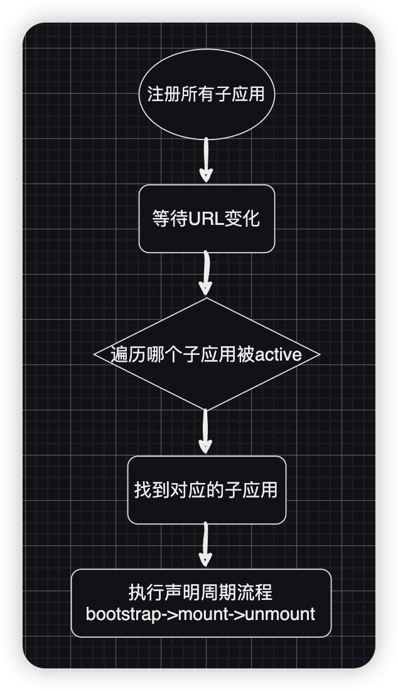
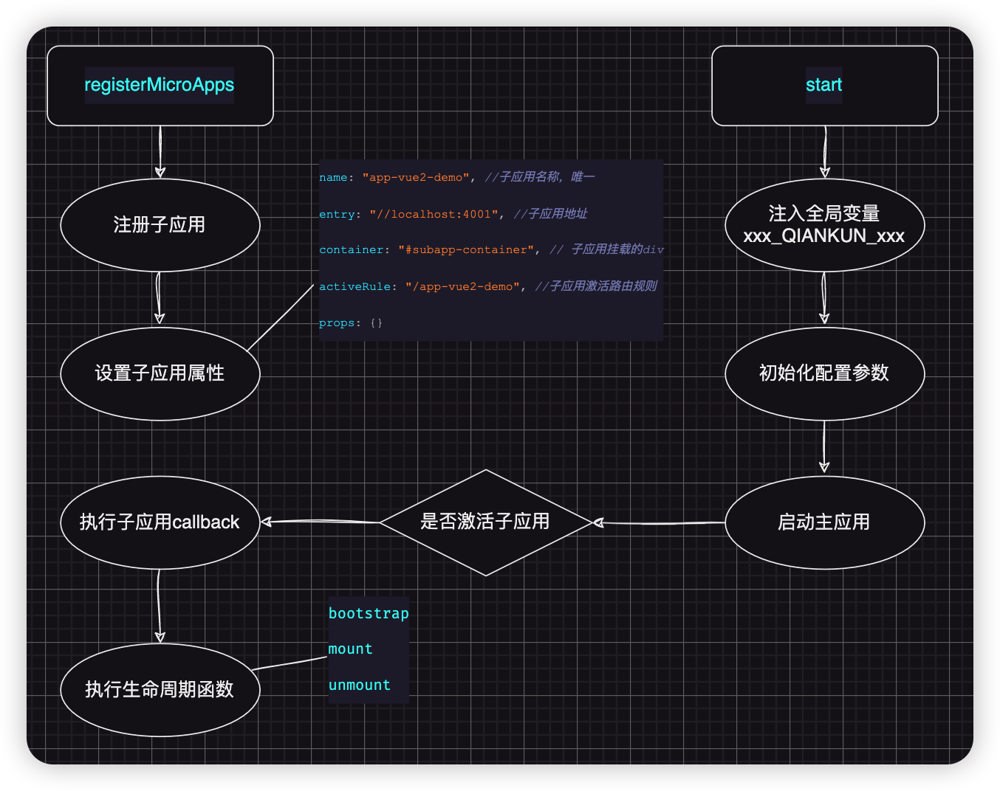
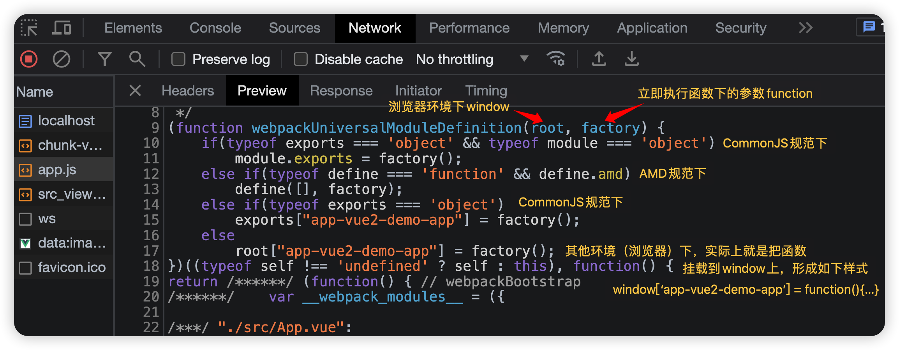
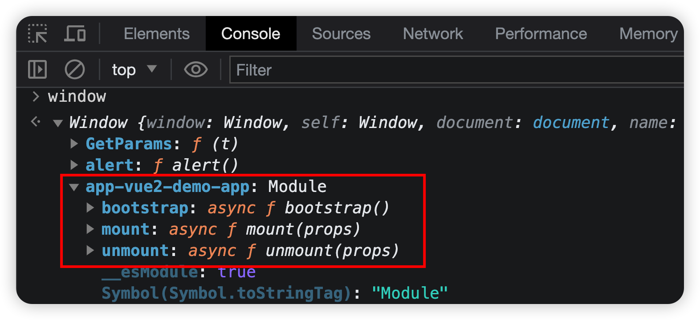
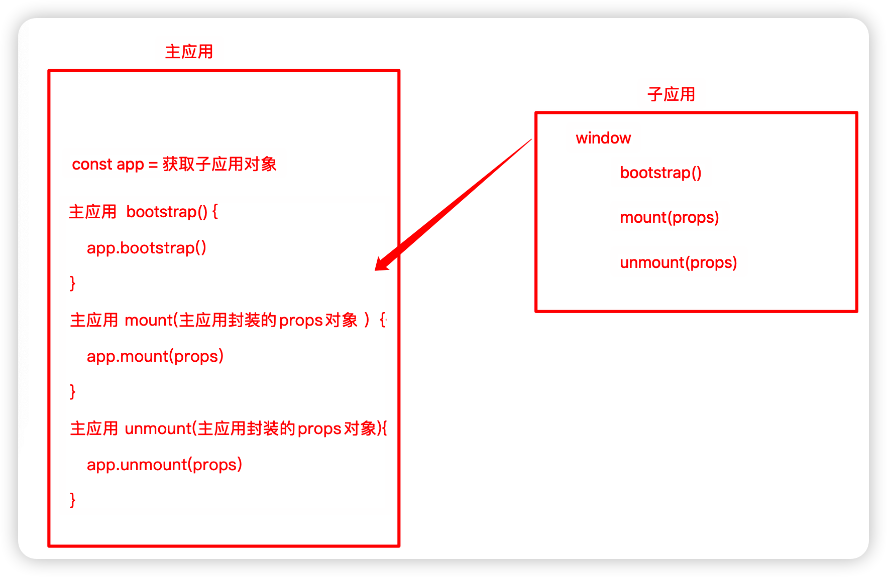
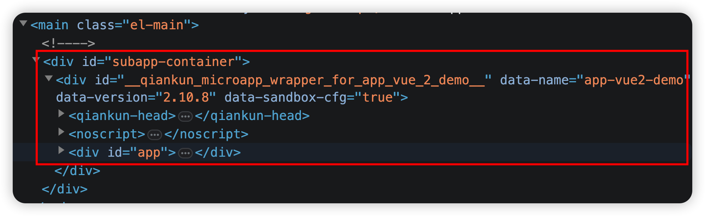
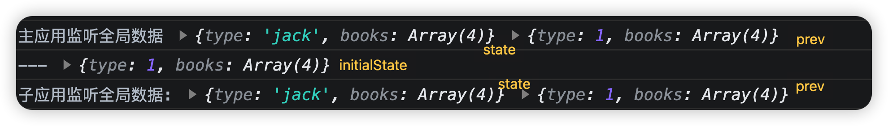
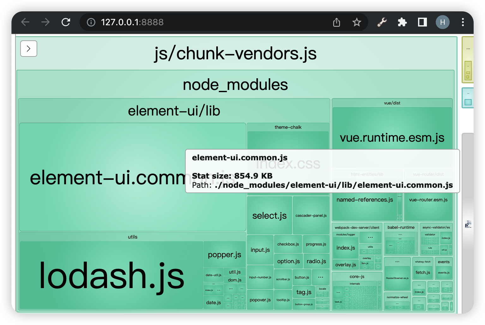
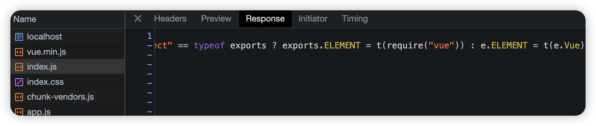

# qiankun微前端框架

## single-spa

qiankun 是一个基于 [single-spa](https://github.com/CanopyTax/single-spa) 的[微前端](https://micro-frontends.org/)实现库

**single-spa** 则很好地解决了 **路由问题、应用入口** 两个问题，但并没有解决应用加载问题，而是将该问题暴露出来由使用者实现。从**single-spa**官网案例给出的示例来看，single-spa给出的加载方案是**JS Entry**，简单来说，就是将子应用将资源打成一个entry script，但是这个方案限制很多，比如子应用的所有资源打包到一个 js bundle 里，包括 css、图片等资源。这样除了打出来的包可能体积庞大之外的问题之外，资源的并行加载等特性也无法利用上。

**qiankun**在此基础上封装了一个应用加载方案，即 **HTML Entry**  ，**HTML Entry** 则更加灵活，直接将子应用打出来 HTML作为入口，主框架可以通过 fetch html 的方式获取子应用的静态资源，同时将 HTML document 作为子节点塞到主框架的容器中。这样不仅可以极大的减少主应用的接入成本，子应用的开发方式及打包方式基本上也不需要调整

这里你就会发现，就中加载不就是和Micro-App是一个意思吗？ 

下面这个图，基本可以简单解释single-spa实现的原理



简单来说，就是当路由发生变化时，也就是window的**hashChange**事件或者**popState**事件会触发，这时single-spa会监听到，然后根据注册的子应用的设置，调用子应用暴露的生命周期钩子。所谓的应用入口，也就是single-spa要求子应用必须要具有**bootstrap、mount、unmount**这三个生命周期钩子，且必须返回**Promise**，以保证single-spa可以注册回调函数。

**single-spa** 主要代码

```js
// single-spa-config.js
import { registerApplication, start } from 'single-spa';

// Simple usage
registerApplication(
  'app2',
  () => import('src/app2/main.js'),
  (location) => location.pathname.startsWith('/app2'),
  { some: 'value' }
);

// Config with more expressive API
registerApplication({
  name: 'app1',
  app: () => import('src/app1/main.js'),
  activeWhen: '/app1',
  customProps: {
    some: 'value',
  }
});

start();
```

```js
const application = {
  bootstrap: () => Promise.resolve(), //bootstrap function
  mount: () => Promise.resolve(), //mount function
  unmount: () => Promise.resolve(), //unmount function
}
registerApplication('applicationName', application, activityFunction)
```

------


## qiankun框架的实现

### 主应用

主应用不限技术栈，只需要提供一个容器 DOM，然后注册微应用并 `start` 即可。

#### 安装

在主应用安装`qiankun`

```js
npm i qiankun -S
```

#### 注册启动

注册微应用并启动：

```js
import { registerMicroApps, start } from 'qiankun';

registerMicroApps([
  {
    name: "app-vue2-demo", //子应用名称，唯一
    entry: "//localhost:4001", //子应用地址
    container: "#subapp-container", // 子应用挂载的div
    activeRule: "/app-vue2-demo", //子应用激活规则
  },
]);
// 启动 qiankun
start();
```

#### 基本原理

这里的配置就使用了qiankun最重要的两个api，**registerMicroApps**与**start**

> 用法：registerMicroApps(apps, lifeCycles?)
>
> - 参数：
>   - apps - `Array<RegistrableApp>` - 必选，微应用的一些注册信息
>   - lifeCycles - `LifeCycles` - 可选，全局的微应用生命周期钩子
> - 详解
>   - RegistrableApp
>     - name - `string` - 必选，微应用的名称，微应用之间必须确保唯一
>     - entry - `string | { scripts?: string[]; styles?: string[]; html?: string }` - 必选，微应用的入口
>     - container - `string | HTMLElement` - 必选，微应用的容器节点的选择器或者 `Element` 实例。如`container: '#root'` 或 `container: document.querySelector('#root')`
>     - activeRule - `string | (location: Location) => boolean | Array<string | (location: Location) => boolean>` - 必选，微应用的激活规则
>     - loader - `(loading: boolean) => void` - 可选，`loading` 状态发生变化时会调用的方法
>     - props - `object` - 可选，主应用需要传递给微应用的数据
>   - LifeCycles
>     - beforeLoad - `Lifecycle | Array<Lifecycle>` - 可选
>     - beforeMount - `Lifecycle | Array<Lifecycle>` - 可选
>     - afterMount - `Lifecycle | Array<Lifecycle>` - 可选
>     - beforeUnmount - `Lifecycle | Array<Lifecycle>` - 可选
>     - afterUnmount - `Lifecycle | Array<Lifecycle>` - 可选

这些参数都是由 `single-spa` 直接实现，这里可以先简单理解为注册子应用。在符合 `activeRule` 激活规则时将会激活子应用，执行回调函数，返回一些生命周期钩子函数（见下图）。



当然这个流程主要还是遵循了single-spa的流程，在子应用激活之后，qiankun通过**HTML entry**，加载了子应用的HTML资源(其实基本的原理，和我们之前手写micro-app是一个道理，只是qiankun直接使用了**import-html-entry**库)


> `template` 将脚本文件内容注释后的 `html` 模板文件  
>
> `assetPublicPath` 资源地址根路径，可用于加载子应用资源  
>
> `getExternalScripts` 方法：获取外部引入的脚本文件 
>
>  `getExternalStyleSheets` 方法：获取外部引入的样式表文件  
>
> `execScripts` 方法：执行该模板文件中所有的 `JS` 脚本文件，并且可以指定脚本的作用域 - `proxy` 对象

#### 挂载

qiankun和micro-app概念不一样，micro-app是需要在本地界面中加载 web component 的自定义元素。而qiankun基于single-spa，理念其实就是把子应用看做一个单独的SPA组件，因此需要一个单独的容器去进行挂载。`container: "#subapp-container"` 这个就是子应用需要加载的容器id。

子应用容器：

我们可以在主应用的布局页面，放入容器，这个容器中就是存放子应用内容的

```html
<el-container>
  <el-header>Micro-App</el-header>
  <el-main>
    <router-view></router-view>
    <div id="subapp-container"></div>
  </el-main>
</el-container>
```

由于qiankun默认使用**location.pathname**值来判断当前应该加载哪个子项目的,所以建议主项目路由模式默认使用history模式，

------


### Vue2子应用

#### 1、修改vue.config.js配置

主要修改两点

- headers的跨域响应头
- webpack的output配置

```js
const { defineConfig } = require('@vue/cli-service')
// package.json的name需注意与主应用一致
const { name } = require('./package.json')

module.exports = defineConfig({
  lintOnSave:false,
  transpileDependencies: true,
  configureWebpack: {
    output: {
      library: `${name}-[name]`,
      libraryTarget: 'umd', //打包成 umd 库格式 所有的模块定义下都可运行
      chunkLoadingGlobal: `webpackJsonp_${name}`, //webpack5的jsonpFunction设置
    }
  },
  devServer: {
    port: 4001,
    headers: {
      'Access-Control-Allow-Origin': '*' // 主应用获取子应用时跨域响应头
    }
  }
})

```

上面稍微注意两点，`const { name } = require('./package.json')` 这里的名字是从`package.json` 文件中读取的，所以，`package.json`的配置name，应该和主应用配置的name一致

```js
// ./package.json
{
  "name": "app-vue2-demo",
  "version": "0.1.0",
  "private": true,
   ......
}
```


#### 2、解决静态文件路径问题

在 `src` 目录新增 `public-path.js`：

```js
if (window.__POWERED_BY_QIANKUN__) {
  // eslint-disable-next-line
  __webpack_public_path__ = window.__INJECTED_PUBLIC_PATH_BY_QIANKUN__;
}
```

在`main.js`文件顶部引入:

```js
import "./public-path"
```

#### 3、修改路由配置(并非必须，这一步只是为了后面获取主应用传递的数据方便)

`src/routes/index.js`改为只暴露routes，`new Router`改到`main.js`中声明。

```js
const routes = [
  {
    path: "/",
    name: "Home",
    component: () => import("@/views/Home.vue")
  },
  {
    path: "/about",
    name: "About",
    component: () => import("@/views/About.vue")
  },
  {
    path: "/users",
    name: "Users",
    component: () => import("@/views/Users.vue")
  }
]
export default routes;

```

#### 4、改造`main.js`入口文件

加入`render函数`，加入`router`，加入`生命周期函数`

```js
import "./public-path"
import Vue from 'vue'
import App from './App.vue'
// import router from "@/routes"
import routes from "@/routes"
import VueRouter from "vue-router";

import ElementUI from 'element-ui';
import 'element-ui/lib/theme-chalk/index.css';

Vue.config.productionTip = false
Vue.use(ElementUI);

// new Vue({
//   render: h => h(App),
//   router
// }).$mount('#app')

let router = null;
let instance = null;
Vue.use(VueRouter);

function render(props = {}) {
  //container 是主应用传过来的生成子应用的dom节点
  const { container } = props;
  router = new VueRouter({
    base: window.__POWERED_BY_QIANKUN__ ? '/app-vue2-demo/' : '/',
    mode: 'history',
    routes,
  });

  instance = new Vue({
    router,
    render: (h) => h(App),
    //为了避免根 id #app 与其他的 DOM 冲突，需要限制查找范围
  }).$mount(container ? container.querySelector('#app') : '#app');
}

// 独立运行时
if (!window.__POWERED_BY_QIANKUN__) {
  render();
}
/**
 * bootstrap 只会在微应用初始化的时候调用一次，下次微应用重新进入时会直接调用 mount 钩子，不会再重复触发 bootstrap。
 * 通常我们可以在这里做一些全局变量的初始化，比如不会在 unmount 阶段被销毁的应用级别的缓存等。
 */
export async function bootstrap() {
  console.log('[vue] vue app bootstraped');
}
/**
 * 应用每次进入都会调用 mount 方法，通常我们在这里触发应用的渲染方法
 */
export async function mount(props) {
  console.log('[vue] props from main framework', props);
  render(props);
}

/**
 * 应用每次 切出/卸载 会调用的方法，通常在这里我们会卸载微应用的应用实例
 */
export async function unmount() {
  instance.$destroy();
  instance.$el.innerHTML = '';
  instance = null;
  router = null;
}
```

到这里，我们配置的子应用已经可以在主应用中跑起来了。

那前面配置了这么多内容是在干嘛呢？

首先，子应用配置最重要的就是**webpack打包设置**和**子应用生命周期**的设置，来看一下通过**umd**打包之后生成的代码：



也就是说，我们子应用的代码，通过umd打包，实际挂载到了window对象上了



从上图可以看到暴露出来的三个生命周期函数，那也就是说，子应用可以加载到主应用中，主应用就可以直接获取到这三个函数,然后，我们通过下图的方式，在主应用中封装一下子应用的生命周期函数，然后再合适的时间调用就可以了



其中**props**就是主应用下发下来的属性对象，就像父组件传递给子组件的**props**一个意思,也就是说，其实，我们可以自己往**props**放入任何我们希望在子路由启动时，主应用传递给子路由的信息。比如：

主应用：

```js
registerMicroApps([
  {
    name: "app-vue2-demo", //子应用名称，唯一
    entry: "//localhost:4001", //子应用地址
    container: "#subapp-container", // 子应用挂载的div
    activeRule: "/app-vue2-demo", //子应用激活路由规则
    props: {
      users: [
        {id:1,name:'张三'},
        {id:2,name:'李四'},
        {id:3,name:'王五'},
      ],
      routerBase: '/app-vue2-demo' //给子应用下发基础路由
    }
  },
]);
```

**props**里面的属性，是我自定义的内容，一个是定义的users数据，一个是下发给子应用的基础路由地址

我们完全可以在子应用中，直接获取这些内容，并应用

子应用：

```js
function render(props = {}) {
  //container 是主应用传过来的生成子应用的dom节点
  const { container, routerBase, users } = props;
  console.log(users);
  router = new VueRouter({
    base: window.__POWERED_BY_QIANKUN__ ? routerBase : '/',
    mode: 'history',
    routes,
  });
  
  ......其他代码省略
}
```

> 既然props可以传递自己定义的users数组，那么当然也可以传递比如**store**，**history**和**router**路由等等对象到子应用中,比如这种形式：
>
> ```js
> registerMicroApps([
>   {
>     name: "app-vue2-demo", //子应用名称，唯一
>     entry: "//localhost:4001", //子应用地址
>     container: "#subapp-container", // 子应用挂载的div
>     activeRule: "/app-vue2-demo", //子应用激活路由规则
>     props: { 
>       data : { store, router, Vue, Vuex, VueRouter }, 
>       routerBase: '/app-vue2-demo'
>     }
>   },
> ]);
> ```
>
> 当然上面这种传递是vue项目之间的就很方便,甚至可以达到资源共用的效果。
>
> 但是不用沾沾自喜。我们使用微前端的目的是为了集成整合而已。这么做的话，就会破坏掉子应用的独立性，得不偿失



------


### 全局生命周期

当然，除了子应用有生命周期之外，我们在最开始就看到了，基座应用在加载子应用的时候，就可以配置全局生命周期，表示子应用的加载生命周期。

- `LifeCycles`

  ```ts
  type Lifecycle = (app: RegistrableApp) => Promise<any>;
  ```

  - beforeLoad - `Lifecycle | Array<Lifecycle>` - 可选
  - beforeMount - `Lifecycle | Array<Lifecycle>` - 可选
  - afterMount - `Lifecycle | Array<Lifecycle>` - 可选
  - beforeUnmount - `Lifecycle | Array<Lifecycle>` - 可选
  - afterUnmount - `Lifecycle | Array<Lifecycle>` - 可选

为了让这个生命周期稍微演示的有点意义，我们可以加一个简单进度条来表示一下每个子应用的加载过程：

安装[NProgress](https://ricostacruz.com/nprogress/)插件

```javascript
npm install --save nprogress
```

main.js中引用

```javascript
import NProgress from 'nprogress'
import 'nprogress/nprogress.css'
```

改变样式，可以在全局或者App.vue中加入样式

```css
#nprogress .bar {
  background: #F811B2 !important;
  height:10px !important;
}
```

使用：

```javascript
registerMicroApps([
  {
    name: "app-vue2-demo", //子应用名称，唯一
    entry: "//localhost:4001", //子应用地址
    container: "#subapp-container", // 子应用挂载的div
    activeRule: "/app-vue2-demo", //子应用激活路由规则
  },
  ......其他配置省略
], {
  beforeLoad:(app)=>{
    // 加载微应用前，加载进度条
    NProgress.start()
    console.log('before load', app);
    return Promise.resolve()
  }, 
  afterMount: (app) => {
    // 加载微应用前，进度条加载完成
    NProgress.done()
    console.log('after mount', app.name)
    return Promise.resolve()
  },
  afterUnmount:(app)=>{
    console.log('after unload', app)
    return Promise.resolve()
  }
});
```

------


### react 子应用

#### 1、主应用注册

首先主应用应该添加react子应用的注册

```js
registerMicroApps([
  ......其他省略
  {
    name: "app-react-demo", //子应用名称，唯一
    entry: "//localhost:4002", //子应用地址
    container: "#subapp-container", // 子应用挂载的div
    activeRule: "/app-react-demo", //子应用激活路由规则
  },
]);
```

#### 2、在 `src` 目录新增 `public-path.js`：

```js
if (window.__POWERED_BY_QIANKUN__) {
  // eslint-disable-next-line
  __webpack_public_path__ = window.__INJECTED_PUBLIC_PATH_BY_QIANKUN__;
}
```

记得需要**import**到入口文件index.js中

#### 3、设置 `history` 模式路由的 `base`：

```html
<BrowserRouter basename={window.__POWERED_BY_QIANKUN__ ? '/app-react-demo' : '/'}>
```

#### 4、加入生命周期，并限制#root根节点查找范围

```js
import "./public-path"
import React from 'react';
import ReactDOM from 'react-dom/client';
import './index.css';
import App from './App';

// const root = ReactDOM.createRoot(document.getElementById('root'));
// root.render(
//   <React.StrictMode>
//     <App />
//   </React.StrictMode>
// );

let root = null;
function render(props) {
  const { container } = props;
  root = ReactDOM.createRoot(container ? container.querySelector('#root') : document.querySelector('#root'));
  root.render(<App />);
}

if (!window.__POWERED_BY_QIANKUN__) {
  render({});
}

export async function bootstrap() {
  console.log('[react18] react app bootstraped');
}

export async function mount(props) {
  console.log('[react18] props from main framework', props);
  render(props);
}

export async function unmount(props) {
  const { container } = props;
  root.unmount(container ? container.querySelector('#root') : document.querySelector('#root'));
}
```

#### 5、修改webpack配置

为了方便修改webpack配置，可以安装相关webpack配置修改插件

安装插件 `@rescripts/cli`，当然也可以选择其他的插件，例如 `react-app-rewired`

```js
npm i -D @rescripts/cli  --legacy-peer-deps
```

`@rescripts/cli` 现在有版本冲突问题，加上`--legacy-peer-deps`防止版本冲突

根目录新增 `.rescriptsrc.js`：记得**package.json**文件的**name**，需要和主应用配置的name一致，**app-react-demo**

```js
const { name } = require('./package');

module.exports = {
  webpack: (config) => {
    config.output.library = `${name}-[name]`;
    config.output.libraryTarget = 'umd';
    config.output.chunkLoadingGlobal = `webpackJsonp_${name}`;
    config.output.globalObject = 'window';

    return config;
  },

  devServer: (_) => {
    const config = _;

    config.headers = {
      'Access-Control-Allow-Origin': '*',
    };
    config.historyApiFallback = true;
    config.hot = false;
    config.liveReload = false;

    return config;
  },
};
```

------


### Vite项目

qiankun框架在目前为止，还不能兼容vite项目，不过已经提上了[qiankun3.0版本](https://github.com/umijs/qiankun/discussions/1378)的日程。目前的版本，子应用是vite项目，那么只能使用一些社区的实现，现在市面上使用最多是`vite-plugin-qiankun`插件

#### 子应用安装插件

```js
npm i vite-plugin-qiankun
```

#### 修改打包配置（`vite.config.ts`）

```diff
import { defineConfig } from 'vite'
import vue from '@vitejs/plugin-vue'
import { resolve } from 'path';
+ import qiankun from 'vite-plugin-qiankun'

// https://vitejs.dev/config/
export default defineConfig({
  plugins: [
    vue(),
+    qiankun('vue3', {
+      useDevMode: true
+    })
  ],
  server: {
    port: 4003,
+    headers: {
+      'Access-Control-Allow-Origin': '*', // 主应用获取子应用时跨域响应头
+    },
  },
  resolve: {
    alias: {
      '@': resolve(__dirname, 'src') // 设置 `@` 指向 `src` 目录
    }
  },
})
```

#### 设置路由前缀

```js
import { createRouter,createWebHistory } from 'vue-router';
import { qiankunWindow } from "vite-plugin-qiankun/dist/helper";

const base = qiankunWindow.__POWERED_BY_QIANKUN__ ? '/app-vite-demo' : '/';

const router = createRouter({
  history: createWebHistory(base),
  routes: [......],
  ......其他省略
})
```

#### 公开生命周期函数

```js
import { createApp, type App as VueApp } from 'vue'
import './style.css'
import App from './App.vue'
import ElementPlus from 'element-plus'
import 'element-plus/dist/index.css'
import router from './routes';

import {
  renderWithQiankun,
  qiankunWindow,
  type QiankunProps,
} from "vite-plugin-qiankun/dist/helper";

let app: VueApp<Element>;

function render(container: any) {
  app = createApp(App);
  app.use(router);
  app.use(ElementPlus);
  app.mount(container);
}

if (qiankunWindow.__POWERED_BY_QIANKUN__) {
  renderWithQiankun({ bootstrap, mount, unmount, update });
} else {
  render("#app");
}

async function bootstrap() {
  console.log("vue3-vite app bootstrap");
}

async function mount(props: QiankunProps) {
  console.log("vue3-vite app mount");

  render(props.container?.querySelector("#app"));
}

async function unmount() {
  console.log("vue3-vite app unmount");
  app?.unmount();
}

async function update() {
  console.log("vue3 app update");
}
```

由于用到了一些全局变量，如果TS提示错误，可以添加全局TS声明文件

在 `src` 目录新增 `global.d.ts` 文件

```ts
declare let __webpack_public_path__: string;

interface Window {
  __POWERED_BY_QIANKUN__: boolean;
  __INJECTED_PUBLIC_PATH_BY_QIANKUN__: string;
}
```

------


## start函数的参数

启动项目之后，react项目正常显示了，但是很明显是有问题的。css出现了问题，这是因为子应用有一些样式写在了全局，那这样就对整个微前端项目产生了。当然，我们这里就需要样式隔离了。

要在qiankun中实现样式隔离很简单，我们只需要在start函数中加入属性配置就行了

### `start(opts)`

- 参数

  - opts - `Options` 可选

- 类型

  - `Options`

    - prefetch - `boolean | 'all' | string[] | (( apps: RegistrableApp[] ) => { criticalAppNames: string[]; minorAppsName: string[] })` - 可选，是否开启预加载，默认为 `true`。

      配置为 `true` 则会在第一个微应用 mount 完成后开始预加载其他微应用的静态资源

      配置为 `'all'` 则主应用 `start` 后即开始预加载所有微应用静态资源

      配置为 `string[]` 则会在第一个微应用 mounted 后开始加载数组内的微应用资源

      配置为 `function` 则可完全自定义应用的资源加载时机 (首屏应用及次屏应用)

    - sandbox - `boolean` | `{ strictStyleIsolation?: boolean, experimentalStyleIsolation?: boolean }` - 可选，是否开启沙箱，默认为 `true`。

      默认情况下沙箱可以确保单实例场景子应用之间的样式隔离，但是无法确保主应用跟子应用、或者多实例场景的子应用样式隔离。当配置为 `{ strictStyleIsolation: true }` 时表示开启严格的样式隔离模式。这种模式下 qiankun 会为每个微应用的容器包裹上一个 [shadow dom](https://developer.mozilla.org/zh-CN/docs/Web/Web_Components/Using_shadow_DOM) 节点，从而确保微应用的样式不会对全局造成影响。

      基于 ShadowDOM 的严格样式隔离并不是一个可以无脑使用的方案，大部分情况下都需要接入应用做一些适配后才能正常在 ShadowDOM 中运行起来（比如 react 场景下需要解决这些 [问题](https://github.com/facebook/react/issues/10422)，使用者需要清楚开启了 `strictStyleIsolation` 意味着什么。后续 qiankun 会提供更多官方实践文档帮助用户能快速的将应用改造成可以运行在 ShadowDOM 环境的微应用。

      除此以外，qiankun 还提供了一个实验性的样式隔离特性，当 experimentalStyleIsolation 被设置为 true 时，qiankun 会改写子应用所添加的样式为所有样式规则增加一个特殊的选择器规则来限定其影响范围，因此改写后的代码会表达类似为如下结构：

      ```javascript
      // 假设应用名是 react16
      .app-main {
        font-size: 14px;
      }
      
      
      div[data-qiankun-react16] .app-main {
        font-size: 14px;
      }
      ```

      注意: @keyframes, @font-face, @import, @page 将不被支持 (i.e. 不会被改写)

    - singular - `boolean | ((app: RegistrableApp<any>) => Promise<boolean>);` - 可选，是否为单实例场景，单实例指的是同一时间只会渲染一个微应用。默认为 `true`。

    - fetch - `Function` - 可选，自定义的 fetch 方法。

    - getPublicPath - `(entry: Entry) => string` - 可选，参数是微应用的 entry 值。

    - getTemplate - `(tpl: string) => string` - 可选。

    - excludeAssetFilter - `(assetUrl: string) => boolean` - 可选，指定部分特殊的动态加载的微应用资源（css/js) 不被 qiankun 劫持处理。

当然，有些时候，就算加上了css隔离，也不会产生效果。比如**antd**的**modal**弹出层，由于默认的**modal**弹出层是挂载到**document.body**上的，所以，如果直接使用的话，是没有效果的。不过好在antd也是阿里的产品，我们可以使用**modal**的`getContainer={false}`属性，让其挂载在当前位置

如果想实现预加载，可以使用`prefetch`属性，当然我们一般默认就好，默认prefetch就是当前第一个微应用加载完成之后，就会预加载其他的子应用。也可以传递`all`字符串，表示在start开始后，有闲余时间就开始加载子应用

------


## 通信

> 注意：下面的内容在课程发布截止时，qiankun的版本还未修改，使用全局状态管理时，会报出一下提醒:
>
> ```js
> [qiankun] globalState tools will be removed in 3.0, pls don't use it!
> ```
>
> 简单来说**globalState**将在[qiankun3.0版本](https://github.com/umijs/qiankun/discussions/1378)的时候移除，时隔一年多了，现在也仅仅放出了beta版本，应该快更新了，所以下面的内容大家可以先做了解

其实在一开始的时候，我们就可以通过注册配置的props属性，主应用传值到子应用中，不过这种当然局限性是很大的。并且仅仅也就只能传值而已，子应用如果修改了值，主应用也是无感的。qiankun给我们提供了相应的api进行全局的状态管理，也就是通信

> ##  initGlobalState(state)
>
> - 参数
>
>   - state - `Record<string, any>` - 必选
>
> - 用法
>
>   定义全局状态，并返回通信方法，建议在主应用使用，微应用通过 props 获取通信方法。
>
> - 返回
>
>   - **MicroAppStateActions**
>     - **onGlobalStateChange**: `(callback: OnGlobalStateChangeCallback, fireImmediately?: boolean) => void`， 在当前应用监听全局状态，有变更触发 callback，fireImmediately = true 立即触发 callback
>     - **setGlobalState**: `(state: Record<string, any>) => boolean`， 按一级属性设置全局状态，微应用中只能修改已存在的一级属性
>     - **offGlobalStateChange**: `() => boolean`，移除当前应用的状态监听，微应用 umount 时会默认调用

简单示例：

主应用初始化全局数据

```js
import { initGlobalState } from 'qiankun';

const initialState = {
  type:1,
  books: [
    {id:1,bookName:'aaa',price:100,author:'作家1'},
    {id:2,bookName:'bbb',price:100,author:'作家2'},
    {id:3,bookName:'ccc',price:100,author:'作家3'},
    {id:4,bookName:'ddd',price:100,author:'作家4'},
  ]
}
//初始化全局状态，并返回actions:MicroAppStateActions
const actions = initGlobalState(initialState);

//actions对象主要负责全局状态的监听和卸载
actions.onGlobalStateChange((state, prev) => {
  // state: 变更后的状态; prev 变更前的状态
  console.log('主应用监听全局数据', state, prev);
  //初始化数据
  console.log("---",initialState)
});
```

子应用通过props获取全局数据

```js
export async function mount(props) {
  console.log('[vue] props from main framework', props);
  
  props.onGlobalStateChange((state, prev) => {
    // state: 变更后的状态; prev 变更前的状态
    console.log("子应用监听全局数据:",state, prev);
  });

  //监听会对全局状态数据属性进行判断，如果全局状态没有属性不会进行修改
  let state = {
    type:'jack'
  };

  //子应用传递全局数据
  props.setGlobalState(state);
  
  render(props);
  
}
```



我们当然也可以在子应用中，把props数据直接保存到全局，比如Vue对象中，Vuex或者Redux仓库中，方便我们使用

```js
export async function mount(props) {
  console.log('[vue] props from main framework', props);
  
  Vue.prototype.$microProps = props;
  
  render(props);
  
}
```

在子应用的某个页面使用:

```js
<template>
  <div>
    <button @click="changeState">修改全局状态</button>
  </div>
</template>

<script>
export default {
  methods: {
    changeState() { 
      this.$microProps.setGlobalState({
        type: '子应用修改全局状态',
        books: [
          {id: 1, name: '张三'},
        ]
      });
    }
  }
};
</script>
```

------


## 手动加载微应用

适用于需要手动 加载/卸载 一个微应用的场景。

通常这种场景下微应用是一个不带路由的可独立运行的业务组件。 微应用不宜拆分过细，建议按照业务域来做拆分。业务关联紧密的功能单元应该做成一个微应用，反之关联不紧密的可以考虑拆分成多个微应用。 一个判断业务关联是否紧密的标准：**看这个微应用与其他微应用是否有频繁的通信需求**。如果有可能说明这两个微应用本身就是服务于同一个业务场景，合并成一个微应用可能会更合适。

### `loadMicroApp(app, configuration?)`

- 参数

  - app - `LoadableApp` - 必选，微应用的基础信息

    - name - `string` - 必选，微应用的名称，微应用之间必须确保唯一。
    - entry - `string | { scripts?: string[]; styles?: string[]; html?: string }` - 必选，微应用的入口（详细说明同上）。
    - container - `string | HTMLElement` - 必选，微应用的容器节点的选择器或者 Element 实例。如`container: '#root'` 或 `container: document.querySelector('#root')`。
    - props - `object` - 可选，初始化时需要传递给微应用的数据。

  - configuration - `Configuration` - 可选，微应用的配置信息

    - sandbox - `boolean` | `{ strictStyleIsolation?: boolean, experimentalStyleIsolation?: boolean }` - 可选，是否开启沙箱，默认为 `true`。

      默认情况下沙箱可以确保单实例场景子应用之间的样式隔离，但是无法确保主应用跟子应用、或者多实例场景的子应用样式隔离。当配置为 `{ strictStyleIsolation: true }` 时表示开启严格的样式隔离模式。这种模式下 qiankun 会为每个微应用的容器包裹上一个 [shadow dom](https://developer.mozilla.org/zh-CN/docs/Web/Web_Components/Using_shadow_DOM) 节点，从而确保微应用的样式不会对全局造成影响。

      基于 ShadowDOM 的严格样式隔离并不是一个可以无脑使用的方案，大部分情况下都需要接入应用做一些适配后才能正常在 ShadowDOM 中运行起来（比如 react 场景下需要解决这些 [问题](https://github.com/facebook/react/issues/10422)，使用者需要清楚开启了 `strictStyleIsolation` 意味着什么。后续 qiankun 会提供更多官方实践文档帮助用户能快速的将应用改造成可以运行在 ShadowDOM 环境的微应用。

      除此以外，qiankun 还提供了一个实验性的样式隔离特性，当 experimentalStyleIsolation 被设置为 true 时，qiankun 会改写子应用所添加的样式为所有样式规则增加一个特殊的选择器规则来限定其影响范围，因此改写后的代码会表达类似为如下结构：

      ```css
      // 假设应用名是 react16
      .app-main {
        font-size: 14px;
      }
      
      
      div[data-qiankun-react16] .app-main {
        font-size: 14px;
      }
      ```

      注意事项: 目前 @keyframes, @font-face, @import, @page 等规则不会支持 (i.e. 不会被改写)

    - singular - `boolean | ((app: RegistrableApp<any>) => Promise<boolean>);` - 可选，是否为单实例场景，单实例指的是同一时间只会渲染一个微应用。默认为 `false`。

    - fetch - `Function` - 可选，自定义的 fetch 方法。

    - getPublicPath - `(entry: Entry) => string` - 可选，参数是微应用的 entry 值。

    - getTemplate - `(tpl: string) => string` - 可选

    - excludeAssetFilter - `(assetUrl: string) => boolean` - 可选，指定部分特殊的动态加载的微应用资源（css/js) 不被 qiankun 劫持处理

- 返回值 - `MicroApp` - 微应用实例

  - mount(): Promise<null>;
  - unmount(): Promise<null>;
  - update(customProps: object): Promise<any>;
  - getStatus(): | "NOT_LOADED" | "LOADING_SOURCE_CODE" | "NOT_BOOTSTRAPPED" | "BOOTSTRAPPING" | "NOT_MOUNTED" | "MOUNTING" | "MOUNTED" | "UPDATING" | "UNMOUNTING" | "UNLOADING" | "SKIP_BECAUSE_BROKEN" | "LOAD_ERROR";
  - loadPromise: Promise<null>;
  - bootstrapPromise: Promise<null>;
  - mountPromise: Promise<null>;
  - unmountPromise: Promise<null>;

我们可以在主应用创建新的页面和路由，在这个新页面中，手动加载子应用

```js
//路由配置
const router = new VueRouter({
  ......其余省略
    {
      path: "/loadMicroApp",
      name: "LoadMicroApp",
      component: () => import("@/views/LoadMicroApp.vue")
    }
  ]
})

//页面配置App.vue
<el-menu-item index="/loadMicroApp">
  <i class="el-icon-setting"></i>
  <span slot="title">导航五</span>
</el-menu-item>
```

**LoadMicroApp.vue页面**

```javascript
<template>
  <div class="container">
    <div ref="microVue2App" class="item"></div>
    <div ref="microReactApp" class="item"></div>
  </div>
</template>

<script>
import { loadMicroApp } from 'qiankun';
export default {
  name: 'LoadMicroApp',
  data () {
    return {
      microVue2App: null,
      microReactApp: null,
    }
  },
  mounted(){
    this.microVue2App = loadMicroApp({
      name: 'app-vue2-load-demo',
      entry: '//localhost:4001',
      container: this.$refs.microVue2App,
      props: { 
        routerBase: '/loadMicroApp',
        pushState: "/about" 
      },
    });
    this.microReactApp = loadMicroApp({
      name: 'app-react-load-demo',
      entry: '//localhost:4002',
      container: this.$refs.microReactApp,
      props: { 
        routerBase: '/loadMicroApp',
        pushState: "/info" 
      },
    });
  },
  destroyed(){
    this.microVue2App && this.microVue2App.unmount();
    this.microReactApp && this.microReactApp.unmount();
  },
}
</script>

<style scoped>
.container{
  display: flex;
  flex-wrap: wrap;
  justify-content: space-between;
}
.item{
  width: 49%;
  height: 400px;
  border: 1px solid #ccc;
}
</style>
```

由于我们之前已经有vue2和react对应的子应用了，所以这里给子应用传值

```javascript
props: { 
  routerBase: '/loadMicroApp',
},
```

是为了和之前的子应用的路由前缀进行区分。不过之前我们没有给react项目使用主应用传递过去的rouerBase，这里稍微处理一下就好

```javascript
let root = null;
function render(props) {
  const { container } = props;
  root = ReactDOM.createRoot(container ? container.querySelector('#root') : document.querySelector('#root'));
  root.render(<App routerBase={props.routerBase} />);
}
```

在app上再往下传递传递**props**就行

```javascript
<Router basename={window.__POWERED_BY_QIANKUN__ ? routerBase : '/'}>
```

不过这里还是有问题，一般像这种，我们可能希望加载的子应用应该是具体的某一个业务场景的组件页面，不是像现在还是加载的首页。

但是，无论如何，**entry** 仅仅只能拿子应用的 **index.html**，是无法指定路由的。

**如果你想加载指定的页面，你需要先加载子应用，然后跳转到对应的路由。**

但是，这样的话，肯定是会影响子应用的路由的，因此，这种模式，我们需要**单独给子应用指定特殊路由模式**：

> **vue-router使用abstrac模式**(abstract其实就是memory-history)
>
> **React-router使用memory-history模式** 

简单来说，**memory是把路由存储在内存中，不会影响url地址栏**，这样，就不会和其他路由在url地址上产生冲突

不过这个需要对子应用路由加以改造，由于之前我们将子应用的路由直接拿到main.js中进行处理的，那么我们现在改造就比较简单，修改router对象就行了

```diff
// vue2子项目

function render(props = {}) {
  //container 是主应用传过来的生成子应用的dom节点
+  const { container, routerBase, users,pushState } = props;

  router = new VueRouter({
    base: window.__POWERED_BY_QIANKUN__ ? routerBase : '/',
+    mode: pushState ? 'abstract' : 'history',
    routes,
  });

  instance = new Vue({
    router,
    render: (h) => h(App),
    //为了避免根 id #app 与其他的 DOM 冲突，需要限制查找范围
  }).$mount(container ? container.querySelector('#app') : '#app');

+  if(pushState){
+    router.push(pushState).catch(err => { console.log(err) });
+  }
}
```

对于react项目，我们需要传值到app组件中，再进行处理，而且我们还需要使用**MemoryHistory**标签

```javascript
// index.js
let root = null;
function render(props) {
  const { container } = props;
  root = ReactDOM.createRoot(container ? container.querySelector('#root') : document.querySelector('#root'));
  root.render(<App routerBase={props.routerBase} pushState={props.pushState}/>);
}
```

**App.js**

```diff
//App.js
+ import { BrowserRouter, Routes, Route,MemoryRouter } from "react-router-dom";
......其他省略

function App(props) {
+  const { routerBase, pushState } = props;
+  const Router = pushState ? MemoryRouter : BrowserRouter;
  
  return (
    <>
+     <Router initialEntries={[routerBase]} basename={window.__POWERED_BY_QIANKUN__ ? routerBase : '/'}>
        <Routes>
          <Route path="/" element={<LayoutMain />} >
+           <Route index element={<Home pushState={pushState}/>} />
            <Route path="about" element={<About />} />
            <Route path="info" element={<Info />} />
          </Route>
        </Routes>
      </Router>
    </> 
  );
}
```

**Home.js**

```javascript
  const navigate = useNavigate();
  useEffect(() => {
    if(props.pushState){
      navigate(props.pushState);
      return;
    }
  },[props.pushState,navigate])
```

------


## 一些常见问题


### 1.主应用 404 页面的配置？

我们以前配置404页面时，特别是vue-router中，都是前面路由匹配不上市，在最后配置`path:'*'`来匹配到404页面，但是在`qiankun`微前端中，子应用的地址是没有配置到主应用的路由中的，如果还是像以前一样配置一个`path:'*'`，就会导致本来是跳转到子页面的，但是住应用页面却到了404页面

```javascript
{
  path: "*",
  name: "NotFound",
  component: () => import("@/views/NotFound.vue")
},
```

我们可以通过导航守卫判断当前路由是子路由还是真正的404，如果是真正的找不到的资源页面，就跳转到我们已经配置好的404页面资源就好

```javascript
{
  path: "/404",
  name: "NotFound",
  component: () => import("@/views/NotFound.vue")
},
{
  path: "*",
  beforeEnter: (to, from, next) => {
    //我们之前约定的子应用路由都是以/app开头
    if (to.path.startsWith('/app')) {
      // 如果是微应用的路由，放行
      next();
    } else {
      // 否则，指向 NotFound 组件
      next({ path: '/404' });
    }
  }
```

当然我这里使用的是路由独享守卫，如果你用全局守卫也行。

```javascript
const childrenPath = ['/app-vue2-demo', '/app-react-demo',.......];
router.beforeEach((to, from, next) => {
  if (to.name) {
    // 有 name 属性，说明是主应用的路由
    return next();
  }
  if (childrenPath.some((item) => to.path.includes(item))) {
    return next();
  }
  next({ path: '/404' });
});
```


### 2.子应用之间的跳转

- 主应用和微应用都是 `hash` 模式，主应用根据 `hash` 来判断微应用，则不用考虑这个问题。

- 主应用根据 `path` 来判断微应用

  `history` 模式的微应用之间的跳转，或者微应用跳主应用页面，直接使用微应用的路由实例是不行的，原因是微应用的路由实例跳转都基于路由的 `base`。有两种办法可以跳转：

  1.`history.pushState()`：[mdn 用法介绍](https://developer.mozilla.org/zh-CN/docs/Web/API/History/pushState)

  ```javascript
  <template>
    <div>
      <button @click="jumpRouter">跳转</button>
    </div>
  </template>
  
  <script>
  export default {
    methods:{
      jumpRouter(){
        window.history.pushState(null,'',"/app-react-demo/about");
      }
    }
  }
  </script>
  ```

  2.将主应用的路由实例通过 `props` 传给微应用，微应用这个路由实例跳转。不过肯定要求**版本对应**

  ```javascript
  //主应用
  registerMicroApps([
    {
      name: "app-vue2-demo", //子应用名称，唯一
      entry: "//localhost:4001", //子应用地址
      container: "#subapp-container", // 子应用挂载的div
      activeRule: "/app-vue2-demo", //子应用激活路由规则
      props: {
        routerBase: '/app-vue2-demo', //给子应用下发基础路由
        mainRouter: router //传递主应用router
      },
    },
    ......省略
  ```

  ```javascript
  //子应用main.js
  function render(props = {}) {
  
    const mainRouter = props.mainRouter;
    Vue.prototype.$mainRouter = mainRouter;
    ......其他省略
  }
  ```

  ```javascript
  //页面使用
  <template>
    <div>
      <button @click="jumpRouter">router跳转</button>
    </div>
  </template>
  
  <script>
  export default {
    methods:{
      jumpRouter(){
        this.$mainRouter.push('/app-react-demo/about');
      }
    }
  }
  </script>
  ```

  

### 3.IE11不兼容问题

如果希望 `qiankun` （或其依赖库、或者您的应用本身）在 IE 下正常运行，你**至少**需要在应用入口引入以下这些 `polyfills`：

```javascript
"dependencies": {
    "core-js": "^3.6.4",
    "custom-event-polyfill": "^1.0.7",
    "fetch-polyfill": "^0.8.2",
    "whatwg-fetch": "^3.6.2"
  	......其他省略
},

import 'whatwg-fetch';
import 'custom-event-polyfill';
import 'core-js/stable/promise';
import 'core-js/stable/symbol';
import 'core-js/stable/string/starts-with';
import 'core-js/web/url';
```

而且在IE 环境下只能使用单实例模式，`qiankun` 会自动将 `singular` 配置为 `true`

### 4.提取公共依赖库

有一些很常用，主应用，子应用都在使用一些常用的公共库，那么能不能在主应用把这些库给提取出来，那么这样的话，子应用就都能使用了。

首先来说，这种想法很好，但是却有很严重的问题，如果把公共资源提取出来，放在主应用上，那么主应用和子应用之间就形成强依赖关系了。微前端最强调的一点是，离开了微前端环境，子应用也应该能独立运行。

>不要共享运行时，即便所有的团队都是用同一个框架。- [微前端](https://micro-frontends.org/)

虽然共享依赖并不建议，但如果你真的有这个需求，你可以在微应用中将公共依赖配置成 `externals`，然后在主应用中导入这些公共依赖。

大多数时候， `externals`都是为了解决**chunk-vendors.js**打包过大的问题，我们就可以利用`externals`来提取一些依赖包，其实应该说用`externals`来防止这些依赖包被打包

安装[webpack-bundle-analyzer](https://www.npmjs.com/package/webpack-bundle-analyzer)插件

```javascript
npm install --save-dev webpack-bundle-analyzer
```

配置`vue.config.js`文件

```javascript
const BundleAnalyzerPlugin = require('webpack-bundle-analyzer').BundleAnalyzerPlugin;

module.exports = defineConfig({
  lintOnSave:false,
  transpileDependencies: true,
  configureWebpack: {
    ......其他省略
    plugins:[
      new BundleAnalyzerPlugin()
    ],
  },
})
```

然后我们直接启动程序，默认在8888端口就可以打开分析报告（这里主要不是为了讲解**webpack-bundle-analyzer**插件，这个插件的其他一些配置这里就不再细说了）



简单来说我们可以使用`externals`配置哪些文件我们不需要打包到`chunk-vendors.js`文件中，避免首屏js文件过大，加载过慢。

比如我们项目中用到的**elementui**，我觉得太大了，不需要打包到`chunk-vendors.js`文件中，所以在打包配置中，我就可以直接配置`externals`，将elementui从打包配置中剔除。

```javascript
const BundleAnalyzerPlugin = require('webpack-bundle-analyzer').BundleAnalyzerPlugin;

module.exports = defineConfig({
  ......其他省略
  configureWebpack: {
    plugins:[
      new BundleAnalyzerPlugin()
    ],
    externals: {
      'element-ui': 'ELEMENT',
    },
  },
})
```


不过我们项目中还是要用到elementui，所以，我可以直接使用**CDN**的方式在**index.html**中直接引入**elementui**

```javascript
<link href="https://cdn.bootcdn.net/ajax/libs/element-ui/2.15.13/theme-chalk/index.css" rel="stylesheet">
<script src="https://cdn.bootcdn.net/ajax/libs/element-ui/2.15.13/index.js"></script>
```

不过还是会报错，这是因为elementui需要配合vue使用，但是在index.html引入elementui的时候vue还没有生产，那其实我们也可以将vue的外链引入，**注意，vue的CDN必须放在element之前,而且这样的话，vue也必须external,我们在项目中还用到了vue-router，因此vue-router也需要一并处理**

```html
<link href="https://cdn.bootcdn.net/ajax/libs/element-ui/2.15.13/theme-chalk/index.css" rel="stylesheet">
<script src="https://cdn.bootcdn.net/ajax/libs/vue/2.7.9/vue.min.js"></script>
<script src="https://cdn.bootcdn.net/ajax/libs/vue-router/3.6.5/vue-router.js"></script>
<script src="https://cdn.bootcdn.net/ajax/libs/element-ui/2.15.13/index.js"></script>
```

```javascript
externals: {
  'element-ui': 'ELEMENT',
  'vue': 'Vue',
  'vue-router': 'VueRouter',
},
```

不过稍微注意一点，**externals**中配置的`key:value`value的值并不是随意乱取的。这是由于通过**CDN**引入了外链element和vue，会直接挂载到**window**中，其实原理和**umd**打包是一样的




所以，我们要说的最终目的就是这个，既然挂载到了window上，我们可以在主项目中引入外链的**CDN**，那么在子项目中就一样可以使用了。

也就是说最终，在**子项目和主项目中都需要配置**`externals`

```javascript
module.exports = defineConfig({
  ......其他省略
  configureWebpack: {
    externals: {
      'element-ui': 'ELEMENT',
      'vue': 'Vue',
      'vue-router': 'VueRouter',
    },
  },
})
```

**在主项目中引入CDN外链**

```javascript
<link href="https://cdn.bootcdn.net/ajax/libs/element-ui/2.15.13/theme-chalk/index.css" rel="stylesheet">
<script src="https://cdn.bootcdn.net/ajax/libs/vue/2.7.9/vue.min.js"></script>
<script src="https://cdn.bootcdn.net/ajax/libs/vue-router/3.6.5/vue-router.js"></script>
<script src="https://cdn.bootcdn.net/ajax/libs/element-ui/2.15.13/index.js"></script>
```

> 为了节约那么一点打包空间，个人**非常不建议**这么做，这样子应用不能很方便的独立运行，另外由于关键对象都挂载到了window上，很容易引起子应用和主应用之间的冲突
