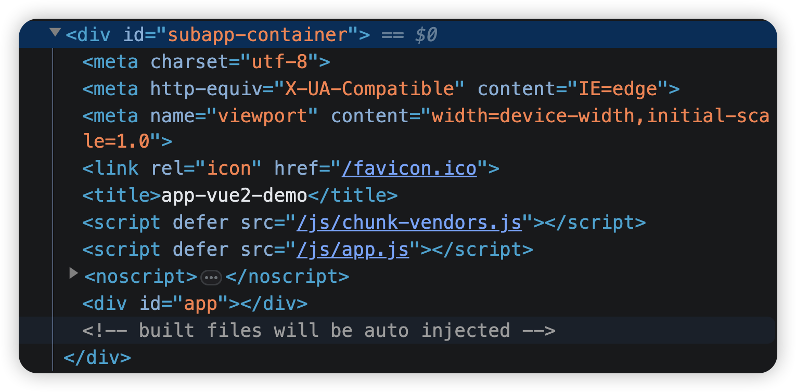
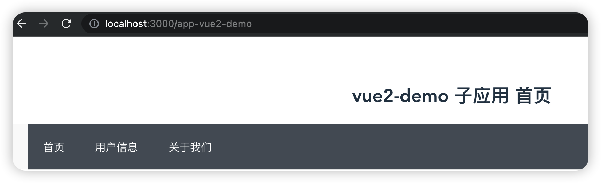
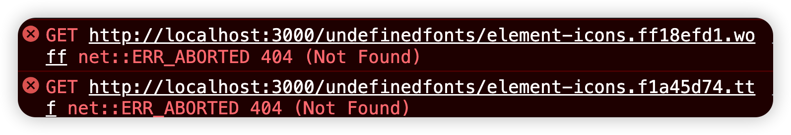
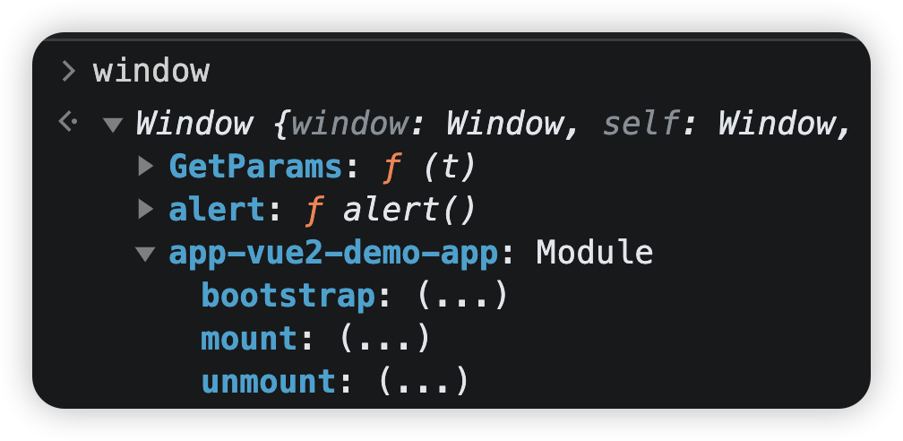
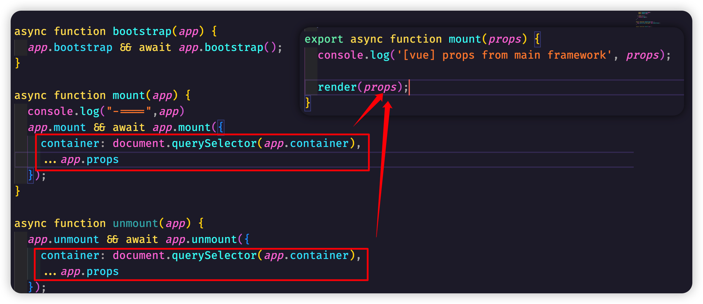
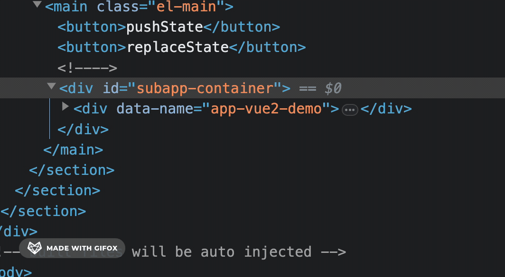

# 手写qiankun


## 从registerMicroApps和start开始


根据我们前面总结的qiankun启动的步骤，无非也就两步：

1、registerMicroApps配置子应用

2、start读取配置，拉取子应用并完成渲染

因此，我们可以在自己的工程中，创建这两个基本的函数

```js
//全局变量
let _app = [];

//更好的获取全局变量_app
export const getApps = () => _app;

//app为传递过来的子应用数组
export const registerMicroApps = (app) => {
  _app = app;
};

export const start = () => {
};

```

这样，至少在主应用界面上，我们也能像qiankun一样，引入自己的这两个函数

```js
import { registerMicroApps,start} from "./micro-ss"
const app = [
  {
    name: "app-vue2-demo", //子应用名称，唯一
    entry: "//localhost:4001", //子应用地址
    container: "#subapp-container", // 子应用挂载的div
    activeRule: "/app-vue2-demo", //子应用激活路由规则
  }
]
registerMicroApps(app);
start();
```

## 要完成渲染的重要步骤

qiankun要完成页面的基本渲染，最重要的，是要依次执行下面的步骤

1、监控路由变化

2、匹配子路由并加载

3、渲染(执行js)

所以，首先就是第一步，我们需要监控路由变化。

对于路由变化来说，无非就是**hash**和**history**两种，hash模式比较的简单。而且qiankun默认使用的history，我们前面的示例也使用的history，所以我们这里手写只考虑history就行了。

history主要有下面几个很关键的[history api](https://developer.mozilla.org/zh-CN/docs/Web/API/History)

1. [`back()`](https://developer.mozilla.org/zh-CN/docs/Web/API/History/back)
2. [`forward()`](https://developer.mozilla.org/zh-CN/docs/Web/API/History/forward)
3. [`go()`](https://developer.mozilla.org/zh-CN/docs/Web/API/History/go)
4. **[`pushState()`](https://developer.mozilla.org/zh-CN/docs/Web/API/History/pushState)**
5. **[`replaceState()`](https://developer.mozilla.org/zh-CN/docs/Web/API/History/replaceState)**

还有一个很关键的window的事件，[**popstate**](https://developer.mozilla.org/zh-CN/docs/Web/API/Window/popstate_event)

我们可以在vue页面做一个简单模拟：

```js
<template>
  ......
	<el-main>
    <button @click="handlePushState">pushState</button>
    <button @click="handleReplaceState">replaceState</button>
          
	</el-main>
</template>  

<script>
export default {
  name: "App",
  mounted() {
    window.addEventListener('popstate', () => {
      console.log('popstate触发了',window.location.pathname)
    })
  },
  methods: {
    handlePushState() { 
      // this.$router.push('/hello')
      window.history.pushState({}, '', '/hello')
    },
    handleReplaceState() { 
      // this.$router.replace('/hey')
      window.history.replaceState({}, '', '/hey')
    }
  }
};
</script>
```

简单总结来说，**popstate**事件会在前进，后退的时候被触发，但是当我们往history中添加**pushState**或者替换**repalceState**时，并不会触发任何事件

所以，现在关键的问题是需要让**pushState**和**repalceState**的时候触发，我们能做一点事情，原生的方法我们并不能做任何事情。因此，我们可以像之前Micro-app手写一样，重写**pushState**和**repalceState**这两个方法就可以了。

```js
const rawPushState = window.history.pushState; 
window.history.pushState = function pushState(...args) { 
  rawPushState.apply(window.history, args);
  console.log("pushState")
}

const rawReplaceState = window.history.replaceState; 
window.history.replaceState = function replaceState(...args) { 
  rawReplaceState.apply(window.history, args);
  console.log("replaceState")
}
```

至此，我们完全可以把路由处理的这一块封装为一个独立的函数模块去进行处理

```js
//rewrite-history.js
export const rewriteHistory = () => { 
  window.addEventListener('popstate', () => { 
    console.log('popstate');
  })
  
  const rawPushState = window.history.pushState;
  window.history.pushState = (...args) => { 
    rawPushState.apply(window.history, args);
    console.log('监视pushState的变化');
  }
  
  const rawReplaceState = window.history.replaceState;
  window.history.replaceState = (...args) => { 
    rawReplaceState.apply(window.history, args);
    console.log('监视到replaceState');
  }
}
```

然后直接放入到index.js的**start**函数中去调用就行了

```diff
let _app = [];
+ import { rewriteHistory } from "./rewrite-history";
export const getApps = () => _app;

export const registerMicroApps = (app) => {
  _app = app;
};

export const start = () => {
+  rewriteHistory();
};

```

## 路由变化的匹配

路由我们可以监控了，现在的关键点是，通过路由的变化，要和我们传入到app数组中子路由的地址进行匹配，匹配到了，我们才进行加载。**也就是现在我们不论前进后退，pushState还是replaceState都需要对路由进行遍历查找**

```js
//handle-router.js
import { getApps } from "./index.js"
import { fetchSource } from "./utils.js";

export const handleRouter = async () => { 
  const apps = getApps();
  const app = apps.find(item => item.activeRule === window.location.pathname)
  
  if (!app) { 
    return;
  }
  try {
    const html = await fetchSource(app.entry);
    const container = document.querySelector(app.container);
    container.innerHTML = html;
  } catch (e) { 
    console.log(e);
  }
}
```

在rewrite-history.js中调用

```diff
+ import { handleRouter } from "./handle-router";
export const rewriteHistory = () => { 
  window.addEventListener('popstate', () => { 
    console.log('popstate');
+   handleRouter()
  })
  
  const rawPushState = window.history.pushState;
  window.history.pushState = (...args) => { 
    rawPushState.apply(window.history, args);
    console.log('pushState');
+    handleRouter()
  }
  
  const rawReplaceState = window.history.replaceState;
  window.history.replaceState = (...args) => { 
    rawReplaceState.apply(window.history, args);
    console.log('replaceState');
+    handleRouter()
  }
}
```

不过这些只是路由变化的时候会触发**handleRouter**，为了让界面一开始就加载，所以在**index.js**文件中最好也载入一次

```diff
export const start = () => {
  rewriteHistory();

+  handleRouter();
};
```


现在，虽然我们在界面上还看不到如何效果，但是只要**路由匹配**，那么其实内容已经加载到主应用的容器中了



## 解析`<script>`

接下来的事情，我们就是去解析script标签。不过在解析之前，我们可以回顾一下，上节课说到了，`qiankun`使用了`import-html-entry`库去解析html资源，并且有几个导出的函数


> `template` 将脚本文件内容注释后的 `html` 模板文件  
>
> `assetPublicPath` 资源地址根路径，可用于加载子应用资源  
>
> `getExternalScripts` 方法：获取外部引入的脚本文件 
>
> `getExternalStyleSheets` 方法：获取外部引入的样式表文件  
>
> `execScripts` 方法：执行该模板文件中所有的 `JS` 脚本文件，并且可以指定脚本的作用域 - `proxy` 对象

既然我们手写的话，我们也可以模拟一下，生成我们自己的`importEntry`函数

```diff
import { getApps } from "./index.js"
+ import { importEntry } from "./importEntry.js"

export const handleRouter = async () => { 
  const apps = getApps();
  const app = apps.find(item => item.activeRule === window.location.pathname)

  if (!app) { 
    return;
  }

  try {
-    const html = await fetchSource(app.entry);
-    const container = document.querySelector(app.container);
-    container.innerHTML = html;
+    let { template,assetPublicPath,getExternalScripts,getExternalStyleSheets,execScripts } = await importEntry(app.entry, app);

		//template得到的是子应用模板，需要加载到基座应用的子应用容器中	
		const container = document.querySelector(app.container);
    container.appendChild(template);

  } catch (e) { 
    console.log(e);
  }
}
```

创建**importEntry.js**文件

```js
import { fetchSource } from "./utils.js";

export const importEntry = async (entry, options) => {
  //读取子应用html中的内容
  const content = await fetchSource(entry);
  //创建div标签
  let template = document.createElement('div');
  template.setAttribute('data-name', options.name);
  template.innerHTML = content;
  
  const assetPublicPath = options.name;

  const getExternalScripts = () => { }

  const execScripts = () => {}

  const getExternalStyleSheets = () => { }
  return {
    template,
    assetPublicPath,
    getExternalScripts,
    getExternalStyleSheets,  
    execScripts
  }
}
```

## 获取script并执行

主要就是要完成**getExternalScripts**和**execScripts**函数

```js
import { fetchSource } from "./utils.js";
export const importEntry = async (entry, options) => { 
  const content = await fetchSource(entry);
  let template = document.createElement('div');
  template.setAttribute('data-name', options.name);
  template.innerHTML = content;

  //数据存放缓存
  const source = {
    links: new Map(),
    scripts: new Map()
  }

  const children = Array.from(template.children);

  const scripts = children.filter(item => item.tagName === 'SCRIPT');

  scripts.forEach(dom => { 
    const src = dom.getAttribute('src');
    if (src) { 
      source.scripts.set(src, {
        code: "", //具体js的代码内容，这个我们还需要通过远程获取
        isExternal:true,//是否是外联js
      })
    }
    else if (dom.textContent) { //内联js
      //随机名字，当做缓存键名
      const randomName = Math.random().toString(36).substring(2,15);
      source.scripts.set(randomName, {
        code: dom.textContent, 
        isExternal:false,
      })
    }
  });

  console.log(source);

  const assetPublicPath = options.name;

  const getExternalScripts = () => { 
    //先将map中的内容转换成数组
    const scriptEntries = Array.from(source.scripts.entries());
    //声明远程获取的promise数组
    const fetchScriptPromise = [];
    for (let [url, info] of scriptEntries) { 
      console.log(url, info);
      //这里的url可能是本地的相对地址
      //由于我们有基座引用，如果是相对地址，就会到基座的下面去查找js文件
      //所以这里需要将相对地址转换为子应用绝对地址
      if (!url.includes('http') && info.isExternal) {
        url = `${entry.endsWith('/') ? entry.substring(0, entry.length - 1) : entry}${url}`;
      }
      console.log(url)
      //放入promise到数组中
      fetchScriptPromise.push(info.code ? Promise.resolve(info.code) : fetchSource(url));
    }

    return Promise.all(fetchScriptPromise)
  }

  const execScripts = async () => {
    const scriptEntries = Array.from(source.scripts.entries());
    const scripts = await getExternalScripts();
    scripts.forEach((code, i) => { 
      scriptEntries[i][1].code = code;
      eval(code);
    });

    console.log(source);
  }

  .....代码省略
}
```

**handle-router.js**调用测试

```js
try {
    // const html = await fetchSource(app.entry);
    // const container = document.querySelector(app.container);
    // container.innerHTML = html;
    let { template,assetPublicPath,getExternalScripts,getExternalStyleSheets,execScripts } = await importEntry(app.entry, app);
    const container = document.querySelector(app.container);
    container.appendChild(template);

  	// getExternalScripts().then(script => { 
    //   console.log(script);
    // })
  
    execScripts();

  } catch (e) { 
    console.log(e);
  }
```

现在直接去运行代码，点击运行子应用路由，发现确实能基本显示了，但是，却是另外一个页面打开。原因很简单。



我们现在是eval运行了code，而我们在子应用里面之前是有判断的，如果是没有`window.__POWERED_BY_QIANKUN__`属性，就会直接调用mount函数去运行子应用代码，目的是方便子应用可以单独运行。

```js
// 子应用中的判断
// 独立运行时
if (!window.__POWERED_BY_QIANKUN__) {
  render();
}
```

而在独立运行的时候，子应用也是把js运行的数据，插入到**app节点**中的，因此和父应用的**#app**肯定就产生了冲突。

最简单的处理，我们可以把子应用用到的**#app**修改掉，改成其他的名字就行了比如**#my-app**,不过这肯定不是我们想要的。

我们可以在父应用中添加好`window.__POWERED_BY_QIANKUN__=true`,比如在我们自己手写的**handle-router.js**文件中就直接添加上`window.__POWERED_BY_QIANKUN__ = true;`至少首先让子应用知道，现在在微前端框架中。

```diff
try {

    let { template,assetPublicPath,getExternalScripts,getExternalStyleSheets,execScripts } = await importEntry(app.entry, app);
    const container = document.querySelector(app.container);
    container.appendChild(template);

+  	window.__POWERED_BY_QIANKUN__ = true;
  	
    execScripts();

  } catch (e) { 
    console.log(e);
  }
```

这句代码也不能随意乱放，毕竟还有执行的先后顺序的问题，所以，最好放在页面加载好，子应用js代码执行之前执行之前

但是只是这么配置之后，还要报错。



这是因为之前，我们就添加了public-path.js文件，但是又没有传数据导致的，我们简单先写一下先

```js
if (window.__POWERED_BY_QIANKUN__) {
  // __webpack_public_path__ = window.__INJECTED_PUBLIC_PATH_BY_QIANKUN__;
  __webpack_public_path__ = 'http://localhost:4001/'
}
```

这样修改之后，界面至少没报错了，但是界面就是不显示。

因为，我们在子应用中添加了生命周期函数，当单独运行时，我们直接调用了`render()`函数,而现在我们添加了

`window.__POWERED_BY_QIANKUN__ = true;`变量之后，**bootstrap，mount，unmoount**是没有执行的，而这几个函数，我们需要拿到基座应用中执行

所以，现在的当务之急，是让基座应用能够拿到子应用的这几个函数，并运行。

还记得我们上节课讲到的**webpack**的**umd**打包后的子应用结果吗？

我们现在直接eval运行了结果，虽然还没有运行出界面，但是打包后的子应用js，已经可以看到效果了


就和上节课一模一样，而且，我们在window对象上，也能直接看到`app-vue2-demo-app`对象了



也就是说，我们现在直接在**execScripts**函数中，导出`window['app-vue2-demo-app']`对象就行了。但是这样写死子应用的名字肯定是不行的。不过我们可以通过变通的方式来处理这个问题。

```js
if(typeof exports === 'object' && typeof module === 'object')
		module.exports = factory();
}
```

这个判断不就是判断**module**和**exports**是不是一个对象吗？我们构造一个**module**和**exports**不就行了

```js
const execScripts = async () => {
  const scriptEntries = Array.from(source.scripts.entries());
  const scripts = await getExternalScripts();

  const module = {
    exports: {}
  }
  const exports = module.exports;

  scripts.forEach((code, i) => { 
    scriptEntries[i][1].code = code;
    eval(code);
  });

  console.log(module.exports);
  
  return module.exports;
}
```

在**handle-router**中调用

```js
export const handleRouter = async () => { 
  const apps = getApps();
  const app = apps.find(item => item.activeRule === window.location.pathname)

  if (!app) { 
    return;
  }

  try {
    let { template,assetPublicPath,getExternalScripts,getExternalStyleSheets,execScripts } = await importEntry(app.entry, app);
    const container = document.querySelector(app.container);
    //现在是每次路由都会加载一次
    container.appendChild(template);
    //获取子应用导出的生命周期函数
    const appExports = await execScripts();
    //将子应用的生命周期函数挂载到app上
    app.bootstrap = appExports.bootstrap;
    app.mount = appExports.mount;
    app.unmount = appExports.unmount;

    await bootstrap(app);
    await mount(app);

  } catch (e) { 
    console.log(e);
  }
}

async function bootstrap(app) { 
  app.bootstrap && await app.bootstrap();
}

async function mount(app) {
  console.log("-====",app)
  app.mount && await app.mount({
    container: document.querySelector(app.container),
    ...app.props
  });
}

async function unmount(app) { 
  app.unmount && await app.unmount({
    container: document.querySelector(app.container),
    ...app.props
  });
}
```

这里注意上面调用的

```javascript
await app.mount({
    container: document.querySelector(app.container),
    ...app.props
});
```

首先子应用中这几个生命周期函数都是异步的，其次，**mount**函数需要我们传递过去的**props**时，我们这里就是在构建传递过去的**props**对象



## 应用卸载

其实我们现在还有一个很严重的问题，每一次路由改变的时候，如果能够匹配到时子应用路由，我们都会无条件的创建一个div，然后读取子应用里面的资源。



也就是说，我们必须在切换路由的时候判断，当前容器中存在有子应用的内容，应该先将其从容器中销毁。然后再加入。

当然，最简单的处理，当然是每次切换路由的时候直接把容器里面的内容全部清理掉就行了

```javascript
export const handleRouter = async () => { 
  const apps = getApps();
  const app = apps.find(item => item.activeRule === window.location.pathname)

  if (!app) { 
    return;
  }

  const container = document.querySelector(app.container);

  if(container.children.length){
    container.innerHTML = "";
  }
  ......省略
}
```

但是这么做意义不大，而且还是有bug的，比如当前不是子应用，这里就判断不到，而且，如果子应用需要再卸载的时候做一些事情，直接这么做也不行，我们最好去调用**unmount**函数，让子应用自己去卸载。

但是**unmount**函数，需要传递一个**app**容器，也就是说，我们每次切换路由的时候我们要获取上一次路由的记录，然后进行删除

```javascript
async function unmount(app) { //这里需要参数app，应该是上一次路由的app
 ......
}
```


但是路由history，只能获取到当前路径，是获取不到上一次的路由的。因此，我们只有自己去做一下处理，记录上一次和下一次路由的路径。

```javascript
//rewrite-history.js

import { handleRouter } from "./handle-router";

let prevRouter = "";
let nextRouter = window.location.pathname;

//通过函数导出上一次和下一次路由
export const getPrevRouter = () => prevRouter;
export const getNextRouter = () => nextRouter;

export const rewriteHistory = () => { 
  window.addEventListener('popstate', () => { 
    console.log('popstate');
    //popstate事件中，
    //prevRouter是之前的nextRouter，
    //nextRouter就是当前的window.location.pathname
    prevRouter = nextRouter;
    nextRouter = window.location.pathname;
    handleRouter()
  })
  
  const rawPushState = window.history.pushState;
  window.history.pushState = (...args) => { 
    //之前的路由
    prevRouter = window.location.pathname;
    rawPushState.apply(window.history, args);
    console.log('pushState');
    //下一个路由
    nextRouter = window.location.pathname;
    handleRouter()
  }
  
  const rawReplaceState = window.history.replaceState;
  window.history.replaceState = (...args) => { 
    prevRouter = window.location.pathname;
    rawReplaceState.apply(window.history, args);
    console.log('replaceState');
    nextRouter = window.location.pathname;
    handleRouter()
  }
}
```

