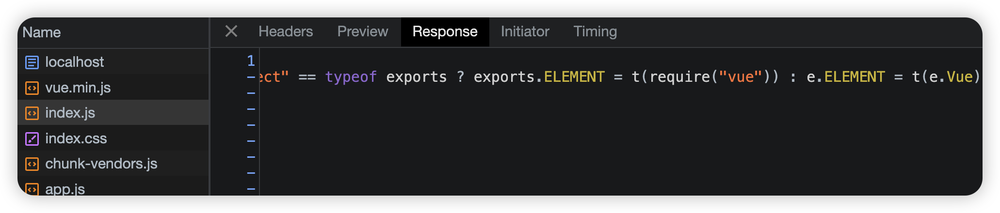
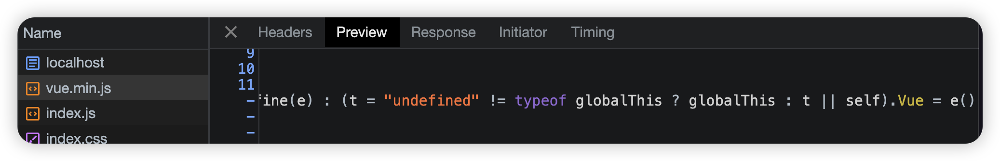
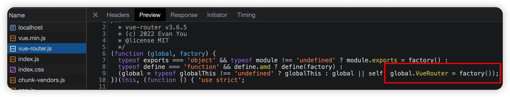

# qiankun的一些常见问题

## 手动加载微应用

适用于需要手动 加载/卸载 一个微应用的场景。

通常这种场景下微应用是一个**不带路由**的可独立运行的业务组件。 微应用不宜拆分过细，建议按照业务域来做拆分。业务关联紧密的功能单元应该做成一个微应用，反之关联不紧密的可以考虑拆分成多个微应用。 一个判断业务关联是否紧密的标准：**看这个微应用与其他微应用是否有频繁的通信需求**。如果有可能说明这两个微应用本身就是服务于同一个业务场景，合并成一个微应用可能会更合适。

### `loadMicroApp(app, configuration?)`

- 参数

  - app - `LoadableApp` - 必选，微应用的基础信息

    - name - `string` - 必选，微应用的名称，微应用之间必须确保唯一。
    - entry - `string | { scripts?: string[]; styles?: string[]; html?: string }` - 必选，微应用的入口（详细说明同上）。
    - container - `string | HTMLElement` - 必选，微应用的容器节点的选择器或者 Element 实例。如`container: '#root'` 或 `container: document.querySelector('#root')`。
    - props - `object` - 可选，初始化时需要传递给微应用的数据。

  - configuration - `Configuration` - 可选，微应用的配置信息

    - sandbox - `boolean` | `{ strictStyleIsolation?: boolean, experimentalStyleIsolation?: boolean }` - 可选，是否开启沙箱，默认为 `true`。

      默认情况下沙箱可以确保单实例场景子应用之间的样式隔离，但是无法确保主应用跟子应用、或者多实例场景的子应用样式隔离。当配置为 `{ strictStyleIsolation: true }` 时表示开启严格的样式隔离模式。这种模式下 qiankun 会为每个微应用的容器包裹上一个 [shadow dom](https://developer.mozilla.org/zh-CN/docs/Web/Web_Components/Using_shadow_DOM) 节点，从而确保微应用的样式不会对全局造成影响。

      基于 ShadowDOM 的严格样式隔离并不是一个可以无脑使用的方案，大部分情况下都需要接入应用做一些适配后才能正常在 ShadowDOM 中运行起来（比如 react 场景下需要解决这些 [问题](https://github.com/facebook/react/issues/10422)，使用者需要清楚开启了 `strictStyleIsolation` 意味着什么。后续 qiankun 会提供更多官方实践文档帮助用户能快速的将应用改造成可以运行在 ShadowDOM 环境的微应用。

      除此以外，qiankun 还提供了一个实验性的样式隔离特性，当 experimentalStyleIsolation 被设置为 true 时，qiankun 会改写子应用所添加的样式为所有样式规则增加一个特殊的选择器规则来限定其影响范围，因此改写后的代码会表达类似为如下结构：

      ```css
      // 假设应用名是 react16
      .app-main {
        font-size: 14px;
      }
      
      
      div[data-qiankun-react16] .app-main {
        font-size: 14px;
      }
      ```

      注意事项: 目前 @keyframes, @font-face, @import, @page 等规则不会支持 (i.e. 不会被改写)

    - singular - `boolean | ((app: RegistrableApp<any>) => Promise<boolean>);` - 可选，是否为单实例场景，单实例指的是同一时间只会渲染一个微应用。默认为 `false`。

    - fetch - `Function` - 可选，自定义的 fetch 方法。

    - getPublicPath - `(entry: Entry) => string` - 可选，参数是微应用的 entry 值。

    - getTemplate - `(tpl: string) => string` - 可选

    - excludeAssetFilter - `(assetUrl: string) => boolean` - 可选，指定部分特殊的动态加载的微应用资源（css/js) 不被 qiankun 劫持处理

- 返回值 - `MicroApp` - 微应用实例

  - mount(): Promise<null>;
  - unmount(): Promise<null>;
  - update(customProps: object): Promise<any>;
  - getStatus(): | "NOT_LOADED" | "LOADING_SOURCE_CODE" | "NOT_BOOTSTRAPPED" | "BOOTSTRAPPING" | "NOT_MOUNTED" | "MOUNTING" | "MOUNTED" | "UPDATING" | "UNMOUNTING" | "UNLOADING" | "SKIP_BECAUSE_BROKEN" | "LOAD_ERROR";
  - loadPromise: Promise<null>;
  - bootstrapPromise: Promise<null>;
  - mountPromise: Promise<null>;
  - unmountPromise: Promise<null>;

我们可以在主应用创建新的页面和路由，在这个新页面中，手动加载子应用

```js
//路由配置
const router = new VueRouter({
  ......其余省略
    {
      path: "/loadMicroApp",
      name: "LoadMicroApp",
      component: () => import("@/views/LoadMicroApp.vue")
    }
  ]
})

//页面配置App.vue
<el-menu-item index="/loadMicroApp">
  <i class="el-icon-setting"></i>
  <span slot="title">导航五</span>
</el-menu-item>
```

**LoadMicroApp.vue页面**

```javascript
<template>
  <div class="container">
    <div ref="microVue2App" class="item"></div>
    <div ref="microReactApp" class="item"></div>
  </div>
</template>

<script>
import { loadMicroApp } from 'qiankun';
export default {
  name: 'LoadMicroApp',
  data () {
    return {
      microVue2App: null,
      microReactApp: null,
    }
  },
  mounted(){
    this.microVue2App = loadMicroApp({
      name: 'app-vue2-load-demo',
      entry: '//localhost:4001',
      container: this.$refs.microVue2App,
      props: { 
        routerBase: '/loadMicroApp',
        pushState: "/about" 
      },
    });
    this.microReactApp = loadMicroApp({
      name: 'app-react-load-demo',
      entry: '//localhost:4002',
      container: this.$refs.microReactApp,
      props: { 
        routerBase: '/loadMicroApp',
        pushState: "/info" 
      },
    });
  },
  destroyed(){
    this.microVue2App && this.microVue2App.unmount();
    this.microReactApp && this.microReactApp.unmount();
  },
}
</script>

<style scoped>
.container{
  display: flex;
  flex-wrap: wrap;
  justify-content: space-between;
}
.item{
  width: 49%;
  height: 400px;
  border: 1px solid #ccc;
}
</style>
```

由于我们之前已经有vue2和react对应的子应用了，所以这里给子应用传值

```javascript
props: { 
  routerBase: '/loadMicroApp',
},
```

是为了和之前的子应用的路由前缀进行区分。不过之前我们没有给react项目使用主应用传递过去的rouerBase，这里稍微处理一下就好

```javascript
let root = null;
function render(props) {
  const { container } = props;
  root = ReactDOM.createRoot(container ? container.querySelector('#root') : document.querySelector('#root'));
  root.render(<App routerBase={props.routerBase} />);
}
```

在app上再往下传递传递**props**就行

```javascript
<Router basename={window.__POWERED_BY_QIANKUN__ ? routerBase : '/'}>
```

不过这里还是有问题，一般像这种，我们可能希望加载的子应用应该是具体的某一个业务场景的组件页面，不是像现在还是加载的首页。

但是，无论如何，**entry** 仅仅只能拿子应用的 **index.html**，是无法指定路由的。

**如果你想加载指定的页面，你需要先加载子应用，然后跳转到对应的路由。**

但是，这样的话，肯定是会影响子应用的路由的，因此，这种模式，我们需要**单独给子应用指定特殊路由模式**：

> **vue-router使用abstrac模式**(abstract其实就是memory-history)
>
> **React-router使用memory-history模式** 

简单来说，**memory是把路由存储在内存中，不会影响url地址栏**，这样，就不会和其他路由在url地址上产生冲突

不过这个需要对子应用路由加以改造，由于之前我们将子应用的路由直接拿到main.js中进行处理的，那么我们现在改造就比较简单，修改router对象就行了

```diff
// vue2子项目

function render(props = {}) {
  //container 是主应用传过来的生成子应用的dom节点
+  const { container, routerBase, users,pushState } = props;

  router = new VueRouter({
    base: window.__POWERED_BY_QIANKUN__ ? routerBase : '/',
+    mode: pushState ? 'abstract' : 'history',
    routes,
  });

  instance = new Vue({
    router,
    render: (h) => h(App),
    //为了避免根 id #app 与其他的 DOM 冲突，需要限制查找范围
  }).$mount(container ? container.querySelector('#app') : '#app');

+  if(pushState){
+    router.push(pushState).catch(err => { console.log(err) });
+  }
}
```

对于react项目，我们需要传值到app组件中，再进行处理，而且我们还需要使用**MemoryHistory**标签

```javascript
// index.js
let root = null;
function render(props) {
  const { container } = props;
  root = ReactDOM.createRoot(container ? container.querySelector('#root') : document.querySelector('#root'));
  root.render(<App routerBase={props.routerBase} pushState={props.pushState}/>);
}
```

**App.js**

```diff
//App.js
+ import { BrowserRouter, Routes, Route,MemoryRouter } from "react-router-dom";
......其他省略

function App(props) {
+  const { routerBase, pushState } = props;
+  const Router = pushState ? MemoryRouter : BrowserRouter;
  
  return (
    <>
+     <Router initialEntries={[routerBase]} basename={window.__POWERED_BY_QIANKUN__ ? routerBase : '/'}>
        <Routes>
          <Route path="/" element={<LayoutMain />} >
+           <Route index element={<Home pushState={pushState}/>} />
            <Route path="about" element={<About />} />
            <Route path="info" element={<Info />} />
          </Route>
        </Routes>
      </Router>
    </> 
  );
}
```

**Home.js**

```javascript
  const navigate = useNavigate();
  useEffect(() => {
    if(props.pushState){
      navigate(props.pushState);
      return;
    }
  },[props.pushState,navigate])
```

------


## 一些常见问题


### 1.主应用 404 页面的配置？

我们以前配置404页面时，特别是vue-router中，都是前面路由匹配不上时，在最后配置`path:'*'`来匹配到404页面，但是在`qiankun`微前端中，子应用的地址是没有配置到主应用的路由中的，如果还是像以前一样配置一个`path:'*'`，就会导致本来是跳转到子页面的，但是住应用页面却到了404页面

```javascript
{
  path: "*",
  name: "NotFound",
  component: () => import("@/views/NotFound.vue")
},
```

我们可以通过导航守卫判断当前路由是子路由还是真正的404，如果是真正的找不到的资源页面，就跳转到我们已经配置好的404页面资源就好

```javascript
{
  path: "/404",
  name: "NotFound",
  component: () => import("@/views/NotFound.vue")
},
{
  path: "*",
  beforeEnter: (to, from, next) => {
    //我们之前约定的子应用路由都是以/app开头
    if (to.path.startsWith('/app')) {
      // 如果是微应用的路由，放行
      next();
    } else {
      // 否则，指向 NotFound 组件
      next({ path: '/404' });
    }
  }
```

当然我这里使用的是路由独享守卫，如果你用全局守卫也行。

```javascript
const childrenPath = ['/app-vue2-demo', '/app-react-demo',.......];
router.beforeEach((to, from, next) => {
  if (to.name) {
    // 有 name 属性，说明是主应用的路由
    return next();
  }
  if (childrenPath.some((item) => to.path.includes(item))) {
    return next();
  }
  next({ path: '/404' });
});
```


### 2.子应用之间的跳转

- 主应用和微应用都是 `hash` 模式，主应用根据 `hash` 来判断微应用，则不用考虑这个问题。

- 主应用根据 `path` 来判断微应用

  `history` 模式的微应用之间的跳转，或者微应用跳主应用页面，直接使用微应用的路由实例是不行的，原因是微应用的路由实例跳转都基于路由的 `base`。有两种办法可以跳转：

  1.`history.pushState()`：[mdn 用法介绍](https://developer.mozilla.org/zh-CN/docs/Web/API/History/pushState)

  ```javascript
  <template>
    <div>
      <button @click="jumpRouter">跳转</button>
    </div>
  </template>
  
  <script>
  export default {
    methods:{
      jumpRouter(){
        window.history.pushState(null,'',"/app-react-demo/about");
      }
    }
  }
  </script>
  ```

  2.将主应用的路由实例通过 `props` 传给微应用，微应用这个路由实例跳转。不过肯定要求**版本对应**

  ```javascript
  //主应用
  registerMicroApps([
    {
      name: "app-vue2-demo", //子应用名称，唯一
      entry: "//localhost:4001", //子应用地址
      container: "#subapp-container", // 子应用挂载的div
      activeRule: "/app-vue2-demo", //子应用激活路由规则
      props: {
        routerBase: '/app-vue2-demo', //给子应用下发基础路由
        mainRouter: router //传递主应用router
      },
    },
    ......省略
  ```

  ```javascript
  //子应用main.js
  function render(props = {}) {
  
    const mainRouter = props.mainRouter;
    Vue.prototype.$mainRouter = mainRouter;
    ......其他省略
  }
  ```

  ```javascript
  //页面使用
  <template>
    <div>
      <button @click="jumpRouter">router跳转</button>
    </div>
  </template>
  
  <script>
  export default {
    methods:{
      jumpRouter(){
        this.$mainRouter.push('/app-react-demo/about');
      }
    }
  }
  </script>
  ```

  

### 3.IE11不兼容问题

如果希望 `qiankun` （或其依赖库、或者您的应用本身）在 IE 下正常运行，你**至少**需要在应用入口引入以下这些 `polyfills`：

```javascript
"dependencies": {
    "core-js": "^3.6.4",
    "custom-event-polyfill": "^1.0.7",
    "fetch-polyfill": "^0.8.2",
    "whatwg-fetch": "^3.6.2"
  	......其他省略
},

//main.js entry  
import 'whatwg-fetch';
import 'custom-event-polyfill';
import 'core-js/stable/promise';
import 'core-js/stable/symbol';
import 'core-js/stable/string/starts-with';
import 'core-js/web/url';
```

而且在IE 环境下只能使用单实例模式，`qiankun` 会自动将 `singular` 配置为 `true`

### 4.提取公共依赖库

有一些很常用，主应用，子应用都在使用一些常用的公共库，那么能不能在主应用把这些库给提取出来，那么这样的话，子应用就都能使用了。

首先来说，这种想法很好，但是却有很严重的问题，如果把公共资源提取出来，放在主应用上，那么主应用和子应用之间就形成强依赖关系了。微前端最强调的一点是，离开了微前端环境，子应用也应该能独立运行。

>不要共享运行时，即便所有的团队都是用同一个框架。- [微前端](https://micro-frontends.org/)

虽然共享依赖并不建议，但如果你真的有这个需求，你可以在微应用中将公共依赖配置成 `externals`，然后在主应用中导入这些公共依赖。

大多数时候， `externals`都是为了解决**chunk-vendors.js**打包过大的问题，我们就可以利用`externals`来提取一些依赖包，其实应该说用`externals`来防止这些依赖包被打包

安装[webpack-bundle-analyzer](https://www.npmjs.com/package/webpack-bundle-analyzer)插件

```javascript
npm install --save-dev webpack-bundle-analyzer
```

配置`vue.config.js`文件

```javascript
const BundleAnalyzerPlugin = require('webpack-bundle-analyzer').BundleAnalyzerPlugin;

module.exports = defineConfig({
  lintOnSave:false,
  transpileDependencies: true,
  configureWebpack: {
    ......其他省略
    plugins:[
      new BundleAnalyzerPlugin()
    ],
  },
})
```

然后我们直接启动程序，默认在8888端口就可以打开分析报告（这里主要不是为了讲解**webpack-bundle-analyzer**插件，这个插件的其他一些配置这里就不再细说了）


简单来说我们可以使用`externals`配置哪些文件我们不需要打包到`chunk-vendors.js`文件中，避免首屏js文件过大，加载过慢。

比如我们项目中用到的**elementui**，我觉得太大了，不需要打包到`chunk-vendors.js`文件中，所以在打包配置中，我就可以直接配置`externals`，将elementui从打包配置中剔除。

```javascript
const BundleAnalyzerPlugin = require('webpack-bundle-analyzer').BundleAnalyzerPlugin;

module.exports = defineConfig({
  ......其他省略
  configureWebpack: {
    plugins:[
      new BundleAnalyzerPlugin()
    ],
    externals: {
      'element-ui': 'ELEMENT',
    },
  },
})
```


不过我们项目中还是要用到elementui，所以，我可以直接使用**CDN**的方式在**index.html**中直接引入**elementui**

```javascript
<link href="https://cdn.bootcdn.net/ajax/libs/element-ui/2.15.13/theme-chalk/index.css" rel="stylesheet">
<script src="https://cdn.bootcdn.net/ajax/libs/element-ui/2.15.13/index.js"></script>
```

不过还是会报错，这是因为elementui需要配合vue使用，但是在index.html引入elementui的时候vue还没有生产，那其实我们也可以将vue的外链引入，**注意，vue的CDN必须放在element之前,而且这样的话，vue也必须external,我们在项目中还用到了vue-router，因此vue-router也需要一并处理**

```html
<link href="https://cdn.bootcdn.net/ajax/libs/element-ui/2.15.13/theme-chalk/index.css" rel="stylesheet">
<script src="https://cdn.bootcdn.net/ajax/libs/vue/2.7.9/vue.min.js"></script>
<script src="https://cdn.bootcdn.net/ajax/libs/vue-router/3.6.5/vue-router.js"></script>
<script src="https://cdn.bootcdn.net/ajax/libs/element-ui/2.15.13/index.js"></script>
```

```javascript
externals: {
  'element-ui': 'ELEMENT',
  'vue': 'Vue',
  'vue-router': 'VueRouter',
},
```

不过稍微注意一点，**externals**中配置的`key:value`value的值并不是随意乱取的。这是由于通过**CDN**引入了外链element和vue，会直接挂载到**window**中，其实原理和**umd**打包是一样的







所以，我们要说的最终目的就是这个，既然挂载到了window上，我们可以在主项目中引入外链的**CDN**，那么在子项目中就一样可以使用了。

也就是说最终，在**子项目和主项目中都需要配置**`externals`

```javascript
module.exports = defineConfig({
  ......其他省略
  configureWebpack: {
    externals: {
      'element-ui': 'ELEMENT',
      'vue': 'Vue',
      'vue-router': 'VueRouter',
    },
  },
})
```

**在主项目中引入CDN外链**

```javascript
<link href="https://cdn.bootcdn.net/ajax/libs/element-ui/2.15.13/theme-chalk/index.css" rel="stylesheet">
<script src="https://cdn.bootcdn.net/ajax/libs/vue/2.7.9/vue.min.js"></script>
<script src="https://cdn.bootcdn.net/ajax/libs/vue-router/3.6.5/vue-router.js"></script>
<script src="https://cdn.bootcdn.net/ajax/libs/element-ui/2.15.13/index.js"></script>
```

> 为了节约那么一点打包空间，个人**非常不建议**这么做，这样子应用不能很方便的独立运行，另外由于关键对象都挂载到了window上，很容易引起子应用和主应用之间的冲突

### 5.实现keep-alive

qiankun并没有实现子应用的keep-alive效果，因此，我们只有自己想办法来达到这个效果。

本身qiankun默认是通过**registerMicroApps**函数一开始注册所有子应用，因此最大的问题是，我们根本获取不了当前激活的子应用对象。所以，这个办法我们不可行。

但是，通过手动加载函数`loadMicroApp`我们可以获取当前激活子应用的对象。所以，我们要实现`keep-alive`,就需要借助这个函数。

另外，我们要实现`keep-alive`实际上，我们只需要缓存子应用的具体页面就行，而子应用如果是vue的项目，是可以有自己的`keep-alive`对当前路由进行缓存的。所以，要实现`keep-alive`效果，我们就需要两步

1、缓存子应用对象

2、子应用自身实现`keep-alive`效果

为了让这个效果更好，在示例中，我们同时实现了**Tabs**页也效果

```javascript
<template>
  <div id="app">
    <el-container>
      <el-container>
        <el-aside width="200px">
          <el-menu @select="changeMenu" :default-active="currentTab" class="el-menu-vertical-demo" router>
            <el-menu-item v-for="item in menuData" :index="item.value" :key="item.value">
              <template #title>{{ item.name }}</template>
            </el-menu-item>
          </el-menu>
        </el-aside>
        <el-container>
          <el-header>Micro-App</el-header>
          <el-main>

            <el-tabs v-model="currentTab" closable @tab-remove="removeTab" type="card" @tab-click="changeTab">
              <el-tab-pane
                v-for="item in allTabs"
                :label="item.name"
                :name="item.value"
                :key="item.value"
              >
              </el-tab-pane>
            </el-tabs>

            <div 
              v-for="item in microApps"
              :key="item.name"
              :id="item.container.slice(1)"
              v-show="$route.path.startsWith(item.props.routerBase)"
            ></div>

            <!-- 主应用自身的路由 -->
            <keep-alive>
              <router-view></router-view>
            </keep-alive>
          </el-main>
        </el-container>
        
      </el-container>
    </el-container>
  </div>
</template>

<script>
import { loadMicroApp, initGlobalState } from 'qiankun';

//初始化state
const actions = initGlobalState({})

export default {
  name: "App",
  data(){
    return {
      menuData:[
        {name:'主应用的Home页面',value:'/'},
        {name:'子应用Vue2的home页面',value:'/app-vue2-demo'},
        {name:'子应用Vue2的users页面',value:'/app-vue2-demo/users'},
        {name:'子应用Vue2的about页面',value:'/app-vue2-demo/about'},
        {name:'子应用React的home页面',value:'/app-react-demo'},
        {name:'子应用React的about页面',value:'/app-react-demo/about'},
        {name:'子应用React的info页面',value:'/app-react-demo/info'},
      ],
      currentTab:'/',
      allTabs: [],
      loadedApp: {},
      microApps:[
        {
          name:'app-vue2-demo',
          entry:'//localhost:4001',
          container:'#appContainer1',
          props:{
            routerBase:'/app-vue2-demo',
          }
        },
        {
          name:'app-react-demo',
          entry:'//localhost:4002',
          container:'#appContainer2',
          props:{
            routerBase:'/app-react-demo',
          }
        }
      ]
    }
  },
  methods:{
    changeMenu(indexPath){
      console.log(indexPath);
      if(this.currentTab === indexPath && this.currentTab !== '/') return;

      //判断是否已经存在tab
      const existTab = this.allTabs.find(item => item.value === indexPath);

      if(existTab){
        this.currentTab = existTab.value;
      }
      else {
        //获取是否是子应用
        const microApp = this.microApps.find(item => indexPath.includes(item.props.routerBase));
 
        //如果存在，证明是子应用
        if (microApp) { 
          //将子路由截取出来
          const childRoutePath = indexPath.replace(microApp.props.routerBase, "");

          if (!this.loadedApp[microApp.name]) { 
            let app = loadMicroApp(microApp);
            this.loadedApp[microApp.name] = {
              app,
              childRoute:[]
            }
          }

          this.loadedApp[microApp.name].childRoute.push(childRoutePath);
          console.log("----", this.loadedApp);
          actions.setGlobalState(this.loadedApp);
        }
        
        //添加到tabs中
        const selectMenu = this.menuData.find(item => item.value === indexPath);
        if(selectMenu){
          this.allTabs.push(selectMenu);
          this.currentTab = selectMenu.value;
        }
      }
    },
    changeTab(tab){
      console.log(tab);
      if(tab.name === this.$route.path) return;
      this.$router.push(this.currentTab);
    },
    removeTab(tab){
      console.log("removeTab---",tab);

      //判断是否是子应用
      const microApp = this.microApps.find(item => tab.includes(item.props.routerBase));

      if (microApp) { 
        //把子应用的子路由截取出来
        const childRoutePath = tab.replace(microApp.props.routerBase, "");
        //从数组中删除，需要获取对应的下标
        const childRouteIndex = this.loadedApp[microApp.name].childRoute.indexOf(childRoutePath);
        this.loadedApp[microApp.name].childRoute.splice(childRouteIndex, 1);
        //删除之后应该更新全局通信数据
        actions.setGlobalState(this.loadedApp);

        //如果子应用的tab也全部被关闭了，其实也就是说childRoute数组为空了，那么整个子应用都关闭了
        //所以子应用需要卸载
        if(this.loadedApp[microApp.name].childRoute.length === 0){
          this.loadedApp[microApp.name].app.unmount();
          this.loadedApp[microApp.name] = null;
        }
      }

      const deleteTabIndex = this.allTabs.findIndex(item => item.value === tab);
      console.log(deleteTabIndex);

      //如果删除的是当前选中的tab，需要判断
      if(tab === this.currentTab){
        let defaultTab = "/";
        //如果删除当前，上一个存在，就选上一个，否则选下一个
        if(this.allTabs[deleteTabIndex + 1]){
          defaultTab = this.allTabs[deleteTabIndex + 1].value;
        }
        else if(this.allTabs[deleteTabIndex - 1]){
          defaultTab = this.allTabs[deleteTabIndex - 1].value;
        }
        
        //获取当前激活状态
        this.currentTab = defaultTab;
        //切换路由
        this.changeTab({name:defaultTab});
      }

      this.allTabs.splice(deleteTabIndex,1);
    },
    initTab(){
      let {fullPath} = this.$route;
      this.changeMenu(fullPath);
    }
  },
  mounted(){
    this.initTab();
  }
};
</script>
```

在子引用中：

```javascript
//vue2-demo子应用 App.vue

<template>
  <div id="app">
     .......省略
      <el-main>
        <keep-alive :include="loadedRouteNames">
          <router-view></router-view>
        </keep-alive>        
      </el-main>
    </el-container>
  </div>
</template>

<script>
export default {
  name: "App",
  data() {  
    return {
      loadedRouteNames:[]
    }
  },  
  computed: {
    activeIndex() {
      return this.$route.path;
    },
  },
  mounted() { 
    if(window.__POWERED_BY_QIANKUN__){
      this.$parentProps.onGlobalStateChange((state, prev) => {
        console.log("===", state);
        const { childRoute } = state['app-vue2-demo'];
        //可以使用this.$router.resolve()方法，将路由路径，解析成路由对象
        const loadedRoutes = childRoute.map(item => this.$router.resolve(item));

        const loadedRouteNames = loadedRoutes.map(item => item.route.name);
        this.loadedRouteNames = loadedRouteNames;
      }, true);
    }
  }
};
</script>
```


### 6、模块联邦实现共享模块

#### [模块联邦](https://webpack.docschina.org/concepts/module-federation/)是什么
· 是Webpack 5 的新特性之一，允许在多个 webpack 编译产物之间共享模块、依赖、页面甚至应用

· 提供了一种轻量级的、在运行时，通过全局变量组合，在不同模块之前进行数据的获取

· 提供了一种解决应用集的官方方案。 每个构建都充当一个容器，也可将其他构建作为容器。通过这种方式，每个构建都能够通过从对应容器中加载模块来访问其他容器暴露出来的模块。

简单来说就是:**可以使用别人共享的模块，自己也可以共享模块给别人，这样可以真正的让项目达到微模块的级别**

#### 基本配置
简单来说，要实现模块联邦，那至少要一个应用要提供模块，一个应用来接受(消费)模块，所以这两方都需要配置，而且是webpack的模块联邦，当然是在webpack中进行配置

**提供方:**

```js
//引入插件
const Mfp = require('webpack/lib/container/ModuleFederationPlugin');

module.exports = defineConfig({
    configureWebpack: {
        plugins:[
          new Mfp({
            filename:'remoteEntry.js',//打包之后的名字
            name:'app1',//唯一名称
            exposes:{
              './Users': './src/views/Users.vue', //暴露的模块
            },
          })
        ]
    },
})
```

**消费方：**
```js

const Mfp = require('webpack').container.ModuleFederationPlugin;

module.exports = defineConfig({
  configureWebpack: {
    plugins:[
      new Mfp({
        name:'app2',//唯一名称
        remotes: {  
          app1: "app1@http://localhost:4004/remoteEntry.js",
        },
      })
    ]
  },
})
```

界面使用，注意必须是用异步加载
```js
<template>
  <div>
    <VueMFP />
    <HelloWorld :msg="msg"/>
  </div>
</template>

<script>
import HelloWorld from "@/components/HelloWorld.vue";
export default {
  data() {
    return {
      msg: "基座首页",
    }
  },
  components: {
    HelloWorld,
    VueMFP: () => import("app1/Users"),
  }
}
</script>
```


#### 基本原理
Webpack 会把 ModuleFederationPlugin 选项配置了 expose 的组件单独打包出一份chunk， 而如果把这份chunk的URL和filename配置在remote属性下，即表示webpack会帮你去请求这份代码，然后帮你挂载到全局变量，并解析放入你的组件中。简单来说，你可以直接在window下访问到你定义的`ModuleFederationPlugin`名字


#### 常见问题

##### 1、ScriptExternalLoadError: Loading script failed.
这个是由于**splitChunks**与模块联邦的插件有冲突，所以，要使用模块联邦，就必须禁用掉**splitChunks**插件
```js
configureWebpack: {
    optimization: {
      splitChunks: false
    },
    ......其他省略
}
```

##### 2、http://localhost:3000/js/xxxx.js net::ERR_ABORTED 404 (Not Found),ChunkLoadError: Loading chunk XXXXXX failed.
这个很明显就是路径的问题，因此，我们需要在暴露接口的应用中，添加publicPath
```js
publicPath: 'http://localhost:4004',
```

##### 3、Uncaught Error: Shared module is not available for eager consumption

如果我们希望共享某一个公共库，可以直接在配置中添加：
```js
plugins:[
    new Mfp({
        ......其他省略
        shared: {
          '库名': {
            singleton: true, //是否单例，防止版本冲突
          }
        },
    })
]
```

消费方同样需要配置：表示如果本地没有，就取共享的内容
```js
configureWebpack: {
    optimization: {
      splitChunks: false
    },
    plugins:[
      new Mfp({
        name:'app2',//唯一名称
        remotes: {  
          app1: "app1@http://localhost:4004/remoteEntry.js",
        },
        shared: {
          echarts: {
            eager: true,
            singleton: true,
          }
        },
      })
    ]
  },
```


但是引入的话，如果没有加上`eager: true`会报错出上面的错误。

其实`webpack`官方给出了[解决方法](https://webpack.js.org/concepts/module-federation/#uncaught-error-shared-module-is-not-available-for-eager-consumption)

> 官方给出的解决方法：新建一个`bootstrap.js` ，将`main.js`的内容放到`bootstrap.js`中，在主入口异步去加载`bootstrap.js`

```js
// bootstrap.js
import Vue from 'vue'
import App from './App.vue'

Vue.config.productionTip = false;

new Vue({
  render: h => h(App),
}).$mount('#app');

// 程序入口：main.js
import ('./bootstrap.js')
```
